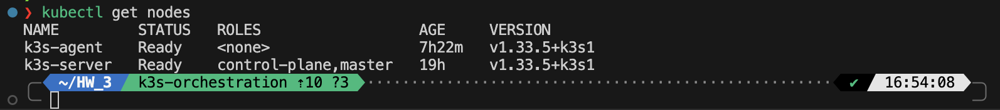
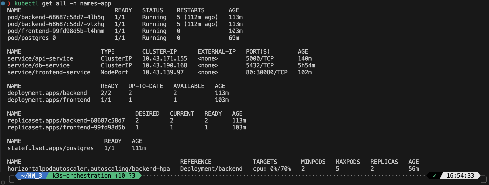
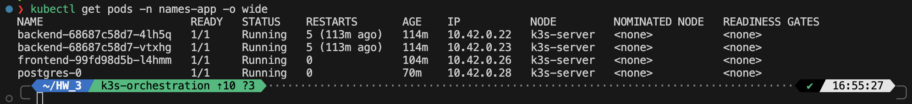
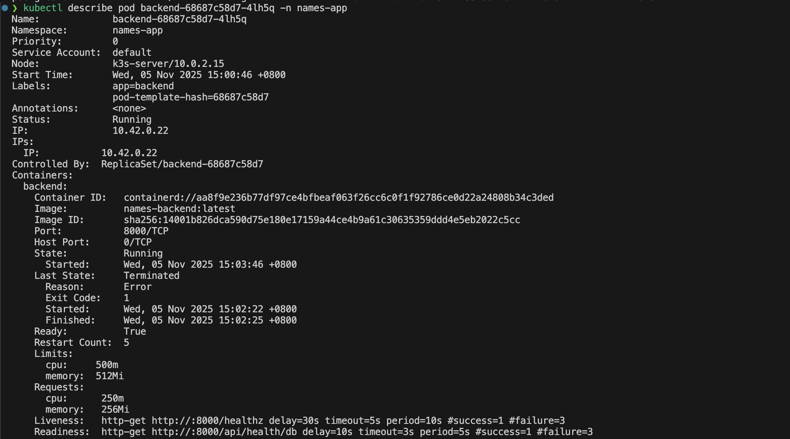
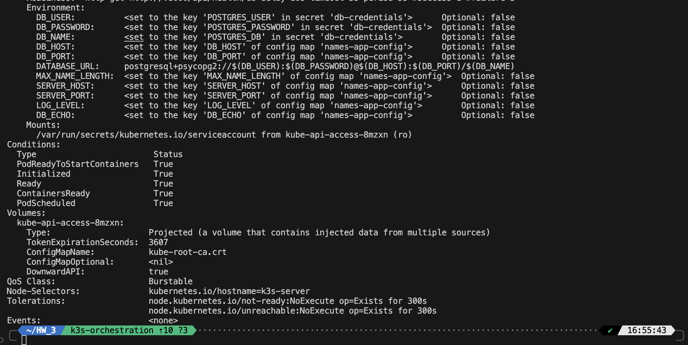
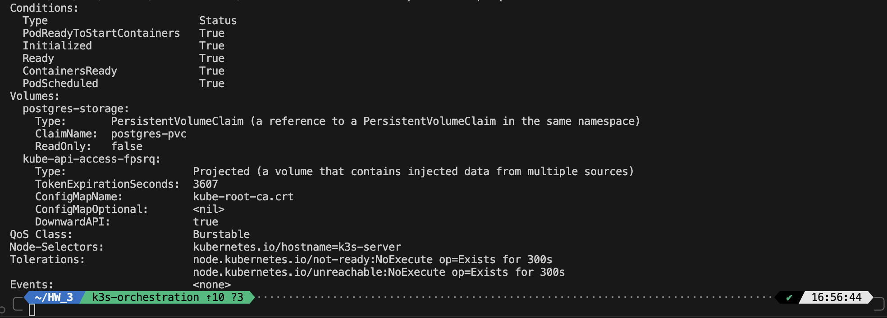
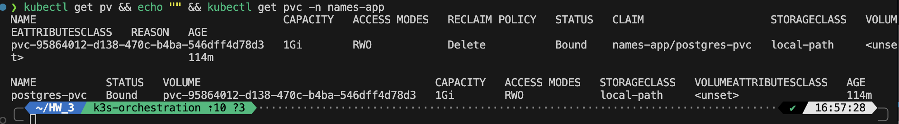
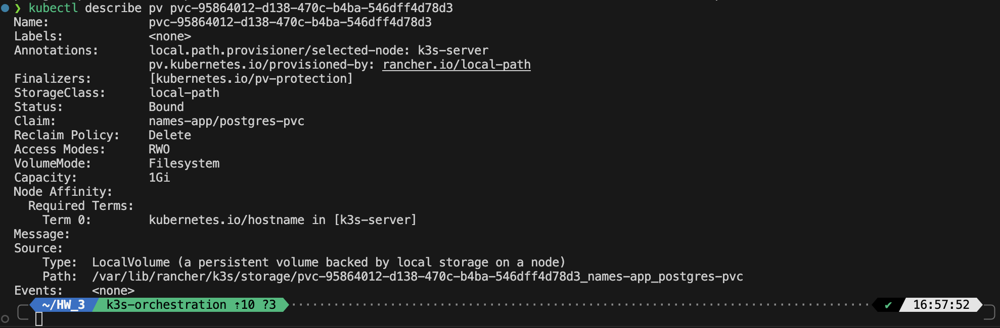
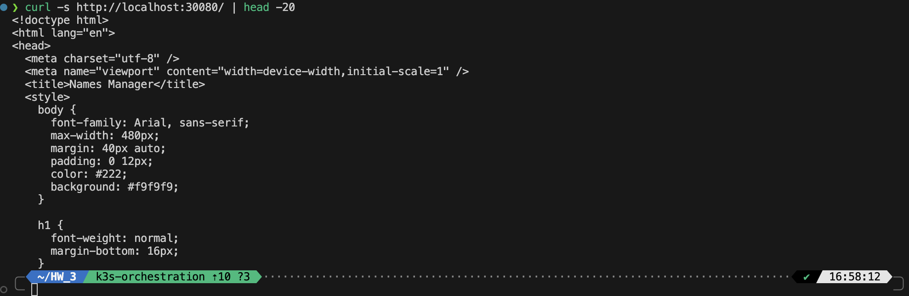
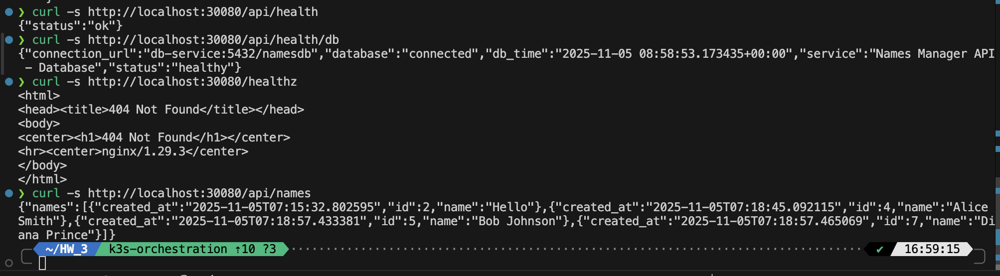

# Evidence Collected for k3s

## Output Screenshots

### kubectl get nodes


### kubectl get all -n mcapp


### kubectl get pods -o wide


### kubectl describe pod + describe pv







### curl to /, /api/…, /healthz



## Short note on storage path & permissions

### Storage Configuration

**Persistent Volume Details:**
- **Storage Class**: `local-path` (k3s default provisioner)
- **PV Name**: `pvc-95864012-d138-470c-b4ba-546dff4d78d3`
- **PVC Name**: `postgres-pvc` (in namespace `names-app`)
- **Capacity**: 1Gi
- **Access Mode**: ReadWriteOnce (RWO)
- **Reclaim Policy**: Delete
- **Node Affinity**: Bound to `k3s-server` node

**Physical Storage Path:**
```
/var/lib/rancher/k3s/storage/pvc-95864012-d138-470c-b4ba-546dff4d78d3_names-app_postgres-pvc/
```

**Directory Structure and Permissions:**
```bash
# Parent directory
drwxrwxrwx  3 root root 4096 Nov  5 07:03 .

# PostgreSQL data directory
drwx------ 19 lxd  root 4096 Nov  5 07:44 pgdata/
```

**PostgreSQL Data Ownership:**
- The `pgdata/` directory and its contents are owned by UID `999` (postgres user inside container)
- Permissions: `700` (drwx------) for security
- This ensures only the PostgreSQL process can access the data files

**Key Observations:**
1. **Local Path Provisioner**: k3s uses the rancher.io/local-path provisioner to dynamically create PVs on the local node filesystem
2. **Node Affinity**: The PV is tied to k3s-server node, meaning the postgres pod must run on this node to access the volume
3. **Automatic Provisioning**: The PV was automatically created when the PVC was requested, no manual intervention needed
4. **Security**: PostgreSQL data directory has restrictive permissions (700) preventing unauthorized access
5. **Persistence**: Data survives pod restarts and deletions (as long as PVC is not deleted)

**Volume Mount in Pod:**
- Container mount point: `/var/lib/postgresql/data`
- Actual data location: `/var/lib/postgresql/data/pgdata` (due to PGDATA environment variable)
- This prevents conflicts with the lost+found directory that may exist in the mount point

