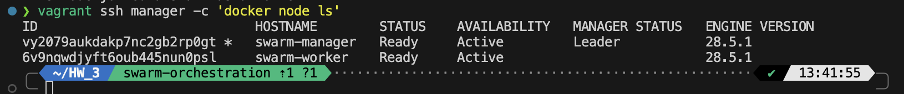
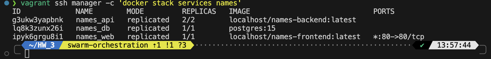
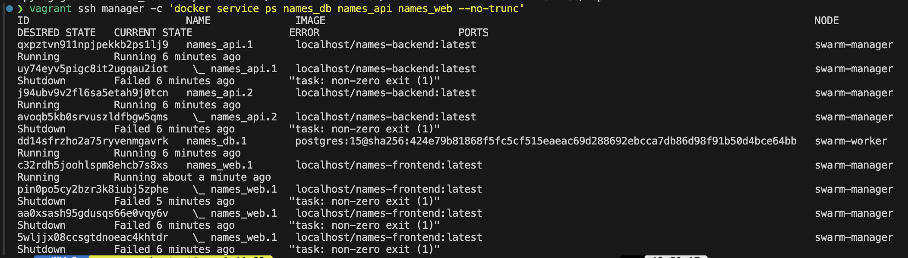
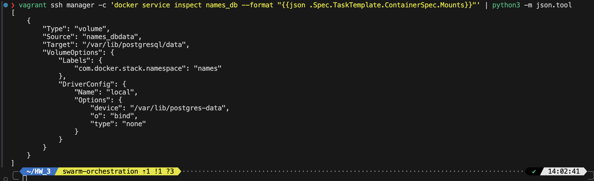
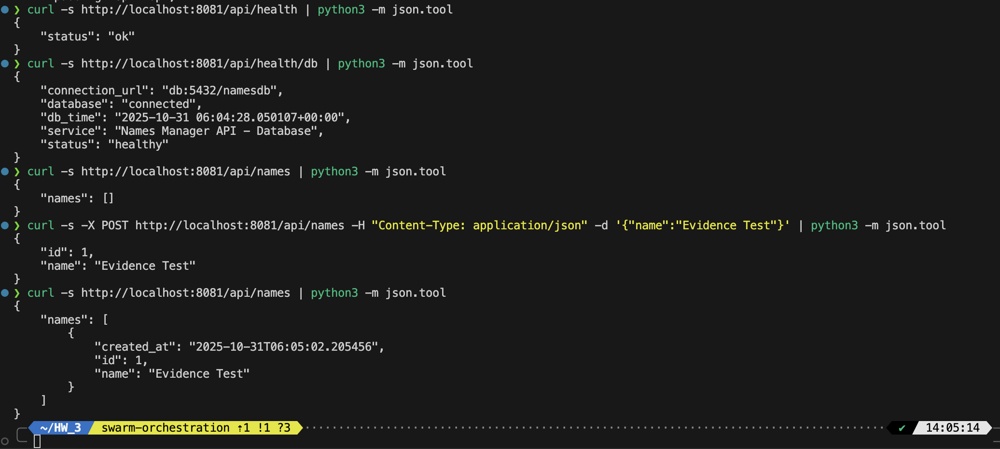

# Evidence Collected

## Output Screenshots

### docker node ls

### docker stack services mcapp

### docker service ps mcapp_*

### docker inspect mount for mcapp_db

### curl to /, /api/…, /healthz

## Short note on storage path & permissions

### Database Storage Configuration

**Storage Path:** `/var/lib/postgres-data` on worker node (swarm-worker)

**Permissions:** `700` (drwx------) - Only owner has read, write, and execute access

**Ownership:** UID 999 (PostgreSQL user in container)

**Size:** 47M of persistent data

**Mount Type:** Bind mount from host filesystem to container (`/var/lib/postgresql/data` inside container)

The `700` permissions ensure that only the PostgreSQL process can access the database files, providing proper security isolation. The bind mount configuration ensures data persists across container restarts and stack redeployments. This storage is constrained to the worker node using the placement constraint `node.labels.role==db`, ensuring the database always runs on the same node where its data resides. 