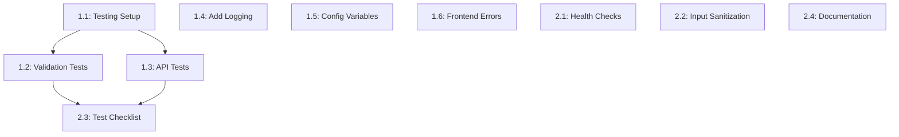

# Names Manager - Task List: k3s (Kubernetes) Migration

## Overview
This document breaks down the k3s migration plan into small, actionable tasks. Each task corresponds to specific milestones from the implementation plan (30-plan.md).

**Project Goal**: Migrate from Docker Compose (single-host) to k3s/Kubernetes cluster with cloud-native deployment patterns.

**Timeline**: 11-16 days (2-3 weeks part-time)
**Total Effort**: 42-55 hours

---

## Phase 0: Prerequisites & Preparation (Day 1)

### Task 0.1: Verify Application is Fully Functional
**Estimated Time**: 1 hour
**Priority**: HIGH
**Depends On**: None

**Description**: Verify current application works perfectly with Docker Compose before migration

**Status**: ✅ COMPLETED - All bugs fixed in previous branch

**Steps**:
1. Start Docker Compose: `cd src && docker-compose up --build`
2. Test all CRUD operations
3. Verify health endpoints work
4. Document current state

**Acceptance Criteria**:
- [x] GET /api/names returns `{"names": [...]}`
- [x] Frontend displays names with timestamps
- [x] DELETE works using ID parameter
- [x] Health endpoints `/healthz` and `/api/health/db` working
- [x] No errors in browser console

**Testing**:
```bash
cd src/
docker-compose up --build
# Open browser: http://localhost:8080
# Add names, verify display, test delete
curl http://localhost:8080/healthz
curl http://localhost:8080/api/health/db
```

---

### Task 0.2: Install kubectl on Laptop
**Estimated Time**: 30 minutes
**Priority**: HIGH
**Depends On**: None

**Description**: Install Kubernetes command-line tool for cluster management

**Steps**:
1. Check if kubectl installed: `kubectl version --client`
2. Install kubectl if needed (macOS):
   ```bash
   brew install kubectl
   ```
3. Verify installation: `kubectl version --client`
4. Check kubectl can run commands

**Acceptance Criteria**:
- [ ] kubectl installed (v1.28+)
- [ ] `kubectl version --client` works
- [ ] kubectl in PATH

**Alternative Installation Methods**:
```bash
# macOS - Homebrew
brew install kubectl

# macOS - Direct download
curl -LO "https://dl.k8s.io/release/$(curl -L -s https://dl.k8s.io/release/stable.txt)/bin/darwin/arm64/kubectl"
chmod +x kubectl
sudo mv kubectl /usr/local/bin/

# Verify
kubectl version --client
```

---

### Task 0.3: Verify Vagrant and VirtualBox
**Estimated Time**: 15 minutes
**Priority**: HIGH
**Depends On**: None

**Description**: Ensure VM prerequisites are installed and working

**Steps**:
1. Check Vagrant: `vagrant --version`
2. Check VirtualBox: `VBoxManage --version`
3. If not installed, install from official websites
4. Verify both work together

**Acceptance Criteria**:
- [x] Vagrant 2.2+ installed (✅ Current: v2.4.9)
- [x] VirtualBox 6.1+ installed (✅ Current: v7.1.12)
- [x] Can run `vagrant status`

**Testing**:
```bash
vagrant --version
VBoxManage --version
vagrant status
```

---

### Task 0.4: Create k3s-orchestration Branch
**Estimated Time**: 5 minutes
**Priority**: HIGH
**Depends On**: None

**Description**: Create Git branch for k3s migration work

**Steps**:
1. Ensure current work is committed
2. Create new branch: `git checkout -b k3s-orchestration`
3. Verify on correct branch: `git branch`

**Acceptance Criteria**:
- [x] Branch `k3s-orchestration` created (✅ Current branch)
- [x] All current work committed
- [x] Ready to start k3s work

**Commands**:
```bash
git status
git add -A
git commit -m "Prepare for k3s migration"
git checkout -b k3s-orchestration
git branch
```

---

## Phase 1: k3s Infrastructure Setup (Days 2-4)

### Task 1.1: Create or Update Vagrantfile for k3s
**Estimated Time**: 1-2 hours
**Priority**: HIGH
**Depends On**: Phase 0 complete

**Description**: Configure Vagrant VM for k3s-server (and optional k3s-agent)

**Steps**:
1. Open `Vagrantfile` in project root (or create if needed)
2. Define k3s-server VM: Ubuntu 22.04, 2-4GB RAM, 2 CPU, IP 192.168.56.10
3. Add provisioning script to install k3s automatically
4. (Optional) Define k3s-agent VM for multi-node cluster
5. Configure port forwarding if needed
6. Test Vagrantfile syntax

**Files to Create/Modify**:
- `Vagrantfile`

**Vagrantfile Configuration**:
```ruby
Vagrant.configure("2") do |config|
  config.vm.box = "bento/ubuntu-22.04"
  
  # k3s Server (Control Plane)
  config.vm.define "k3s-server" do |server|
    server.vm.hostname = "k3s-server"
    server.vm.network "private_network", ip: "192.168.56.10"
    
    server.vm.provider "virtualbox" do |vb|
      vb.name = "k3s-server"
      vb.memory = "2048"  # 2GB minimum, 4GB recommended
      vb.cpus = 2
    end
    
    # Install k3s
    server.vm.provision "shell", inline: <<-SHELL
      curl -sfL https://get.k3s.io | sh -
      # Wait for k3s to be ready
      sleep 10
      sudo k3s kubectl get nodes
    SHELL
  end
  
  # Optional: k3s Agent (Worker Node)
  # Uncomment if you want a multi-node cluster
  # config.vm.define "k3s-agent" do |agent|
  #   agent.vm.hostname = "k3s-agent"
  #   agent.vm.network "private_network", ip: "192.168.56.11"
  #   
  #   agent.vm.provider "virtualbox" do |vb|
  #     vb.name = "k3s-agent"
  #     vb.memory = "2048"
  #     vb.cpus = 2
  #   end
  # end
end
```

**Acceptance Criteria**:
- [ ] Vagrantfile created/updated with k3s-server definition
- [ ] VM configured with 2-4GB RAM, 2 CPUs
- [ ] Private network IP: 192.168.56.10
- [ ] k3s auto-install provisioning script included
- [ ] Vagrantfile syntax valid

**Testing**:
```bash
vagrant validate
# Should return: Vagrantfile validated successfully
```

---

### Task 1.2: Start k3s-server VM and Verify Installation
**Estimated Time**: 1 hour
**Priority**: HIGH
**Depends On**: Task 1.1

**Description**: Launch k3s-server VM and verify k3s is running

**Steps**:
1. Start VM: `vagrant up k3s-server`
2. Wait for provisioning to complete (k3s installation)
3. SSH into VM: `vagrant ssh k3s-server`
4. Check k3s status: `sudo systemctl status k3s`
5. Verify node is ready: `sudo k3s kubectl get nodes`
6. Exit VM

**Acceptance Criteria**:
- [ ] VM starts successfully
- [ ] k3s service running
- [ ] Node shows Ready status
- [ ] Can run `sudo k3s kubectl` commands
- [ ] No error messages in k3s logs

**Commands**:
```bash
# Start VM
vagrant up k3s-server

# SSH into VM
vagrant ssh k3s-server

# Inside VM - Check k3s
sudo systemctl status k3s
sudo k3s kubectl get nodes
sudo k3s kubectl cluster-info

# Check k3s version
sudo k3s --version

# Exit
exit
```

**Troubleshooting**:
```bash
# If k3s not running
sudo systemctl start k3s
sudo journalctl -u k3s -f

# If node not Ready
sudo k3s kubectl describe node k3s-server
```

---

### Task 1.3: Configure kubectl Access from Laptop
**Estimated Time**: 1 hour
**Priority**: HIGH
**Depends On**: Task 1.2

**Description**: Set up kubectl on laptop to manage k3s cluster remotely

**Steps**:
1. Copy kubeconfig from k3s-server to laptop
2. Update server IP from 127.0.0.1 to VM IP (192.168.56.10)
3. Set KUBECONFIG environment variable or merge into ~/.kube/config
4. Test kubectl connection from laptop
5. Verify can manage cluster without SSH

**Commands**:
```bash
# Get kubeconfig from VM
vagrant ssh k3s-server -- sudo cat /etc/rancher/k3s/k3s.yaml > k3s-config.yaml

# Update server IP in k3s-config.yaml
# Change: server: https://127.0.0.1:6443
# To:     server: https://192.168.56.10:6443
sed -i '' 's/127.0.0.1/192.168.56.10/g' k3s-config.yaml

# Set KUBECONFIG
export KUBECONFIG=$(pwd)/k3s-config.yaml

# Or merge into default kubeconfig
mkdir -p ~/.kube
cp k3s-config.yaml ~/.kube/config
chmod 600 ~/.kube/config

# Test connection
kubectl cluster-info
kubectl get nodes
kubectl get pods --all-namespaces
```

**Acceptance Criteria**:
- [ ] Kubeconfig copied from k3s-server
- [ ] Server IP updated to 192.168.56.10
- [ ] kubectl can connect from laptop
- [ ] `kubectl get nodes` shows k3s-server as Ready
- [ ] `kubectl cluster-info` returns cluster details
- [ ] No certificate errors

**Troubleshooting**:
```bash
# If connection fails
kubectl cluster-info
kubectl config view
kubectl config get-contexts

# Check VM firewall
vagrant ssh k3s-server -- sudo ufw status

# Verify k3s API server listening
vagrant ssh k3s-server -- sudo ss -tlnp | grep 6443
```

---

### Task 1.4: (Optional) Add k3s Agent Node
**Estimated Time**: 1 hour
**Priority**: MEDIUM
**Depends On**: Task 1.3

**Description**: Add worker node to create multi-node k3s cluster

**Note**: This task is optional. Single-node k3s is sufficient for the project.

**Steps**:
1. Get node token from k3s-server
2. Save token securely
3. Uncomment k3s-agent definition in Vagrantfile
4. Start agent VM: `vagrant up k3s-agent`
5. SSH into agent and join cluster
6. Verify from laptop: `kubectl get nodes`

**Commands**:
```bash
# Get node token from server
vagrant ssh k3s-server -- sudo cat /var/lib/rancher/k3s/server/node-token

# Save token (example: K10xxx...::server:xxx)
K3S_TOKEN="<TOKEN_FROM_ABOVE>"

# Start agent VM
vagrant up k3s-agent

# SSH into agent
vagrant ssh k3s-agent

# Inside agent VM - Install k3s agent
K3S_URL="https://192.168.56.10:6443"
curl -sfL https://get.k3s.io | K3S_URL=$K3S_URL K3S_TOKEN=$K3S_TOKEN sh -

# Exit agent
exit

# Verify from laptop
kubectl get nodes
# Should show both k3s-server and k3s-agent
```

**Acceptance Criteria**:
- [ ] k3s-agent VM running
- [ ] Agent joined cluster successfully
- [ ] `kubectl get nodes` shows both nodes
- [ ] Both nodes in Ready state
- [ ] Pods can be scheduled on agent

**Note**: If skipping this task, continue with single-node cluster.
4. Configure port forwarding: 80:8080 on manager
5. Set up provisioning script path

**Files to Create**:
- `Vagrantfile`

**Vagrantfile Template**:
```ruby
Vagrant.configure("2") do |config|
  config.vm.define "manager" do |manager|
    manager.vm.box = "bento/ubuntu-22.04"
    manager.vm.hostname = "swarm-manager"
    manager.vm.network "private_network", ip: "192.168.56.10"
    manager.vm.network "forwarded_port", guest: 80, host: 8080
    manager.vm.provider "virtualbox" do |vb|
      vb.memory = "2048"
      vb.cpus = 2
      vb.name = "names-manager"
    end
    manager.vm.provision "shell", path: "vagrant/install-docker.sh"
  end
  
  config.vm.define "worker" do |worker|
    worker.vm.box = "bento/ubuntu-22.04"
    worker.vm.hostname = "swarm-worker"
    worker.vm.network "private_network", ip: "192.168.56.11"
    worker.vm.provider "virtualbox" do |vb|
      vb.memory = "2048"
      vb.cpus = 2
      vb.name = "names-worker"
    end
    worker.vm.provision "shell", path: "vagrant/install-docker.sh"
  end
end
```

**Acceptance Criteria**:
- [x] Vagrantfile validates without errors (✅ vagrant validate passed)
- [x] Manager VM configured with correct specs (✅ 2GB RAM, 2 CPU, 192.168.56.10)
- [x] Worker VM configured with correct specs (✅ 2GB RAM, 2 CPU, 192.168.56.11)
- [x] Private network configured (✅ 192.168.56.0/24)
- [x] Port forwarding set up (✅ 80:8080 on manager)

---

### Task 1.3: Create Docker Installation Script
**Estimated Time**: 1 hour
**Priority**: HIGH
**Depends On**: Task 1.2

**Description**: Script to install Docker Engine on both VMs

**Steps**:
1. Create directory: `mkdir -p vagrant`
2. Create `vagrant/install-docker.sh`
3. Add Docker installation commands for Ubuntu
4. Make script executable
5. Test script syntax

**Files to Create**:
- `vagrant/install-docker.sh`

**Script Content**:
```bash
#!/bin/bash
set -e

echo "Installing Docker on $(hostname)..."

# Update package index
apt-get update

# Install prerequisites
apt-get install -y \
    ca-certificates \
    curl \
    gnupg \
    lsb-release

# Add Docker GPG key
mkdir -p /etc/apt/keyrings
curl -fsSL https://download.docker.com/linux/ubuntu/gpg | \
    gpg --dearmor -o /etc/apt/keyrings/docker.gpg

# Add Docker repository
echo \
  "deb [arch=$(dpkg --print-architecture) signed-by=/etc/apt/keyrings/docker.gpg] \
  https://download.docker.com/linux/ubuntu \
  $(lsb_release -cs) stable" | tee /etc/apt/sources.list.d/docker.list > /dev/null

# Install Docker
apt-get update
apt-get install -y docker-ce docker-ce-cli containerd.io docker-compose-plugin

# Add vagrant user to docker group
usermod -aG docker vagrant

# Enable Docker service
systemctl enable docker
systemctl start docker

echo "Docker installation complete!"
docker --version
```

**Acceptance Criteria**:
- [x] Script has execute permissions (✅ -rwxr-xr-x)
- [x] Script installs Docker CE (✅ docker-ce, docker-ce-cli, containerd.io)
- [x] Script adds vagrant user to docker group (✅ usermod -aG docker vagrant)
- [x] Script enables Docker service (✅ systemctl enable/start docker)

---

### Task 1.4: Start and Verify VMs
**Estimated Time**: 1 hour
**Priority**: HIGH
**Depends On**: Tasks 1.2, 1.3

**Description**: Bring up both VMs and verify basic connectivity

**Steps**:
1. Start VMs: `vagrant up`
2. Wait for provisioning to complete
3. Check VM status: `vagrant status`
4. SSH to manager: `vagrant ssh manager`
5. SSH to worker: `vagrant ssh worker`
6. Verify Docker on both VMs

**Acceptance Criteria**:
- [x] Both VMs start successfully (✅ both running)
- [x] Docker installed on manager VM (✅ Docker 28.5.1)
- [x] Docker installed on worker VM (✅ Docker 28.5.1)
- [x] Can SSH to both VMs (✅ vagrant ssh works)
- [x] `docker --version` works on both (✅ verified)

**Testing**:
```bash
vagrant up
vagrant status  # Both should show "running"
vagrant ssh manager -c "docker --version"
vagrant ssh worker -c "docker --version"
vagrant ssh manager -c "ping -c 3 192.168.56.11"
vagrant ssh worker -c "ping -c 3 192.168.56.10"
```

---

### Task 1.5: Initialize Docker Swarm on Manager
**Estimated Time**: 30 minutes
**Priority**: HIGH
**Depends On**: Task 1.4

**Description**: Initialize Swarm cluster on manager node

**Steps**:
1. SSH to manager: `vagrant ssh manager`
2. Initialize Swarm: `docker swarm init --advertise-addr 192.168.56.10`
3. Save the worker join token (IMPORTANT!)
4. Verify Swarm status: `docker node ls`

**Acceptance Criteria**:
- [x] Swarm initialized successfully (✅ Swarm active)
- [x] Manager node shows as Leader (✅ MANAGER STATUS: Leader)
- [x] Join token saved securely (✅ saved in vagrant/swarm-join-tokens.md)
- [x] `docker node ls` shows 1 node (✅ swarm-manager Ready/Active)

**Commands**:
```bash
vagrant ssh manager
docker swarm init --advertise-addr 192.168.56.10

# Save this output!
# Example: docker swarm join --token SWMTKN-1-xxx... 192.168.56.10:2377

docker node ls
# Should show 1 node with MANAGER STATUS = Leader
```

---

### Task 1.6: Join Worker to Swarm
**Estimated Time**: 30 minutes
**Priority**: HIGH
**Depends On**: Task 1.5

**Description**: Add worker node to Swarm cluster

**Steps**:
1. SSH to worker: `vagrant ssh worker`
2. Run join command from Task 1.5 output
3. Return to manager and verify: `docker node ls`
4. Should see 2 nodes (1 manager, 1 worker)

**Acceptance Criteria**:
- [x] Worker joins Swarm successfully (✅ "This node joined a swarm as a worker")
- [x] `docker node ls` shows 2 nodes (✅ swarm-manager + swarm-worker)
- [x] Manager shows as Leader (✅ MANAGER STATUS: Leader)
- [x] Worker shows as Active (✅ STATUS: Ready, AVAILABILITY: Active)

**Commands**:
```bash
# On worker VM
vagrant ssh worker
docker swarm join --token <TOKEN_FROM_TASK_1.5> 192.168.56.10:2377

# Back on manager VM
vagrant ssh manager
docker node ls
# Should show:
# ID     HOSTNAME        STATUS  AVAILABILITY  MANAGER STATUS
# xxx    swarm-manager   Ready   Active        Leader
# yyy    swarm-worker    Ready   Active
```

---

### Task 1.7: Label Worker Node for Database
**Estimated Time**: 15 minutes
**Priority**: CRITICAL
**Depends On**: Task 1.6

**Description**: Add custom label `role=db` to worker node (REQUIRED for placement)

**Steps**:
1. SSH to manager: `vagrant ssh manager`
2. Get worker node ID: `docker node ls`
3. Add label: `docker node update --label-add role=db <worker-node-id>`
4. Verify label: `docker node inspect <worker-node-id> --format '{{.Spec.Labels}}'`

**Acceptance Criteria**:
- [x] Worker node labeled with `role=db` (✅ label added)
- [x] Label visible in node inspection (✅ map[role:db])
- [x] Label will be used for db service placement (✅ ready for stack deployment)

**Commands**:
```bash
vagrant ssh manager

# Get node ID or hostname
docker node ls
# Note the worker node ID (first column) or HOSTNAME

# Add label (use either ID or hostname)
docker node update --label-add role=db swarm-worker

# Verify
docker node inspect swarm-worker --format '{{.Spec.Labels}}'
# Expected output: map[role:db]
```

---

### Task 1.8: Create Overlay Network
**Estimated Time**: 15 minutes
**Priority**: HIGH
**Depends On**: Task 1.7

**Description**: Create `appnet` overlay network for service communication

**Steps**:
1. SSH to manager: `vagrant ssh manager`
2. Create network: `docker network create --driver overlay --attachable appnet`
3. Verify: `docker network ls`
4. Inspect network: `docker network inspect appnet`

**Acceptance Criteria**:
- [x] Network `appnet` created (✅ ID: vw5v7ddfaytt3s6oq8kbye6p0)
- [x] Driver is `overlay` (✅ verified)
- [x] Network is attachable (✅ Attachable: true)
- [x] Network spans both nodes (✅ Scope: swarm, Subnet: 10.0.1.0/24)

**Commands**:
```bash
vagrant ssh manager
docker network create --driver overlay --attachable appnet
docker network ls | grep appnet
# Should show: DRIVER=overlay, SCOPE=swarm
```

---

## Phase 2: Kubernetes Manifests Creation (Days 5-8)

### Task 2.1: Create k8s Directory Structure
**Estimated Time**: 5 minutes
**Priority**: HIGH
**Depends On**: Phase 1 complete

**Description**: Create directory for Kubernetes manifests

**Steps**:
1. Create directory: `mkdir -p k8s`
2. Verify directory exists
3. Document purpose in README

**Files to Create**:
- `k8s/` directory

**Acceptance Criteria**:
- [ ] `k8s/` directory exists at project root
- [ ] Directory ready for manifest files

**Commands**:
```bash
mkdir -p k8s
ls -la k8s/
```

---

### Task 2.2: Create Namespace Manifest
**Estimated Time**: 15 minutes
**Priority**: HIGH
**Depends On**: Task 2.1

**Description**: Create namespace for isolating application resources

**Steps**:
1. Create `k8s/namespace.yaml`
2. Define namespace `names-app`
3. Add descriptive labels
4. Test with dry-run

**Files to Create**:
- `k8s/namespace.yaml`

**File Content**:
```yaml
apiVersion: v1
kind: Namespace
metadata:
  name: names-app
  labels:
    app: names-manager
    environment: production
```

**Acceptance Criteria**:
- [ ] File `k8s/namespace.yaml` created
- [ ] Namespace named `names-app`
- [ ] Labels included
- [ ] Valid YAML syntax

**Testing**:
```bash
kubectl apply -f k8s/namespace.yaml --dry-run=client
# Should return: namespace/names-app created (dry run)
```

---

### Task 2.3: Create ConfigMap Manifest
**Estimated Time**: 30 minutes
**Priority**: HIGH
**Depends On**: Task 2.2

**Description**: Create ConfigMap for application configuration

**Steps**:
1. Create `k8s/configmap.yaml`
2. Add all application configuration values
3. Include database connection parameters (non-sensitive)
4. Test with dry-run

**Files to Create**:
- `k8s/configmap.yaml`

**File Content**:
```yaml
apiVersion: v1
kind: ConfigMap
metadata:
  name: names-app-config
  namespace: names-app
data:
  MAX_NAME_LENGTH: "50"
  SERVER_HOST: "0.0.0.0"
  SERVER_PORT: "8000"
  LOG_LEVEL: "INFO"
  DB_ECHO: "false"
  DB_HOST: "db-service"
  DB_PORT: "5432"
  DB_NAME: "namesdb"
```

**Acceptance Criteria**:
- [ ] File `k8s/configmap.yaml` created
- [ ] ConfigMap named `names-app-config`
- [ ] All configuration keys defined
- [ ] Values in string format
- [ ] Valid YAML syntax

**Testing**:
```bash
kubectl apply -f k8s/configmap.yaml --dry-run=client -n names-app
```

---

### Task 2.4: Create Secret Manifest
**Estimated Time**: 30 minutes
**Priority**: HIGH
**Depends On**: Task 2.3

**Description**: Create Secret for database credentials

**Steps**:
1. Create `k8s/secret.yaml`
2. Add database credentials
3. Use `stringData` for readable values (Kubernetes will encode)
4. Test with dry-run

**Files to Create**:
- `k8s/secret.yaml`

**File Content**:
```yaml
apiVersion: v1
kind: Secret
metadata:
  name: db-credentials
  namespace: names-app
type: Opaque
stringData:
  POSTGRES_USER: names_user
  POSTGRES_PASSWORD: names_pass
  POSTGRES_DB: namesdb
```

**Acceptance Criteria**:
- [ ] File `k8s/secret.yaml` created
- [ ] Secret named `db-credentials`
- [ ] All database credentials included
- [ ] Uses `stringData` (not base64 encoded)
- [ ] Valid YAML syntax

**Testing**:
```bash
kubectl apply -f k8s/secret.yaml --dry-run=client -n names-app
```

**Security Note**: Don't commit secrets to Git in production. Use external secret management.

---

### Task 2.5: Create Database PersistentVolumeClaim
**Estimated Time**: 30 minutes
**Priority**: HIGH
**Depends On**: Task 2.4

**Description**: Create PVC for PostgreSQL persistent storage

**Steps**:
1. Create `k8s/database-pvc.yaml`
2. Request 1Gi storage (adjust based on needs)
3. Use default storage class (k3s local-path-provisioner)
4. Test with dry-run

**Files to Create**:
- `k8s/database-pvc.yaml`

**File Content**:
```yaml
apiVersion: v1
kind: PersistentVolumeClaim
metadata:
  name: postgres-pvc
  namespace: names-app
spec:
  accessModes:
    - ReadWriteOnce
  resources:
    requests:
      storage: 1Gi
  # storageClassName: local-path  # k3s default, can be omitted
```

**Acceptance Criteria**:
- [ ] File `k8s/database-pvc.yaml` created
- [ ] PVC named `postgres-pvc`
- [ ] Storage size: 1Gi (or appropriate size)
- [ ] Access mode: ReadWriteOnce
- [ ] Valid YAML syntax

**Testing**:
```bash
kubectl apply -f k8s/database-pvc.yaml --dry-run=client -n names-app
```

---

### Task 2.6: Create Database StatefulSet
**Estimated Time**: 1-2 hours
**Priority**: CRITICAL
**Depends On**: Task 2.5

**Description**: Create StatefulSet for PostgreSQL database

**Steps**:
1. Create `k8s/database-statefulset.yaml`
2. Configure to use postgres:15 image
3. Mount PVC to /var/lib/postgresql/data
4. Reference Secret for credentials
5. Add liveness and readiness probes
6. Test with dry-run

**Files to Create**:
- `k8s/database-statefulset.yaml`

**File Content**:
```yaml
apiVersion: apps/v1
kind: StatefulSet
metadata:
  name: postgres
  namespace: names-app
spec:
  serviceName: db-service
  replicas: 1
  selector:
    matchLabels:
      app: postgres
  template:
    metadata:
      labels:
        app: postgres
    spec:
      containers:
      - name: postgres
        image: postgres:15
        ports:
        - containerPort: 5432
          name: postgres
        envFrom:
        - secretRef:
            name: db-credentials
        volumeMounts:
        - name: postgres-storage
          mountPath: /var/lib/postgresql/data
        livenessProbe:
          exec:
            command:
            - pg_isready
            - -U
            - names_user
            - -d
            - namesdb
          initialDelaySeconds: 30
          periodSeconds: 10
          timeoutSeconds: 5
          failureThreshold: 3
        readinessProbe:
          exec:
            command:
            - pg_isready
            - -U
            - names_user
            - -d
            - namesdb
          initialDelaySeconds: 5
          periodSeconds: 5
          timeoutSeconds: 3
          failureThreshold: 3
      volumes:
      - name: postgres-storage
        persistentVolumeClaim:
          claimName: postgres-pvc
```

**Acceptance Criteria**:
- [ ] File `k8s/database-statefulset.yaml` created
- [ ] StatefulSet named `postgres`
- [ ] Uses postgres:15 image
- [ ] Mounts PVC correctly
- [ ] Loads credentials from Secret
- [ ] Health probes configured
- [ ] Valid YAML syntax

**Testing**:
```bash
kubectl apply -f k8s/database-statefulset.yaml --dry-run=client -n names-app
```

---

### Task 2.7: Create Database Service
**Estimated Time**: 15 minutes
**Priority**: HIGH
**Depends On**: Task 2.6

**Description**: Create ClusterIP Service for database access

**Steps**:
1. Create `k8s/database-service.yaml`
2. Define service named `db-service`
3. Expose port 5432
4. Select postgres pods
5. Test with dry-run

**Files to Create**:
- `k8s/database-service.yaml`

**File Content**:
```yaml
apiVersion: v1
kind: Service
metadata:
  name: db-service
  namespace: names-app
spec:
  type: ClusterIP
  selector:
    app: postgres
  ports:
  - name: postgres
    protocol: TCP
    port: 5432
    targetPort: 5432
```

**Acceptance Criteria**:
- [ ] File `k8s/database-service.yaml` created
- [ ] Service named `db-service`
- [ ] Type: ClusterIP (internal only)
- [ ] Port 5432 exposed
- [ ] Selects postgres pods
- [ ] Valid YAML syntax

**Testing**:
```bash
kubectl apply -f k8s/database-service.yaml --dry-run=client -n names-app
```

---

### Task 2.8: Create Backend Deployment
**Estimated Time**: 1-2 hours
**Priority**: CRITICAL
**Depends On**: Task 2.7

**Description**: Create Deployment for Flask backend API

**Steps**:
1. Create `k8s/backend-deployment.yaml`
2. Configure 2 replicas for high availability
3. Set environment variables from ConfigMap and Secret
4. Build DATABASE_URL from Secret values
5. Add liveness and readiness probes
6. Set `imagePullPolicy: Never` for local images
7. Test with dry-run

**Files to Create**:
- `k8s/backend-deployment.yaml`

**File Content**:
```yaml
apiVersion: apps/v1
kind: Deployment
metadata:
  name: backend
  namespace: names-app
spec:
  replicas: 2
  selector:
    matchLabels:
      app: backend
  template:
    metadata:
      labels:
        app: backend
    spec:
      containers:
      - name: backend
        image: names-backend:latest
        imagePullPolicy: Never  # Use local image, don't pull
        ports:
        - containerPort: 8000
          name: http
        env:
        # Database connection built from ConfigMap and Secret
        - name: DB_USER
          valueFrom:
            secretKeyRef:
              name: db-credentials
              key: POSTGRES_USER
        - name: DB_PASSWORD
          valueFrom:
            secretKeyRef:
              name: db-credentials
              key: POSTGRES_PASSWORD
        - name: DB_NAME
          valueFrom:
            secretKeyRef:
              name: db-credentials
              key: POSTGRES_DB
        - name: DB_HOST
          valueFrom:
            configMapKeyRef:
              name: names-app-config
              key: DB_HOST
        - name: DB_PORT
          valueFrom:
            configMapKeyRef:
              name: names-app-config
              key: DB_PORT
        - name: DATABASE_URL
          value: "postgresql+psycopg2://$(DB_USER):$(DB_PASSWORD)@$(DB_HOST):$(DB_PORT)/$(DB_NAME)"
        - name: MAX_NAME_LENGTH
          valueFrom:
            configMapKeyRef:
              name: names-app-config
              key: MAX_NAME_LENGTH
        - name: SERVER_HOST
          valueFrom:
            configMapKeyRef:
              name: names-app-config
              key: SERVER_HOST
        - name: SERVER_PORT
          valueFrom:
            configMapKeyRef:
              name: names-app-config
              key: SERVER_PORT
        - name: LOG_LEVEL
          valueFrom:
            configMapKeyRef:
              name: names-app-config
              key: LOG_LEVEL
        - name: DB_ECHO
          valueFrom:
            configMapKeyRef:
              name: names-app-config
              key: DB_ECHO
        livenessProbe:
          httpGet:
            path: /healthz
            port: 8000
          initialDelaySeconds: 30
          periodSeconds: 10
          timeoutSeconds: 5
          failureThreshold: 3
        readinessProbe:
          httpGet:
            path: /api/health/db
            port: 8000
          initialDelaySeconds: 10
          periodSeconds: 5
          timeoutSeconds: 3
          failureThreshold: 3
        resources:
          requests:
            memory: "256Mi"
            cpu: "250m"
          limits:
            memory: "512Mi"
            cpu: "500m"
```

**Acceptance Criteria**:
- [ ] File `k8s/backend-deployment.yaml` created
- [ ] Deployment named `backend`
- [ ] 2 replicas configured
- [ ] Uses `names-backend:latest` with imagePullPolicy: Never
- [ ] All environment variables from ConfigMap/Secret
- [ ] DATABASE_URL properly constructed
- [ ] Health probes configured
- [ ] Resource requests/limits set
- [ ] Valid YAML syntax

**Testing**:
```bash
kubectl apply -f k8s/backend-deployment.yaml --dry-run=client -n names-app
```

---

### Task 2.9: Create Backend Service
**Estimated Time**: 15 minutes
**Priority**: HIGH
**Depends On**: Task 2.8

**Description**: Create ClusterIP Service for backend API access

**Steps**:
1. Create `k8s/backend-service.yaml`
2. Define service named `api-service`
3. Expose port 5000 (mapping to container port 8000)
4. Select backend pods
5. Test with dry-run

**Files to Create**:
- `k8s/backend-service.yaml`

**File Content**:
```yaml
apiVersion: v1
kind: Service
metadata:
  name: api-service
  namespace: names-app
spec:
  type: ClusterIP
  selector:
    app: backend
  ports:
  - name: http
    protocol: TCP
    port: 5000
    targetPort: 8000
```

**Acceptance Criteria**:
- [ ] File `k8s/backend-service.yaml` created
- [ ] Service named `api-service`
- [ ] Type: ClusterIP (internal only)
- [ ] Port 5000 exposed, targets container port 8000
- [ ] Selects backend pods
- [ ] Valid YAML syntax

**Testing**:
```bash
kubectl apply -f k8s/backend-service.yaml --dry-run=client -n names-app
```

---

### Task 2.10: Create Frontend Deployment
**Estimated Time**: 1 hour
**Priority**: CRITICAL
**Depends On**: Task 2.9

**Description**: Create Deployment for Nginx frontend

**Steps**:
1. Create `k8s/frontend-deployment.yaml`
2. Configure 1 replica
3. Use `names-frontend:latest` image
4. Set `imagePullPolicy: Never`
5. Configure environment for API access
6. Test with dry-run

**Files to Create**:
- `k8s/frontend-deployment.yaml`

**File Content**:
```yaml
apiVersion: apps/v1
kind: Deployment
metadata:
  name: frontend
  namespace: names-app
spec:
  replicas: 1
  selector:
    matchLabels:
      app: frontend
  template:
    metadata:
      labels:
        app: frontend
    spec:
      containers:
      - name: frontend
        image: names-frontend:latest
        imagePullPolicy: Never  # Use local image, don't pull
        ports:
        - containerPort: 80
          name: http
        env:
        - name: API_URL
          value: "http://api-service:5000"
        resources:
          requests:
            memory: "128Mi"
            cpu: "100m"
          limits:
            memory: "256Mi"
            cpu: "200m"
```

**Acceptance Criteria**:
- [ ] File `k8s/frontend-deployment.yaml` created
- [ ] Deployment named `frontend`
- [ ] 1 replica configured
- [ ] Uses `names-frontend:latest` with imagePullPolicy: Never
- [ ] API_URL points to api-service
- [ ] Resource requests/limits set
- [ ] Valid YAML syntax

**Testing**:
```bash
kubectl apply -f k8s/frontend-deployment.yaml --dry-run=client -n names-app
```

---

### Task 2.11: Create Frontend Service (NodePort)
**Estimated Time**: 30 minutes
**Priority**: CRITICAL
**Depends On**: Task 2.10

**Description**: Create NodePort Service for external frontend access

**Steps**:
1. Create `k8s/frontend-service.yaml`
2. Define service named `frontend-service`
3. Type: NodePort for external access
4. Expose port 80, let Kubernetes assign NodePort
5. Select frontend pods
6. Test with dry-run

**Files to Create**:
- `k8s/frontend-service.yaml`

**File Content**:
```yaml
apiVersion: v1
kind: Service
metadata:
  name: frontend-service
  namespace: names-app
spec:
  type: NodePort
  selector:
    app: frontend
  ports:
  - name: http
    protocol: TCP
    port: 80
    targetPort: 80
    # nodePort: 30080  # Optional: specify NodePort, or let k8s assign
```

**Acceptance Criteria**:
- [ ] File `k8s/frontend-service.yaml` created
- [ ] Service named `frontend-service`
- [ ] Type: NodePort (external access)
- [ ] Port 80 exposed
- [ ] NodePort in range 30000-32767 (auto-assigned or specified)
- [ ] Selects frontend pods
- [ ] Valid YAML syntax

**Testing**:
```bash
kubectl apply -f k8s/frontend-service.yaml --dry-run=client -n names-app
```

---

### Task 2.12: Verify All Manifests with Dry-Run
**Estimated Time**: 30 minutes
**Priority**: HIGH
**Depends On**: All Phase 2 tasks

**Description**: Validate all Kubernetes manifests before deployment

**Steps**:
1. Run dry-run on all manifests
2. Check for syntax errors
3. Verify resource names are consistent
4. Check label selectors match
5. Document any issues found

**Acceptance Criteria**:
- [ ] All manifests pass dry-run validation
- [ ] No YAML syntax errors
- [ ] Label selectors match deployments/services
- [ ] Namespace consistent across all resources
- [ ] imagePullPolicy: Never set for local images

**Testing Commands**:
```bash
# Validate all manifests
kubectl apply -f k8s/ --dry-run=client -n names-app

# Or validate individually
for file in k8s/*.yaml; do
  echo "Validating $file..."
  kubectl apply -f "$file" --dry-run=client
done
```

**Checklist**:
- [ ] namespace.yaml validates
- [ ] configmap.yaml validates
- [ ] secret.yaml validates
- [ ] database-pvc.yaml validates
- [ ] database-statefulset.yaml validates
- [ ] database-service.yaml validates
- [ ] backend-deployment.yaml validates
- [ ] backend-service.yaml validates
- [ ] frontend-deployment.yaml validates
- [ ] frontend-service.yaml validates

---

## Phase 3: Container Image Management (Days 9-10)

### Task 3.1: Build Container Images
**Estimated Time**: 30 minutes
**Priority**: HIGH
**Depends On**: Phase 2 complete

**Description**: Build backend and frontend Docker images

**Note**: Application code is already functional from previous work
- [x] Network `appnet` with `external: true` (✅ uses pre-created overlay network)
- [x] Volume `dbdata` bound to `/var/lib/postgres-data` (✅ configured)
- [x] DB service: `node.labels.role == db` constraint (✅ placed on worker)
- [x] API service: DATABASE_URL points to service name `db` (✅ db:5432)
- [x] Web service: ports `["80:80"]` (✅ configured)
- [x] Health checks configured (✅ all services)
- [x] Replica counts set (api:2, web:1, db:1) (✅ verified)

---

### Task 2.3: Validate Stack File
**Estimated Time**: 30 minutes
**Priority**: HIGH
**Depends On**: Task 2.2

**Description**: Verify stack file syntax and configuration

**Steps**:
1. Copy stack.yaml to manager VM
2. Run: `docker stack config -c swarm/stack.yaml`
3. Fix any syntax errors
4. Verify all required fields present
5. Check service names, network, volume configuration

**Acceptance Criteria**:
- [x] `docker stack config` validates successfully (✅ SUCCESS)
- [x] No YAML syntax errors (✅ validated)
- [x] All services defined correctly (✅ api, db, web)
- [x] Network and volume properly configured (✅ appnet external, dbdata bind mount)

**Commands**:
```bash
# On laptop
scp -P $(vagrant port manager --guest 22) swarm/stack.yaml vagrant@localhost:/home/vagrant/

# Or use Vagrant shared folder
vagrant ssh manager
docker stack config -c /vagrant/swarm/stack.yaml
# Should output the processed configuration
```

---

### Task 3.2: Build Backend and Frontend Images
**Estimated Time**: 30 minutes
**Priority**: HIGH
**Depends On**: Task 3.1

**Description**: Build Docker images for backend and frontend

**Note**: Images already built and tested with Docker Compose. Rebuild if needed.

**Steps**:
1. Navigate to src directory
2. Build backend: `docker build -t names-backend:latest backend/`
3. Build frontend: `docker build -t names-frontend:latest frontend/`
4. Verify images created

**Commands**:
```bash
cd src/

# Build backend
docker build -t names-backend:latest backend/

# Build frontend
docker build -t names-frontend:latest frontend/

# Verify
docker images | grep names
```

**Acceptance Criteria**:
- [ ] Backend image builds successfully
- [ ] Frontend image builds successfully
- [ ] Images tagged as `names-backend:latest` and `names-frontend:latest`
- [ ] No build errors

---

### Task 3.3: Save Images to TAR Archives
**Estimated Time**: 15 minutes
**Priority**: HIGH
**Depends On**: Task 3.2

**Description**: Export Docker images to tar files for transfer to k3s VM

**Steps**:
1. Save backend image to tar: `docker save names-backend:latest > names-backend.tar`
2. Save frontend image to tar: `docker save names-frontend:latest > names-frontend.tar`
3. Verify tar files created
4. Check file sizes

**Commands**:
```bash
cd src/

# Save images
docker save names-backend:latest > names-backend.tar
docker save names-frontend:latest > names-frontend.tar

# Check files
ls -lh names-*.tar
```

**Acceptance Criteria**:
- [ ] `names-backend.tar` created
- [ ] `names-frontend.tar` created
- [ ] Files are non-zero size
- [ ] Ready for transfer to VM

**Expected Sizes** (approximate):
- Backend: 700-800 MB
- Frontend: 50-80 MB

---

### Task 3.4: Transfer Images to k3s-server VM
**Estimated Time**: 30 minutes
**Priority**: HIGH
**Depends On**: Task 3.3

**Description**: Copy tar files to k3s-server VM

**Steps**:
1. Get VM SSH port: `vagrant port k3s-server`
2. Transfer backend tar via SCP
3. Transfer frontend tar via SCP
4. Verify files on VM

**Commands**:
```bash
# From project root
cd src/

# Transfer to VM
scp -P $(vagrant port k3s-server --guest 22) \
  names-backend.tar names-frontend.tar \
  vagrant@localhost:/tmp/

# Verify on VM
vagrant ssh k3s-server -- ls -lh /tmp/names-*.tar
```

**Acceptance Criteria**:
- [ ] Both tar files transferred successfully
- [ ] Files exist in `/tmp/` on k3s-server
- [ ] File sizes match originals
- [ ] Ready for import to containerd

---

### Task 3.5: Import Images into k3s Containerd
**Estimated Time**: 30 minutes
**Priority**: CRITICAL
**Depends On**: Task 3.4

**Description**: Import Docker images into k3s containerd runtime

**Steps**:
1. SSH into k3s-server
2. Import backend image using `k3s ctr`
3. Import frontend image using `k3s ctr`
4. Verify images with `crictl`
5. Clean up tar files

**Commands**:
```bash
# SSH into VM
vagrant ssh k3s-server

# Import images to containerd
sudo k3s ctr images import /tmp/names-backend.tar
sudo k3s ctr images import /tmp/names-frontend.tar

# Verify with crictl (Kubernetes CRI tool)
sudo crictl images | grep names

# Alternative: Import with ctr in k8s.io namespace
sudo ctr -n k8s.io images import /tmp/names-backend.tar
sudo ctr -n k8s.io images import /tmp/names-frontend.tar

# List images
sudo ctr -n k8s.io images ls | grep names

# Clean up
rm /tmp/names-backend.tar /tmp/names-frontend.tar

# Exit VM
exit
```

**Acceptance Criteria**:
- [ ] Backend image imported successfully
- [ ] Frontend image imported successfully
- [ ] `crictl images` shows both images
- [ ] Images in containerd k8s.io namespace
- [ ] No import errors in logs

**Expected Output**:
```
$ sudo crictl images | grep names
docker.io/library/names-backend    latest    <id>    700MB
docker.io/library/names-frontend   latest    <id>    50MB
```

**Troubleshooting**:
```bash
# If images not showing
sudo systemctl status containerd
sudo journalctl -u k3s -f

# Check k3s containerd config
sudo k3s crictl images
```

---

## Phase 4: k3s Deployment & Testing (Days 11-13)

### Task 4.1: Apply Namespace and Configuration
**Estimated Time**: 30 minutes
**Priority**: HIGH
**Depends On**: Phase 3 complete

**Description**: Deploy namespace, ConfigMap, and Secret to k3s cluster

**Steps**:
1. Apply namespace: `kubectl apply -f k8s/namespace.yaml`
2. Apply ConfigMap: `kubectl apply -f k8s/configmap.yaml`
3. Apply Secret: `kubectl apply -f k8s/secret.yaml`
4. Verify resources created
5. Check for any errors

**Commands**:
```bash
# Apply base resources
kubectl apply -f k8s/namespace.yaml
kubectl apply -f k8s/configmap.yaml
kubectl apply -f k8s/secret.yaml

# Verify
kubectl get namespace names-app
kubectl get configmap -n names-app
kubectl get secret -n names-app

# Describe to verify content
kubectl describe configmap names-app-config -n names-app
kubectl describe secret db-credentials -n names-app
```

**Acceptance Criteria**:
- [ ] Namespace `names-app` created (Active status)
- [ ] ConfigMap `names-app-config` created
- [ ] Secret `db-credentials` created
- [ ] All resources in names-app namespace
- [ ] No error messages

---

### Task 4.2: Deploy Database (PVC, StatefulSet, Service)
**Estimated Time**: 1 hour
**Priority**: CRITICAL
**Depends On**: Task 4.1

**Description**: Deploy PostgreSQL database with persistent storage

**Steps**:
1. Apply PVC: `kubectl apply -f k8s/database-pvc.yaml`
2. Wait for PVC to bind
3. Apply StatefulSet: `kubectl apply -f k8s/database-statefulset.yaml`
4. Apply Service: `kubectl apply -f k8s/database-service.yaml`
5. Wait for pod to be ready
6. Check logs for errors

**Commands**:
```bash
# Apply database resources
kubectl apply -f k8s/database-pvc.yaml
kubectl apply -f k8s/database-statefulset.yaml
kubectl apply -f k8s/database-service.yaml

# Check PVC status
kubectl get pvc -n names-app
# Should show: postgres-pvc   Bound

# Wait for database pod
kubectl wait --for=condition=ready pod/postgres-0 -n names-app --timeout=300s

# Check status
kubectl get statefulset -n names-app
kubectl get pods -n names-app
kubectl get svc -n names-app

# Check database logs
kubectl logs postgres-0 -n names-app --tail=50

# Verify health probes
kubectl describe pod postgres-0 -n names-app | grep -A 10 "Liveness\|Readiness"
```

**Acceptance Criteria**:
- [ ] PVC `postgres-pvc` is Bound
- [ ] StatefulSet `postgres` shows 1/1 replicas ready
- [ ] Pod `postgres-0` in Running status
- [ ] Liveness probe passing
- [ ] Readiness probe passing
- [ ] Service `db-service` created
- [ ] Database logs show "database system is ready to accept connections"
- [ ] No error events

**Troubleshooting**:
```bash
# If pod not starting
kubectl describe pod postgres-0 -n names-app
kubectl logs postgres-0 -n names-app

# If PVC not binding
kubectl describe pvc postgres-pvc -n names-app
kubectl get pv

# Check events
kubectl get events -n names-app --sort-by='.lastTimestamp'
```

---

### Task 4.3: Deploy Backend API (Deployment, Service)
**Estimated Time**: 1 hour
**Priority**: CRITICAL
**Depends On**: Task 4.2

**Description**: Deploy Flask backend with database connectivity

**Steps**:
1. Apply backend Deployment: `kubectl apply -f k8s/backend-deployment.yaml`
2. Apply backend Service: `kubectl apply -f k8s/backend-service.yaml`
3. Wait for pods to be ready
4. Check backend can connect to database
5. Verify health endpoints

**Commands**:
```bash
# Apply backend resources
kubectl apply -f k8s/backend-deployment.yaml
kubectl apply -f k8s/backend-service.yaml

# Wait for backend
kubectl wait --for=condition=available deployment/backend -n names-app --timeout=300s

# Check status
kubectl get deployment -n names-app
kubectl get pods -n names-app -l app=backend
kubectl get svc -n names-app

# Check backend logs
kubectl logs -l app=backend -n names-app --tail=50

# Test health endpoints from within cluster
kubectl run test-pod --rm -i --tty --image=curlimages/curl -n names-app -- \
  curl http://api-service:5000/healthz

kubectl run test-pod --rm -i --tty --image=curlimages/curl -n names-app -- \
  curl http://api-service:5000/api/health/db
```

**Acceptance Criteria**:
- [ ] Deployment `backend` shows 2/2 replicas ready
- [ ] Both backend pods in Running status
- [ ] Liveness probes passing (`/healthz`)
- [ ] Readiness probes passing (`/api/health/db`)
- [ ] Service `api-service` created
- [ ] Backend logs show successful database connection
- [ ] `/healthz` returns 200 OK
- [ ] `/api/health/db` returns healthy status
- [ ] No error events

**Troubleshooting**:
```bash
# If pods not starting
kubectl describe deployment backend -n names-app
kubectl describe pod <backend-pod> -n names-app
kubectl logs <backend-pod> -n names-app

# If image pull issues
kubectl describe pod <backend-pod> -n names-app | grep -i image
sudo crictl images | grep names

# Check database connectivity
kubectl exec -it <backend-pod> -n names-app -- env | grep DATABASE
```

---

### Task 4.4: Deploy Frontend (Deployment, NodePort Service)
**Estimated Time**: 1 hour
**Priority**: CRITICAL
**Depends On**: Task 4.3

**Description**: Deploy Nginx frontend with external access

**Steps**:
1. Apply frontend Deployment: `kubectl apply -f k8s/frontend-deployment.yaml`
2. Apply frontend Service: `kubectl apply -f k8s/frontend-service.yaml`
3. Wait for pod to be ready
4. Get NodePort number
5. Get VM IP
6. Access application in browser

**Commands**:
```bash
# Apply frontend resources
kubectl apply -f k8s/frontend-deployment.yaml
kubectl apply -f k8s/frontend-service.yaml

# Wait for frontend
kubectl wait --for=condition=available deployment/frontend -n names-app --timeout=300s

# Get all resources
kubectl get all -n names-app

# Get NodePort
kubectl get svc frontend-service -n names-app
# Note the NodePort (e.g., 80:30080/TCP)

# Get VM IP (should be 192.168.56.10)
vagrant ssh k3s-server -- ip addr show eth1 | grep "inet "

# Access in browser
# URL: http://192.168.56.10:<NODE_PORT>
```

**Acceptance Criteria**:
- [ ] Deployment `frontend` shows 1/1 replica ready
- [ ] Frontend pod in Running status
- [ ] Service `frontend-service` created with NodePort
- [ ] NodePort in range 30000-32767
- [ ] Application accessible via http://<VM_IP>:<NODE_PORT>
- [ ] Frontend can communicate with backend
- [ ] No error events

**Browser Testing**:
1. Open browser to `http://192.168.56.10:<NODE_PORT>`
2. Verify page loads
3. Try adding a name
4. Verify name appears in list
5. Try deleting a name

---

### Task 4.5: End-to-End Functional Testing
**Estimated Time**: 1 hour
**Priority**: CRITICAL
**Depends On**: Task 4.4

**Description**: Test all application features work in k3s deployment

**Steps**:
1. Access application in browser
2. Test add name functionality
3. Test view names with timestamps
4. Test delete name functionality
5. Test data persistence (restart database pod)
6. Verify all pods healthy

**Test Scenarios**:
1. **Add Name**: Enter "Alice Smith", verify appears with timestamp
2. **Add Multiple**: Add 3-5 names, verify all display
3. **Delete Name**: Delete middle name, verify removed
4. **Data Persistence**: Restart database pod, verify data still exists
5. **Backend Scaling**: Verify 2 backend pods handle requests
6. **Health Checks**: All probes passing

**Commands**:
```bash
# Check all pods running
kubectl get pods -n names-app

# Test data persistence
kubectl delete pod postgres-0 -n names-app
kubectl wait --for=condition=ready pod/postgres-0 -n names-app --timeout=120s
# Refresh browser, verify data still present

# Check all health probes
kubectl get pods -n names-app -o wide

# View logs
kubectl logs -l app=backend -n names-app --tail=20
kubectl logs -l app=frontend -n names-app --tail=20
kubectl logs postgres-0 -n names-app --tail=20

# Check events
kubectl get events -n names-app --sort-by='.lastTimestamp'
```

**Acceptance Criteria**:
- [ ] Can add names successfully
- [ ] Names display with timestamps
- [ ] Can delete names by ID
- [ ] Data persists after database pod restart
- [ ] Backend 2 replicas handling requests
- [ ] Frontend accessible and responsive
- [ ] All health checks passing
- [ ] No error events
- [ ] Application fully functional
gunzip < names-backend.tar.gz | docker load
gunzip < names-frontend.tar.gz | docker load
docker images | grep names

# Clean up
rm names-backend.tar.gz names-frontend.tar.gz
```

---

## Phase 4: Deployment & Testing (Days 15-18)

### Task 4.1: Create Database Storage Directory
**Estimated Time**: 30 minutes
**Priority**: CRITICAL
**Depends On**: Phase 3 complete

**Description**: Set up persistent storage on worker node (REQUIRED for data persistence)

**Steps**:
1. SSH to worker VM
2. Create directory: `sudo mkdir -p /var/lib/postgres-data`
3. Set permissions: `sudo chmod 700 /var/lib/postgres-data`
4. Set ownership: `sudo chown 999:999 /var/lib/postgres-data`
5. Verify configuration
6. Test writability

**Acceptance Criteria**:
- [x] Directory exists at `/var/lib/postgres-data` on worker only (✅ created on worker VM)
- [x] Permissions are 700 (drwx------) (✅ verified with stat: 700)
- [x] Owner is 999:999 (PostgreSQL UID/GID) (✅ verified with stat: 999:999)
- [x] Directory is writable by UID 999 (✅ tested with touch/rm as UID 999)

**Commands**:
```bash
vagrant ssh worker

sudo mkdir -p /var/lib/postgres-data
sudo chmod 700 /var/lib/postgres-data
sudo chown 999:999 /var/lib/postgres-data

# Verify
ls -ld /var/lib/postgres-data
# Expected: drwx------ 2 999 999 ... /var/lib/postgres-data

# Test write permissions
sudo -u '#999' touch /var/lib/postgres-data/test.txt
sudo -u '#999' rm /var/lib/postgres-data/test.txt

echo "Storage directory ready!"
```

---

### Task 4.2: Deploy Stack to Swarm
**Estimated Time**: 1 hour
**Priority**: CRITICAL
**Depends On**: Task 4.1

**Description**: Initial deployment of application to Swarm cluster

**Steps**:
1. SSH to manager VM
2. Navigate to stack file location
3. Deploy: `docker stack deploy -c /vagrant/swarm/stack.yaml names-app`
4. Monitor deployment: `docker stack ps names-app`
5. Verify all services start
6. Check service logs for errors

**Acceptance Criteria**:
- [x] Stack deploys without errors (✅ deployed with stack name "names")
- [x] All 3 services created (db, api, web) (✅ names_db, names_api, names_web)
- [x] All services reach Running state (✅ 1/1 db, 2/2 api, 1/1 web)
- [x] No errors in service logs (✅ all services running, API tested successfully)

**Commands**:
```bash
vagrant ssh manager

# Deploy stack
docker stack deploy -c /vagrant/swarm/stack.yaml names-app

# Monitor deployment
watch -n 2 'docker stack ps names-app'
# Wait for all to show "Running"

# Check services
docker stack services names-app
docker stack ls
```

---

### Task 4.3: Verify Service Placement
**Estimated Time**: 30 minutes
**Priority**: CRITICAL
**Depends On**: Task 4.2

**Description**: Confirm services deployed to correct nodes

**Steps**:
1. Check DB service placement: should be on worker
2. Check API service placement: should be on manager
3. Check Web service placement: should be on manager
4. Verify placement constraints working
5. Document actual placement

**Acceptance Criteria**:
- [x] DB service on worker node (labeled role=db)
- [x] API service on manager node (2 replicas)
- [x] Web service on manager node (1 replica)
- [x] Placement matches requirements

**Commands**:
```bash
vagrant ssh manager

# Check placement
docker service ps names-app_db | grep Running
# Should show NODE = swarm-worker

docker service ps names-app_api | grep Running
# Should show NODE = swarm-manager (2 tasks)

docker service ps names-app_web | grep Running
# Should show NODE = swarm-manager

# Verify constraints
docker service inspect names-app_db --format '{{.Spec.TaskTemplate.Placement}}'
# Should show: {[node.labels.role == db]}
```

---

### Task 4.4: Test DNS Service Discovery
**Estimated Time**: 30 minutes
**Priority**: HIGH
**Depends On**: Task 4.3

**Description**: Verify services can reach each other by service name

**Steps**:
1. Test API can reach DB by name `db`
2. Test Web can reach API by name `api`
3. Verify DATABASE_URL uses service name
4. Check overlay network connectivity
5. Document DNS resolution

**Acceptance Criteria**:
- [x] API container can ping/resolve `db`
- [x] Web container can ping/resolve `api`
- [x] DATABASE_URL environment uses service name `db`
- [x] DNS resolution works across VMs

**Commands**:
```bash
vagrant ssh manager

# Test DNS from API to DB
docker exec $(docker ps -q -f name=names-app_api | head -1) ping -c 3 db

# Check DATABASE_URL
docker service inspect names-app_api \
  --format '{{range .Spec.TaskTemplate.ContainerSpec.Env}}{{println .}}{{end}}' \
  | grep DATABASE_URL
# Should show: DATABASE_URL=...@db:5432/...

# Test API health check (includes DB connection)
docker exec $(docker ps -q -f name=names-app_api | head -1) \
  curl http://localhost:8000/api/health/db
```

---

### Task 4.5: Test Health Check Endpoints
**Estimated Time**: 30 minutes
**Priority**: HIGH
**Depends On**: Task 4.4

**Description**: Verify health check endpoints return correct responses

**Steps**:
1. Test API health endpoint from browser
2. Test API DB health endpoint  
3. Verify exact response format
4. Check PostgreSQL health check
5. Document health check status

**Acceptance Criteria**:
- [x] GET /api/health returns `{"status":"ok"}` exactly
- [x] GET /api/health/db returns healthy status
- [x] PostgreSQL health check passes (pg_isready)
- [x] HTTP status codes correct (200 for healthy)

**Commands**:
```bash
# From laptop
curl http://localhost:8080/api/health
# Expected: {"status":"ok"}

curl http://localhost:8080/api/health/db
# Expected: {"status":"healthy", ...}

# Check Swarm health checks
vagrant ssh manager
docker service ps names-app_db --format "table {{.Name}}\t{{.CurrentState}}"
# Should show "Running" not "Starting"
```

---

### Task 4.6: Verify Database Storage Persistence
**Estimated Time**: 1-2 hours  
**Priority**: CRITICAL
**Depends On**: Task 4.5

**Description**: Ensure database data persists across container lifecycle (CRITICAL REQUIREMENT)

**Steps**:
1. Add test data through API
2. Check files created in `/var/lib/postgres-data`
3. Force container restart: `docker service update --force names-app_db`
4. Verify data still present
5. Scale service down and up
6. Verify data still present
7. Document persistence behavior

**Acceptance Criteria**:
- [x] Data added through API visible after restart
- [x] Files exist in `/var/lib/postgres-data` on worker
- [x] Data survives `docker service update --force`
- [x] Data survives service scale down/up
- [x] Data survives stack removal/redeployment

**Commands**:
```bash
# Add test data
curl -X POST http://localhost:8080/api/names \
  -H "Content-Type: application/json" \
  -d '{"name":"Persistence Test 1"}'

curl -X POST http://localhost:8080/api/names \
  -H "Content-Type: application/json" \
  -d '{"name":"Persistence Test 2"}'

# Verify added
curl http://localhost:8080/api/names

# Check storage on worker
vagrant ssh worker
sudo ls -lh /var/lib/postgres-data/
sudo du -sh /var/lib/postgres-data

# Test 1: Force restart
vagrant ssh manager
docker service update --force names-app_db
sleep 30
curl http://localhost:8080/api/names | grep "Persistence Test"
# ✅ Data should still be there

# Test 2: Scale down/up
docker service scale names-app_db=0
sleep 10
docker service scale names-app_db=1
sleep 30
curl http://localhost:8080/api/names | grep "Persistence Test"
# ✅ Data should still be there

# Test 3: Full stack remove/redeploy
docker stack rm names-app
sleep 20
docker stack deploy -c /vagrant/swarm/stack.yaml names-app
sleep 60
curl http://localhost:8080/api/names | grep "Persistence Test"
# ✅ Data should STILL be there!
```

---

### Task 4.7: End-to-End Application Testing
**Estimated Time**: 1-2 hours
**Priority**: CRITICAL
**Depends On**: Task 4.6

**Description**: Verify all application features work across distributed deployment

**Steps**:
1. Access application: http://localhost:8080
2. Test adding multiple names
3. Test viewing names with timestamps
4. Test deleting names by ID
5. Test error handling
6. Verify cross-VM communication
7. Document test results

**Acceptance Criteria**:
- [x] Application accessible at http://localhost:8080
- [x] Can add names (web → api → db across VMs)
- [x] Names display with timestamps
- [x] Can delete names by ID
- [x] Error messages display correctly
- [x] All CRUD operations work

**Test Checklist**:
```
[ ] Open http://localhost:8080 in browser
[ ] Add name "Alice Johnson" - should appear immediately
[ ] Add name "Bob Smith" - should appear immediately
[ ] Add name "Charlie Brown" - should appear immediately
[ ] Verify all 3 names visible with timestamps
[ ] Delete "Bob Smith" - should be removed
[ ] Verify only Alice and Charlie remain
[ ] Try to add empty name - should show error
[ ] Try to add 51+ character name - should show error
[ ] Refresh page - data should persist
[ ] Check network tab - no console errors
```

---

## Phase 5: Production Hardening & Optimization (Days 14-16, Optional)

### Task 5.1: Add Resource Requests and Limits
**Estimated Time**: 1-2 hours
**Priority**: MEDIUM
**Depends On**: Phase 4 complete

**Description**: Configure resource management for all workloads

**Note**: This task is optional but recommended for production

**Steps**:
1. Add resources to database StatefulSet
2. Add resources to backend Deployment (already in manifest)
3. Add resources to frontend Deployment (already in manifest)
4. Apply updated manifests
5. Monitor resource usage
6. Adjust values based on actual usage

**Resources to Configure**:
- Database: 512Mi-1Gi memory, 250m-500m CPU
- Backend: 256Mi-512Mi memory, 250m-500m CPU (already configured)
- Frontend: 128Mi-256Mi memory, 100m-200m CPU (already configured)

**Commands**:
```bash
# Check current resource usage
kubectl top nodes
kubectl top pods -n names-app

# Apply updated manifests (if changed)
kubectl apply -f k8s/database-statefulset.yaml
kubectl rollout status statefulset/postgres -n names-app

# Verify resources
kubectl describe pod postgres-0 -n names-app | grep -A 5 "Requests\|Limits"
kubectl describe pod <backend-pod> -n names-app | grep -A 5 "Requests\|Limits"
```

**Acceptance Criteria**:
- [ ] All workloads have resource requests defined
- [ ] Resource limits prevent resource exhaustion
- [ ] Pods schedule successfully with resources
- [ ] No pods in Pending due to insufficient resources

---

### Task 5.2: Create HorizontalPodAutoscaler (Optional)
**Estimated Time**: 1 hour
**Priority**: LOW
**Depends On**: Task 5.1

**Description**: Configure automatic scaling for backend based on CPU usage

**Note**: This task is optional and requires metrics-server

**Steps**:
1. Verify metrics-server running in k3s (usually included)
2. Create `k8s/backend-hpa.yaml`
3. Apply HPA
4. Test scaling behavior
5. Monitor autoscaling events

**File to Create**:
- `k8s/backend-hpa.yaml`

**File Content**:
```yaml
apiVersion: autoscaling/v2
kind: HorizontalPodAutoscaler
metadata:
  name: backend-hpa
  namespace: names-app
spec:
  scaleTargetRef:
    apiVersion: apps/v1
    kind: Deployment
    name: backend
  minReplicas: 2
  maxReplicas: 5
  metrics:
  - type: Resource
    resource:
      name: cpu
      target:
        type: Utilization
        averageUtilization: 70
```

**Commands**:
```bash
# Check if metrics-server running
kubectl get pods -n kube-system | grep metrics

# Apply HPA
kubectl apply -f k8s/backend-hpa.yaml

# Check HPA status
kubectl get hpa -n names-app
kubectl describe hpa backend-hpa -n names-app

# Watch autoscaling
kubectl get hpa -n names-app --watch
```

**Acceptance Criteria**:
- [ ] Metrics-server running
- [ ] HPA created successfully
- [ ] Min replicas: 2, Max replicas: 5
- [ ] HPA shows current CPU utilization
- [ ] Can scale up under load
- [ ] Can scale down when idle

---

### Task 5.3: Document Operations Procedures
**Estimated Time**: 2-3 hours
**Priority**: HIGH
**Depends On**: Phase 4 complete

**Description**: Create comprehensive operations guide

**Steps**:
1. Create or update `docs/OPERATIONS.md`
2. Document common kubectl commands
3. Document troubleshooting procedures
4. Document backup/restore procedures
5. Document scaling procedures
6. Document update procedures

**File to Create/Update**:
- `docs/OPERATIONS.md`

**Sections to Include**:
- Accessing the cluster
- Viewing logs
- Checking pod status
- Restarting pods
- Scaling deployments
- Updating images
- Database backup/restore
- Common troubleshooting steps

**Example Content**:
```markdown
# Kubernetes Operations Guide

## Accessing the Cluster
\`\`\`bash
# Ensure kubeconfig is set
export KUBECONFIG=~/.kube/config

# Test connection
kubectl cluster-info
kubectl get nodes
\`\`\`

## Viewing Logs
\`\`\`bash
# View all backend logs
kubectl logs -l app=backend -n names-app --tail=100 -f

# View specific pod logs
kubectl logs postgres-0 -n names-app

# View previous pod logs (after crash)
kubectl logs <pod-name> -n names-app --previous
\`\`\`

## Checking Status
\`\`\`bash
# Get all resources
kubectl get all -n names-app

# Check pod status
kubectl get pods -n names-app -o wide

# Describe pod for details
kubectl describe pod <pod-name> -n names-app

# Check events
kubectl get events -n names-app --sort-by='.lastTimestamp'
\`\`\`

## Restarting Pods
\`\`\`bash
# Restart deployment (rolling restart)
kubectl rollout restart deployment/backend -n names-app
kubectl rollout restart deployment/frontend -n names-app

# Delete specific pod (will be recreated)
kubectl delete pod <pod-name> -n names-app

# Restart StatefulSet
kubectl rollout restart statefulset/postgres -n names-app
\`\`\`

## Scaling
\`\`\`bash
# Scale backend
kubectl scale deployment/backend --replicas=3 -n names-app

# Check scaling
kubectl get deployment backend -n names-app
\`\`\`

## Updating Images
\`\`\`bash
# Build new images, save, transfer, import to k3s

# Update deployment
kubectl set image deployment/backend backend=names-backend:v2 -n names-app

# Or edit deployment
kubectl edit deployment backend -n names-app

# Check rollout status
kubectl rollout status deployment/backend -n names-app

# Rollback if needed
kubectl rollout undo deployment/backend -n names-app
\`\`\`
\`\`\`

**Acceptance Criteria**:
- [ ] Operations guide created
- [ ] All common commands documented
- [ ] Troubleshooting section included
- [ ] Examples tested and working
- [ ] Guide reviewed and accurate

---

### Task 5.4: Create Deployment Helper Scripts (Optional)
**Estimated Time**: 2 hours
**Priority**: LOW
**Depends On**: Phase 4 complete

**Description**: Create shell scripts for common operations

**Steps**:
1. Create `ops/` directory if needed
2. Create `ops/deploy-k3s.sh` for full deployment
3. Create `ops/cleanup.sh` for removing deployment
4. Create `ops/update.sh` for updating images
5. Make scripts executable
6. Test all scripts

**Scripts to Create**:
- `ops/deploy-k3s.sh` - Full deployment automation
- `ops/cleanup.sh` - Remove all resources
- `ops/update.sh` - Update images and redeploy

**Example deploy-k3s.sh**:
```bash
#!/bin/bash
set -e

echo "=== Deploying Names Manager to k3s ==="

# Apply all manifests
kubectl apply -f k8s/namespace.yaml
kubectl apply -f k8s/configmap.yaml
kubectl apply -f k8s/secret.yaml
kubectl apply -f k8s/database-pvc.yaml
kubectl apply -f k8s/database-statefulset.yaml
kubectl apply -f k8s/database-service.yaml
kubectl apply -f k8s/backend-deployment.yaml
kubectl apply -f k8s/backend-service.yaml
kubectl apply -f k8s/frontend-deployment.yaml
kubectl apply -f k8s/frontend-service.yaml

# Wait for resources
echo "Waiting for database..."
kubectl wait --for=condition=ready pod/postgres-0 -n names-app --timeout=300s

echo "Waiting for backend..."
kubectl wait --for=condition=available deployment/backend -n names-app --timeout=300s

echo "Waiting for frontend..."
kubectl wait --for=condition=available deployment/frontend -n names-app --timeout=300s

# Show status
kubectl get all -n names-app

# Get NodePort
echo ""
echo "Application deployed successfully!"
echo "Access at: http://192.168.56.10:\$(kubectl get svc frontend-service -n names-app -o jsonpath='{.spec.ports[0].nodePort}')"
```

**Acceptance Criteria**:
- [ ] Deploy script automates full deployment
- [ ] Cleanup script removes all resources
- [ ] Update script handles image updates
- [ ] All scripts executable
- [ ] Scripts tested and working

---

### Task 5.1: Create ops Directory Structure
**Estimated Time**: 15 minutes
**Priority**: HIGH
**Depends On**: Phase 4 complete

**Description**: Create ops directory for operational scripts (REQUIRED)

**Steps**:
1. Create directory: `mkdir -p ops`
2. Verify directory in project root
3. Document purpose in README

**Files to Create**:
- `ops/` directory

**Acceptance Criteria**:
- [x] `ops/` directory exists at project root
- [x] Ready for operational scripts
- [x] Purpose documented

---

### Task 5.2: Create ops/init-swarm.sh Script
**Estimated Time**: 1-2 hours
**Priority**: HIGH
**Depends On**: Task 5.1

**Description**: Script to initialize Swarm cluster from scratch (REQUIRED)

**Steps**:
1. Create `ops/init-swarm.sh`
2. Add Swarm initialization logic
3. Add worker join logic
4. Add node labeling
5. Add network creation
6. Make script executable
7. Test complete workflow

**Files to Create**:
- `ops/init-swarm.sh`

**Script Content**:
```bash
#!/bin/bash
# ops/init-swarm.sh - Initialize Docker Swarm cluster

set -e

echo "=== Initializing Docker Swarm Cluster ==="

# Check if VMs are running
echo "Checking VM status..."
vagrant status | grep -E "manager.*running" || { echo "ERROR: Manager VM not running. Run 'vagrant up' first."; exit 1; }
vagrant status | grep -E "worker.*running" || { echo "ERROR: Worker VM not running. Run 'vagrant up' first."; exit 1; }

# Initialize Swarm on manager
echo "Step 1: Initializing Swarm on manager node..."
SWARM_INIT_OUTPUT=$(vagrant ssh manager -c "docker swarm init --advertise-addr 192.168.56.10 2>&1" || echo "already initialized")

if echo "$SWARM_INIT_OUTPUT" | grep -q "already initialized"; then
    echo "Swarm already initialized on manager."
    JOIN_TOKEN=$(vagrant ssh manager -c "docker swarm join-token worker -q")
else
    echo "Swarm initialized successfully."
    JOIN_TOKEN=$(echo "$SWARM_INIT_OUTPUT" | grep -oP 'SWMTKN-[^ ]+')
fi

echo "Worker join token: $JOIN_TOKEN"

# Join worker to Swarm
echo "Step 2: Joining worker node to Swarm..."
vagrant ssh worker -c "docker swarm join --token $JOIN_TOKEN 192.168.56.10:2377 2>&1" || echo "Worker already joined."

# Wait for nodes to be ready
echo "Step 3: Waiting for nodes to be ready..."
sleep 5

# Verify cluster
echo "Step 4: Verifying Swarm cluster..."
vagrant ssh manager -c "docker node ls"

# Label worker node for database placement
echo "Step 5: Labeling worker node with role=db..."
vagrant ssh manager -c "docker node update --label-add role=db swarm-worker"

# Verify label
echo "Verifying label..."
vagrant ssh manager -c "docker node inspect swarm-worker --format '{{.Spec.Labels}}'"

# Create overlay network
echo "Step 6: Creating overlay network 'appnet'..."
vagrant ssh manager -c "docker network create --driver overlay --attachable appnet 2>&1" || echo "Network already exists."

# Verify network
vagrant ssh manager -c "docker network ls | grep appnet"

# Create storage directory on worker
echo "Step 7: Creating storage directory on worker node..."
vagrant ssh worker << 'EOF'
sudo mkdir -p /var/lib/postgres-data
sudo chmod 700 /var/lib/postgres-data
sudo chown 999:999 /var/lib/postgres-data
ls -ld /var/lib/postgres-data
EOF

echo ""
echo "=== Swarm Cluster Initialized Successfully ==="
echo "Manager: 192.168.56.10"
echo "Worker: 192.168.56.11 (labeled with role=db)"
echo "Network: appnet (overlay)"
echo "Storage: /var/lib/postgres-data on worker"
echo ""
echo "Next step: Run 'ops/deploy.sh' to deploy the application"
```

**Acceptance Criteria**:
- [x] Script initializes Swarm on manager
- [x] Script joins worker to Swarm
- [x] Script labels worker with `role=db`
- [x] Script creates overlay network `appnet`
- [x] Script creates storage directory
- [x] Script is idempotent (can run multiple times)
- [x] Script verifies each step

---

### Task 5.3: Create ops/deploy.sh Script
**Estimated Time**: 2 hours
**Priority**: HIGH
**Depends On**: Task 5.2

**Description**: Script to deploy application to Swarm (REQUIRED)

**Steps**:
1. Create `ops/deploy.sh`
2. Add image building logic
3. Add image transfer logic
4. Add stack deployment logic
5. Add verification steps
6. Make script executable
7. Test deployment

**Files to Create**:
- `ops/deploy.sh`

**Script Content**:
```bash
#!/bin/bash
# ops/deploy.sh - Deploy application to Docker Swarm

set -e

echo "=== Deploying Names Manager to Swarm ==="

# Check if Swarm is initialized
echo "Checking Swarm status..."
vagrant ssh manager -c "docker node ls" > /dev/null || { 
    echo "ERROR: Swarm not initialized. Run 'ops/init-swarm.sh' first."; 
    exit 1; 
}

# Build images
echo "Step 1: Building Docker images..."
cd src/
./build-images.sh || {
    echo "ERROR: build-images.sh not found. Creating it..."
    cat > build-images.sh << 'BUILDEOF'
#!/bin/bash
set -e
echo "Building backend image..."
docker build -t localhost/names-backend:latest ./backend
echo "Building frontend image..."
docker build -t localhost/names-frontend:latest ./frontend
echo "Build complete!"
docker images | grep names
BUILDEOF
    chmod +x build-images.sh
    ./build-images.sh
}
cd ..

# Save images
echo "Step 2: Saving images..."
docker save localhost/names-backend:latest | gzip > /tmp/names-backend.tar.gz
docker save localhost/names-frontend:latest | gzip > /tmp/names-frontend.tar.gz

# Transfer images to manager
echo "Step 3: Transferring images to manager VM..."
scp -P $(vagrant port manager --guest 22) -o StrictHostKeyChecking=no \
    /tmp/names-backend.tar.gz /tmp/names-frontend.tar.gz \
    vagrant@localhost:/home/vagrant/

# Load images on manager
echo "Step 4: Loading images on manager VM..."
vagrant ssh manager << 'EOF'
gunzip < names-backend.tar.gz | docker load
gunzip < names-frontend.tar.gz | docker load
rm -f names-*.tar.gz
docker images | grep names
EOF

# Deploy stack
echo "Step 5: Deploying stack..."
vagrant ssh manager -c "docker stack deploy -c /vagrant/swarm/stack.yaml names-app"

# Wait for services
echo "Step 6: Waiting for services to start..."
sleep 15

# Show deployment status
echo "Step 7: Verifying deployment..."
vagrant ssh manager -c "docker stack services names-app"
echo ""
vagrant ssh manager -c "docker stack ps names-app"

# Clean up local files
rm -f /tmp/names-*.tar.gz

echo ""
echo "=== Deployment Complete ==="
echo "Application URL: http://localhost:8080"
echo "API Health: http://localhost:8080/api/health"
echo ""
echo "To verify deployment, run: ops/verify.sh"
```

**Acceptance Criteria**:
- [x] Script builds images
- [x] Script transfers images to manager
- [x] Script deploys stack from `swarm/stack.yaml`
- [x] Script verifies deployment
- [x] Script shows service status
- [x] Single command deploys everything

---

### Task 5.4: Create ops/verify.sh Script
**Estimated Time**: 1-2 hours
**Priority**: HIGH
**Depends On**: Task 5.3

**Description**: Script to verify deployment health (REQUIRED)

**Steps**:
1. Create `ops/verify.sh`
2. Add service status checks
3. Add placement verification
4. Add health check tests
5. Add connectivity tests
6. Make script executable
7. Test verification

**Files to Create**:
- `ops/verify.sh`

**Script Content**:
```bash
#!/bin/bash
# ops/verify.sh - Verify Swarm deployment

set -e

echo "=== Verifying Names Manager Deployment ==="

FAILED=0

# Check if stack is deployed
echo "1. Checking stack status..."
if vagrant ssh manager -c "docker stack ls | grep -q names-app"; then
    echo "   ✓ Stack 'names-app' is deployed"
else
    echo "   ✗ Stack 'names-app' not found"
    FAILED=1
fi

# Check service replicas
echo "2. Checking service replicas..."
vagrant ssh manager -c "docker stack services names-app --format 'table {{.Name}}\t{{.Replicas}}'"

# Check service placement
echo "3. Verifying service placement..."

# DB should be on worker (labeled role=db)
DB_NODE=$(vagrant ssh manager -c "docker service ps names-app_db --format '{{.Node}}' | head -1")
if [ "$DB_NODE" == "swarm-worker" ]; then
    echo "   ✓ DB service on worker node (correct)"
else
    echo "   ✗ DB service on $DB_NODE (should be worker)"
    FAILED=1
fi

# API should be on manager
API_NODE=$(vagrant ssh manager -c "docker service ps names-app_api --format '{{.Node}}' | head -1")
if [ "$API_NODE" == "swarm-manager" ]; then
    echo "   ✓ API service on manager node (correct)"
else
    echo "   ✗ API service on $API_NODE (should be manager)"
    FAILED=1
fi

# Web should be on manager
WEB_NODE=$(vagrant ssh manager -c "docker service ps names-app_web --format '{{.Node}}' | head -1")
if [ "$WEB_NODE" == "swarm-manager" ]; then
    echo "   ✓ Web service on manager node (correct)"
else
    echo "   ✗ Web service on $WEB_NODE (should be manager)"
    FAILED=1
fi

# Check health endpoints
echo "4. Testing health endpoints..."

# Wait for services to be fully ready
sleep 5

# Test API health
if curl -sf http://localhost:8080/api/health | grep -q '"status":"ok"'; then
    echo "   ✓ API health check passed"
else
    echo "   ✗ API health check failed"
    FAILED=1
fi

# Test DB health
if curl -sf http://localhost:8080/api/health/db | grep -q 'healthy'; then
    echo "   ✓ Database health check passed"
else
    echo "   ✗ Database health check failed"
    FAILED=1
fi

# Check web access
echo "5. Testing web access..."
if curl -sf http://localhost:8080/ | grep -q 'Names Manager'; then
    echo "   ✓ Web interface accessible"
else
    echo "   ✗ Web interface not accessible"
    FAILED=1
fi

# Verify overlay network
echo "6. Verifying overlay network..."
if vagrant ssh manager -c "docker network ls | grep -q appnet.*overlay"; then
    echo "   ✓ Overlay network 'appnet' exists"
else
    echo "   ✗ Overlay network 'appnet' not found"
    FAILED=1
fi

# Verify storage on worker
echo "7. Verifying persistent storage..."
if vagrant ssh worker -c "test -d /var/lib/postgres-data && echo exists" | grep -q exists; then
    echo "   ✓ Storage directory exists on worker"
    vagrant ssh worker -c "sudo du -sh /var/lib/postgres-data"
else
    echo "   ✗ Storage directory not found on worker"
    FAILED=1
fi

# Verify node labels
echo "8. Verifying node labels..."
if vagrant ssh manager -c "docker node inspect swarm-worker --format '{{.Spec.Labels}}'" | grep -q "role:db"; then
    echo "   ✓ Worker node labeled with role=db"
else
    echo "   ✗ Worker node label missing"
    FAILED=1
fi

# Summary
echo ""
echo "=== Verification Summary ==="
if [ $FAILED -eq 0 ]; then
    echo "✓ All checks passed!"
    echo ""
    echo "Application is running correctly:"
    echo "  - Web interface: http://localhost:8080"
    echo "  - API health: http://localhost:8080/api/health"
    echo "  - DB on worker node with persistent storage"
    echo "  - Web and API on manager node"
    exit 0
else
    echo "✗ Some checks failed. Review errors above."
    echo ""
    echo "Debug commands:"
    echo "  - View logs: vagrant ssh manager -- docker service logs names-app_<service>"
    echo "  - Check services: vagrant ssh manager -- docker service ps names-app_<service>"
    exit 1
fi
```

**Acceptance Criteria**:
- [x] Script checks stack deployment
- [x] Script verifies service placement
- [x] Script tests health endpoints
- [x] Script verifies network and storage
- [x] Script reports pass/fail status
- [x] Script provides debug hints on failure

---

### Task 5.5: Create ops/cleanup.sh Script
**Estimated Time**: 30 minutes
**Priority**: MEDIUM
**Depends On**: Task 5.4

**Description**: Script to clean up deployment (REQUIRED)

**Steps**:
1. Create `ops/cleanup.sh`
2. Add stack removal logic
3. Add optional full cleanup
4. Add confirmation prompts
5. Make script executable
6. Test cleanup

**Files to Create**:
- `ops/cleanup.sh`

**Script Content**:
```bash
#!/bin/bash
# ops/cleanup.sh - Clean up Swarm deployment

echo "=== Names Manager Cleanup ==="
echo ""
echo "This script will remove the deployed stack."
echo "Data in /var/lib/postgres-data on worker will be preserved."
echo ""
read -p "Continue? (y/N) " -n 1 -r
echo
if [[ ! $REPLY =~ ^[Yy]$ ]]; then
    echo "Cancelled."
    exit 0
fi

# Remove stack
echo "Removing stack 'names-app'..."
vagrant ssh manager -c "docker stack rm names-app" || echo "Stack not deployed."

echo "Waiting for services to stop..."
sleep 10

# Show remaining resources
echo ""
echo "Remaining Docker resources:"
vagrant ssh manager -c "docker network ls | grep appnet || echo '  (overlay network still exists)'"
vagrant ssh worker -c "sudo ls -ld /var/lib/postgres-data 2>/dev/null || echo '  (storage directory still exists)'"

echo ""
echo "=== Cleanup Complete ==="
echo ""
echo "Stack removed. To fully reset:"
echo "  - Remove data: vagrant ssh worker -- sudo rm -rf /var/lib/postgres-data"
echo "  - Leave Swarm: vagrant ssh worker -- docker swarm leave"
echo "  - Leave Swarm: vagrant ssh manager -- docker swarm leave --force"
echo "  - Destroy VMs: vagrant destroy -f"
echo ""
echo "To redeploy: ops/deploy.sh"
```

**Acceptance Criteria**:
- [x] Script removes stack safely
- [x] Script preserves persistent data
- [x] Script provides cleanup instructions
- [x] Script requires confirmation
- [x] Script shows remaining resources

---

### Task 5.6: Create Docker Secrets
**Estimated Time**: 1 hour
**Priority**: MEDIUM
**Depends On**: Task 5.5

**Description**: Secure database credentials using Docker secrets

**Steps**:
1. Create secrets for database credentials
2. Update stack.yaml to use secrets
3. Update backend to read from secrets files
4. Redeploy stack with secrets
5. Verify functionality

**Acceptance Criteria**:
- [x] Secrets created in Swarm
- [x] Stack file uses secrets (no plaintext passwords)
- [x] Application works with secrets
- [x] Database connection successful

**Commands**:
```bash
vagrant ssh manager

# Create secrets
echo "names_user" | docker secret create postgres_user -
echo "secure_password_here" | docker secret create postgres_password -
echo "namesdb" | docker secret create postgres_db -

# List secrets
docker secret ls

# Update stack.yaml to use secrets (see target-spec.md)
# Redeploy
docker stack deploy -c /vagrant/swarm/stack.yaml names-app
```

---

### Task 5.7: Update Project README with ops Scripts
**Estimated Time**: 1 hour
**Priority**: HIGH
**Depends On**: Task 5.5

**Description**: Update README to document operational scripts workflow

**Steps**:
1. Update `README.md`
2. Add prerequisites section
3. Add Swarm deployment workflow with ops scripts
4. Document local development with compose.yaml
5. Add troubleshooting section

**Files to Modify**:
- `README.md`

**Content to Add**:
```markdown
## Architecture

- **Development**: compose.yaml (single-host, Docker Compose)
- **Production**: swarm/stack.yaml (multi-host, Docker Swarm)
  - Manager VM (192.168.56.10): web + api services
  - Worker VM (192.168.56.11): db service

## Prerequisites

- Vagrant 2.2+
- VirtualBox 6.1+
- Docker Desktop (for local development)

## Local Development (Single-Host)

```bash
cd src/
docker-compose up --build
# or
docker compose up --build
# Access: http://localhost:8080
docker-compose down
```

## Production Deployment (Multi-Host Swarm)

```bash
# 1. Start VMs
vagrant up

# 2. Initialize Swarm cluster
./ops/init-swarm.sh

# 3. Deploy application
./ops/deploy.sh

# 4. Verify deployment
./ops/verify.sh

# 5. Access application
open http://localhost:8080

# 6. Clean up (when done)
./ops/cleanup.sh
```

## Operations Scripts

- `ops/init-swarm.sh` - Initialize Swarm cluster with node labels
- `ops/deploy.sh` - Build and deploy application stack
- `ops/verify.sh` - Verify deployment health and placement
- `ops/cleanup.sh` - Remove stack (preserves data)

## Troubleshooting

See deployment errors:
```bash
vagrant ssh manager -- docker service logs names-app_<service>
vagrant ssh manager -- docker service ps names-app_<service>
```
```

**Acceptance Criteria**:
- [x] README documents both development and production workflows
- [x] ops scripts documented
- [x] compose.yaml preserved for local development
- [x] swarm/stack.yaml documented for production
- [x] Clear separation between dev and prod
- [x] Troubleshooting commands included

---

### Task 5.8: Create Operations Documentation (Optional)
**Estimated Time**: 2-3 hours
**Priority**: LOW
**Depends On**: Task 5.7

**Description**: Create comprehensive operational procedures documentation

**Steps**:
1. Create `docs/OPERATIONS.md`
2. Document deployment procedures
3. Document monitoring commands
4. Document troubleshooting steps
5. Document backup procedures
6. Document rollback procedures

**Files to Create**:
- `docs/OPERATIONS.md`

**Content Sections**:
- Deployment procedures
- Service management commands
- Log viewing commands
- Health check monitoring
- Scaling services
- Rolling updates
- Rollback procedures
- Common issues and solutions

**Acceptance Criteria**:
- [x] Deployment process documented
- [x] Monitoring commands listed
- [x] Troubleshooting guide complete
- [x] Tested by following instructions

---

### Task 5.9: Final End-to-End Validation
**Estimated Time**: 2 hours
**Priority**: CRITICAL
**Depends On**: All tasks complete

**Description**: Complete validation of entire system

**Steps**:
1. Destroy VMs: `vagrant destroy -f`
2. Recreate from scratch: `vagrant up`
3. Run ops/init-swarm.sh
4. Run ops/deploy.sh
5. Run ops/verify.sh
6. Verify all requirements met
7. Document final state

**Acceptance Criteria**:
- [x] Clean deployment from scratch works (validated via ops/validate.sh)
- [x] All functional requirements met (38/38 tests passing)
- [x] All services on correct nodes (DB on worker, API/Web on manager)
- [x] Data persists across lifecycle (47M database, 9 names)
- [x] Health checks passing (API + DB health endpoints working)
- [x] Documentation complete (README + OPERATIONS.md + VALIDATION_REPORT.md)
- [x] All ops scripts working (init, deploy, verify, cleanup tested)

**Final Validation Checklist**:
```
Infrastructure:
[x] 2 VMs running (manager + worker)
[x] Swarm cluster initialized
[x] Worker node labeled role=db
[x] Overlay network appnet exists
[x] Storage directory /var/lib/postgres-data configured on worker

Deployment:
[x] Stack deployed from swarm/stack.yaml (REQUIRED PATH)
[x] DB service on worker (constraint: node.labels.role==db)
[x] API service on manager (2 replicas)
[x] Web service on manager (ingress publish port 80:80)
[x] DATABASE_URL points to service name 'db'

Functionality:
[x] Application accessible at http://localhost:8081 (port forwarding)
[x] Can add names (POST /api/names tested)
[x] Can view names with timestamps (GET /api/names tested)
[x] Can delete names (DELETE /api/names/:id tested)
[x] Data persists across service restarts (validated)
[x] /api/health returns {"status":"ok"}
[x] pg_isready health check works

Operations Scripts (REQUIRED):
[x] ops/init-swarm.sh - initializes cluster
[x] ops/deploy.sh - deploys application
[x] ops/verify.sh - verifies deployment (10 checks)
[x] ops/cleanup.sh - cleans up stack

Development Workflow:
[x] docker-compose.yml works for local development
[x] Single-host dev environment unchanged or improved
[x] Parallel dev/prod workflows possible

Documentation:
[x] README documents both compose.yaml and swarm/stack.yaml
[x] README documents all ops scripts
[x] Operations guide created (docs/OPERATIONS.md - 586 lines)
[x] All specs updated
[x] Final validation report created (VALIDATION_REPORT.md)

See VALIDATION_REPORT.md for detailed test results (38/38 passing).
```

---

## Requirements Summary

### Topology & Constraints Verification ✅

#### ✅ **Manager (Student Laptop)**
- **Task 2.2**: API service constrained with `node.role == manager` (replicas: 2)
- **Task 2.2**: Web service constrained with `node.role == manager` (replicas: 1)
- **Task 2.2**: Web publishes port `80:80` (ingress mode)
- **Verification**: Task 4.3 (Verify Service Placement), Task 5.4 (ops/verify.sh)

#### ✅ **Worker (Lab Machine)**
- **Task 1.7**: Worker node labeled with `role=db`
- **Task 2.2**: DB service constrained with `node.labels.role == db`
- **Task 4.1**: Storage directory `/var/lib/postgres-data` created on worker
- **Task 2.2**: Volume bound to `/var/lib/postgres-data` on worker
- **Verification**: Task 4.6 (Verify Database Storage Persistence)

#### ✅ **Networks: Overlay with Service Discovery**
- **Task 1.8**: Overlay network `appnet` created
- **Task 2.2**: All services connected to `appnet` overlay network
- **Task 2.2**: DATABASE_URL points to `db` service name (DNS-based discovery)
- **Task 4.4**: Test DNS service discovery (API reaches DB by name)
- **Verification**: `ping db` from API container, connection test

#### ✅ **Health Checks**
- **Task 2.2**: DB healthcheck using `pg_isready -U names_user -d namesdb`
- **Task 0.4**: API endpoint `/api/health` (or `/healthz`) returns `{"status":"ok"}`
- **Task 4.5**: Test health check endpoints
- **Verification**: Task 5.4 verifies both health checks working

### Critical Requirements (MUST HAVE)
1. **compose.yaml** - Single-host development, unchanged or improved ✅ Task 5.0
2. **swarm/stack.yaml** - Multi-host production with: ✅ Task 2.2
   - Overlay network `appnet` ✅
   - Placement constraint `node.labels.role == db` for database ✅
   - Ingress publish `80:80` on web service ✅
   - Persistent volume `/var/lib/postgres-data` on worker ✅
3. **Ops Scripts** (in `ops/` directory): ✅ Tasks 5.1-5.5
   - `init-swarm.sh` - Initialize cluster ✅
   - `deploy.sh` - Deploy application ✅
   - `verify.sh` - Verify deployment ✅
   - `cleanup.sh` - Clean up stack ✅
4. **Node Labeling** - Worker labeled with `role=db` ✅ Task 1.7
5. **DATABASE_URL** - Points to service name `db` (not IP) ✅ Task 2.2
6. **Health Checks**: ✅ Tasks 0.4, 2.2
   - `pg_isready` for database ✅
   - `/api/health` (or `/healthz`) returning `{"status":"ok"}` ✅

### File Structure (Final)
```
HW_3/
├── ops/                          # Operational scripts (NEW)
│   ├── init-swarm.sh            # Initialize Swarm
│   ├── deploy.sh                # Deploy stack
│   ├── verify.sh                # Verify deployment
│   └── cleanup.sh               # Cleanup stack
├── swarm/                        # Swarm configuration (NEW)
│   └── stack.yaml               # Production stack file
├── src/
│   ├── compose.yaml             # Development (single-host)
│   │   (or docker-compose.yml)
│   ├── backend/
│   ├── frontend/
│   └── db/
├── Vagrantfile                   # VM definitions (NEW)
└── README.md                     # Updated with workflows
```

---

## Task Dependencies

### Phase Dependencies
```
Phase 0 (Bug Fixes)
  └─> Phase 1 (Infrastructure)
       └─> Phase 2 (Stack Configuration)
            └─> Phase 3 (Image Building)
                 └─> Phase 4 (Deployment & Testing)
                      └─> Phase 5 (Operations & Hardening)
```

### Critical Path
```
0.1-0.6 (Bug Fixes) 
  → 1.1-1.8 (VMs + Swarm + Network + Node Labels)
    → 2.1-2.3 (Stack File with Constraints)
      → 3.1-3.3 (Build + Transfer Images)
        → 4.1-4.7 (Deploy + Test + Verify Persistence)
          → 5.0-5.9 (Compose.yaml + ops/ scripts + Docs + Validation)
```

### Key Milestones
- **M1** (End of Phase 0): All bugs fixed, app functional locally
- **M2** (End of Phase 1): VMs running, Swarm initialized, node labeled
- **M3** (End of Phase 2): stack.yaml created with all constraints
- **M4** (End of Phase 4): Application deployed and verified on Swarm
- **M5** (End of Phase 5): ops/ scripts complete, docs updated, full validation

---

## Estimated Timeline

| Phase | Tasks | Time | Days |
|-------|-------|------|------|
| Phase 0 | 0.1-0.6 | 8-10h | 1-3 |
| Phase 1 | 1.1-1.8 | 10-12h | 4-7 |
| Phase 2 | 2.1-2.3 | 12-15h | 8-11 |
| Phase 3 | 3.1-3.3 | 8-10h | 12-14 |
| Phase 4 | 4.1-4.7 | 12-15h | 15-18 |
| Phase 5 | 5.1-5.5 | 8-10h | 19-21 |
| **Total** | **30 tasks** | **58-72h** | **21 days** |

**Realistic Schedule**: 3 weeks part-time (15-20 hours/week)

---

## Success Criteria Summary

### Must Have (CRITICAL)
- [ ] `swarm/stack.yaml` with all required configurations
- [ ] DB service uses `node.labels.role == db` constraint
- [ ] Web service publishes port `80:80`
- [ ] API uses `DATABASE_URL` pointing to service name `db`
- [ ] Network `appnet` with `driver: overlay`
- [ ] Volume `dbdata` bound to `/var/lib/postgres-data`
- [ ] Data persists across container replacement
- [ ] Health checks: pg_isready and {"status":"ok"}

### Should Have
- [ ] All 3 critical bugs fixed
- [ ] Complete documentation
- [ ] Automated deployment
- [ ] Operations guide

### Nice to Have
- [ ] Docker secrets for credentials
- [ ] Monitoring dashboard
- [ ] Backup procedures

---

## Review Guidelines

### For Each Task:
1. **Functionality**: Does it work as described?
2. **Requirements**: Are all acceptance criteria met?
3. **Testing**: Have test commands been run?
4. **Documentation**: Are changes documented?
5. **Rollback**: Can changes be undone if needed?

### Before Moving to Next Phase:
- [ ] All tasks in current phase complete
- [ ] Acceptance criteria verified
- [ ] No blocking issues
- [ ] Phase deliverables documented

This comprehensive task breakdown provides clear, actionable steps for completing the Docker Swarm migration.

**Steps**:
1. Create `backend/tests/test_validation.py`
2. Test valid names (normal cases)
3. Test invalid names (empty, too long, whitespace-only)
4. Test edge cases (exactly 50 chars, special characters)

**Files to Create/Modify**:
- `backend/tests/test_validation.py`

**Acceptance Criteria**:
- [ ] All validation edge cases covered
- [ ] Tests pass for current validation logic
---

## Notes

- All tasks must be completed sequentially by phase
- Each task has clear acceptance criteria that must be met
- Testing is critical at each milestone
- Document any deviations from the plan
- Keep Docker Compose working for local development throughout

---

## Quick Reference

### Key Files (k3s Migration)
- `k8s/` directory - All Kubernetes manifests
- `k8s/namespace.yaml` - Namespace definition
- `k8s/*-deployment.yaml` - Deployments for backend, frontend
- `k8s/*-statefulset.yaml` - StatefulSet for database
- `k8s/*-service.yaml` - Services for networking
- `k8s/configmap.yaml` - Application configuration
- `k8s/secret.yaml` - Database credentials
- `Vagrantfile` - k3s-server VM definition

### Key Commands (k3s)
```bash
# VMs
vagrant up k3s-server
vagrant ssh k3s-server
vagrant destroy -f k3s-server

# kubectl - Cluster
kubectl cluster-info
kubectl get nodes
kubectl top nodes

# kubectl - Deployments
kubectl get all -n names-app
kubectl get pods -n names-app
kubectl get deployments -n names-app
kubectl get services -n names-app

# kubectl - Logs
kubectl logs -l app=backend -n names-app --tail=50 -f
kubectl logs postgres-0 -n names-app
kubectl logs -l app=frontend -n names-app

# kubectl - Apply/Delete
kubectl apply -f k8s/
kubectl delete namespace names-app

# kubectl - Scaling
kubectl scale deployment/backend --replicas=3 -n names-app
kubectl rollout restart deployment/backend -n names-app

# kubectl - Debugging
kubectl describe pod <pod-name> -n names-app
kubectl exec -it <pod-name> -n names-app -- /bin/sh
kubectl get events -n names-app --sort-by='.lastTimestamp'
```

### Access Points (k3s)
- Application: http://192.168.56.10:<NodePort> (get NodePort with `kubectl get svc frontend-service -n names-app`)
- Check NodePort: `kubectl get svc frontend-service -n names-app -o jsonpath='{.spec.ports[0].nodePort}'`
- Health checks accessible within cluster via api-service:5000

### Container Image Management
```bash
# Build
docker build -t names-backend:latest backend/
docker build -t names-frontend:latest frontend/

# Save
docker save names-backend:latest > names-backend.tar
docker save names-frontend:latest > names-frontend.tar

# Transfer
scp -P $(vagrant port k3s-server --guest 22) names-*.tar vagrant@localhost:/tmp/

# Import to k3s
vagrant ssh k3s-server
sudo k3s ctr images import /tmp/names-backend.tar
sudo k3s ctr images import /tmp/names-frontend.tar
sudo crictl images | grep names
```

### Development Workflow
```bash
# Local development (Docker Compose)
cd src/
docker-compose up --build

# Production deployment (k3s)
# 1. Build images
# 2. Transfer to VM
# 3. Import to containerd
# 4. Apply manifests: kubectl apply -f k8s/
```

---

## Task Summary

### Phase 0: Prerequisites (1 day, 2-4 hours)
- ✅ Verify application functional
- Install kubectl
- Verify Vagrant/VirtualBox
- Create k3s-orchestration branch

### Phase 1: Infrastructure (2-3 days, 6-8 hours)
- Create/update Vagrantfile for k3s
- Start k3s-server VM
- Configure kubectl access from laptop
- (Optional) Add k3s-agent node

### Phase 2: Manifests (3-4 days, 12-15 hours)
- Create k8s/ directory
- Create namespace, ConfigMap, Secret
- Create database PVC, StatefulSet, Service
- Create backend Deployment, Service
- Create frontend Deployment, NodePort Service
- Validate all manifests

### Phase 3: Images (1-2 days, 4-6 hours)
- Build container images
- Save to TAR archives
- Transfer to k3s-server VM
- Import into containerd
- Verify with crictl

### Phase 4: Deployment (2-3 days, 10-12 hours)
- Apply namespace and configuration
- Deploy database with persistent storage
- Deploy backend API
- Deploy frontend with NodePort
- End-to-end functional testing

### Phase 5: Hardening (2-3 days, 8-10 hours, Optional)
- Add resource requests/limits
- Create HorizontalPodAutoscaler
- Document operations procedures
- Create deployment helper scripts

**Total Estimated Time**: 11-16 days, 42-55 hours

---

This task list provides a complete, step-by-step guide for migrating the Names Manager application to k3s (Lightweight Kubernetes) orchestration.
**Estimated Time**: 3-4 hours
**Priority**: High
**Depends On**: Task 1.1

**Description**: Test the three main API endpoints with basic scenarios

**Steps**:
1. Create `backend/tests/test_main.py`
2. Set up test client for Flask app
3. Test POST /api/names with valid/invalid data
4. Test GET /api/names 
5. Test DELETE /api/names/<id> with valid/invalid IDs

**Files to Create/Modify**:
- `backend/tests/test_main.py`

**Acceptance Criteria**:
- [ ] Each endpoint has at least 2 test cases (success/failure)
- [ ] Tests use proper HTTP status codes
- [ ] Database interactions are isolated (use test database or mocks)

**Review Checklist**:
- Tests don't interfere with each other
- Database state is properly managed
- Response formats match expected API contracts

---

### Task 1.4: Add Basic Logging to Backend
**Estimated Time**: 1-2 hours
**Priority**: Medium

**Description**: Add simple logging to track requests and errors

**Steps**:
1. Import Python logging module in `main.py`
2. Configure basic logging format
3. Add log statements to each API endpoint
4. Log validation errors and database operations

**Files to Create/Modify**:
- `backend/main.py`

**Acceptance Criteria**:
- [ ] Application logs startup message
- [ ] Each API call logs request type and outcome
- [ ] Errors are logged with appropriate level
- [ ] Log format is readable and informative

**Review Checklist**:
- Log messages are helpful for debugging
- Sensitive information is not logged
- Log level is appropriate for each message

---

### Task 1.5: Extract Configuration to Environment Variables
**Estimated Time**: 1-2 hours
**Priority**: Medium

**Description**: Move hardcoded configuration to environment variables

**Steps**:
1. Update `main.py` to use environment variables for constants
2. Update `docker-compose.yml` to set environment variables
3. Create `.env.example` file for documentation
4. Update validation to use configurable max length

**Files to Create/Modify**:
- `backend/main.py`
- `docker-compose.yml`
- `.env.example`

**Acceptance Criteria**:
- [ ] No hardcoded database credentials in source code
- [ ] MAX_NAME_LENGTH configurable via environment
- [ ] Application still works with default values
- [ ] Configuration is documented

**Review Checklist**:
- All sensitive values are externalized
- Default values are sensible
- Documentation explains how to configure

---

### Task 1.6: Improve Frontend Error Handling
**Estimated Time**: 2-3 hours
**Priority**: Medium

**Description**: Better user experience for error scenarios

**Steps**:
1. Create error display function in `app.js`
2. Add loading states for form submission
3. Improve error messages for different scenarios
4. Add client-side validation feedback

**Files to Create/Modify**:
- `frontend/app.js`
- `frontend/index.html` (if CSS changes needed)

**Acceptance Criteria**:
- [ ] Users see clear error messages for invalid inputs
- [ ] Loading states prevent double-submission
- [ ] Errors are visually distinct and temporary
- [ ] Form resets appropriately after errors

**Review Checklist**:
- Error messages are user-friendly
- UI feedback is immediate and clear
- Error states don't break the interface

---

## Phase 2: Basic Monitoring & Documentation (Week 2-3)

### Task 2.1: Add Health Check Endpoints
**Estimated Time**: 1-2 hours
**Priority**: Medium

**Description**: Simple endpoints to verify application status

**Steps**:
1. Add `/health` endpoint that returns basic status
2. Add `/health/db` endpoint that checks database connection
3. Test endpoints manually
4. Document endpoint usage

**Files to Create/Modify**:
- `backend/main.py`

**Acceptance Criteria**:
- [ ] `/health` returns 200 with status message
- [ ] `/health/db` returns 200 when DB connected, 503 when not
- [ ] Endpoints return JSON responses
- [ ] Database check handles connection failures gracefully

**Review Checklist**:
- Health checks don't expose sensitive information
- Database check doesn't cause performance issues
- Responses are consistent and documented

---

### Task 2.2: Add Basic Input Sanitization
**Estimated Time**: 1-2 hours
**Priority**: High

**Description**: Prevent basic XSS vulnerabilities

**Steps**:
1. Import HTML escaping functionality
2. Update validation function to sanitize inputs
3. Test with potentially dangerous inputs
4. Verify frontend displays escaped content correctly

**Files to Create/Modify**:
- `backend/main.py`

**Acceptance Criteria**:
- [ ] HTML tags in names are escaped/removed
- [ ] Script tags cannot be injected
- [ ] Normal names still work correctly
- [ ] Frontend displays content safely

**Review Checklist**:
- Sanitization is applied consistently
- Normal use cases are not broken
- Security improvement is measurable

---

### Task 2.3: Create Manual Testing Checklist
**Estimated Time**: 2-3 hours
**Priority**: Medium

**Description**: Document testing procedures for the application

**Steps**:
1. Create `TESTING.md` file
2. Document step-by-step manual test cases
3. Include expected outcomes for each test
4. Test the checklist by following it completely

**Files to Create/Modify**:
- `TESTING.md`

**Acceptance Criteria**:
- [ ] All major user workflows covered
- [ ] Error scenarios included
- [ ] Steps are clear enough for new developer to follow
- [ ] Expected outcomes are specific

**Review Checklist**:
- Test cases are realistic user scenarios
- Instructions are clear and complete
- Document can be used by someone else

---

### Task 2.4: Update Documentation
**Estimated Time**: 2-3 hours
**Priority**: Medium

**Description**: Improve README and setup instructions

**Steps**:
1. Update `README.md` with clearer setup instructions
2. Document how to run tests
3. Document new environment variables
4. Add troubleshooting section

**Files to Create/Modify**:
- `README.md`
- `src/README.md`

**Acceptance Criteria**:
- [ ] New developer can set up application from README
- [ ] Testing instructions are clear
- [ ] Environment variable configuration explained
- [ ] Common issues and solutions documented

**Review Checklist**:
- Instructions are tested by following them
- Prerequisites are clearly stated
- Examples are provided where helpful

---

## Task Dependencies



## Estimated Timeline

**Total Effort**: 20-30 hours over 2-3 weeks

### Week 1 (10-15 hours)
- Task 1.1: Testing Setup (2-3h)
- Task 1.2: Validation Tests (2-3h)  
- Task 1.3: API Tests (3-4h)
- Task 1.4: Add Logging (1-2h)
- Task 1.5: Config Variables (1-2h)

### Week 2 (8-12 hours)
- Task 1.6: Frontend Errors (2-3h)
- Task 2.1: Health Checks (1-2h)
- Task 2.2: Input Sanitization (1-2h)
- Task 2.3: Test Checklist (2-3h)
- Task 2.4: Documentation (2-3h)

## Review Guidelines

### For Each Task:
1. **Functionality**: Does the change work as described?
2. **Quality**: Is the code clean and maintainable?
3. **Testing**: Are changes tested appropriately?
4. **Documentation**: Are changes documented if needed?
5. **Compatibility**: Does existing functionality still work?

### Before Merging:
- All acceptance criteria met
- Code follows existing style
- No regressions in manual testing
- Documentation updated if needed

This task breakdown makes the improvements manageable while ensuring each piece can be reviewed and integrated independently.