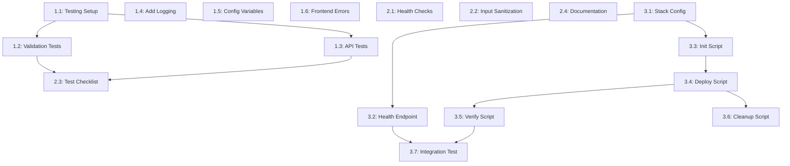
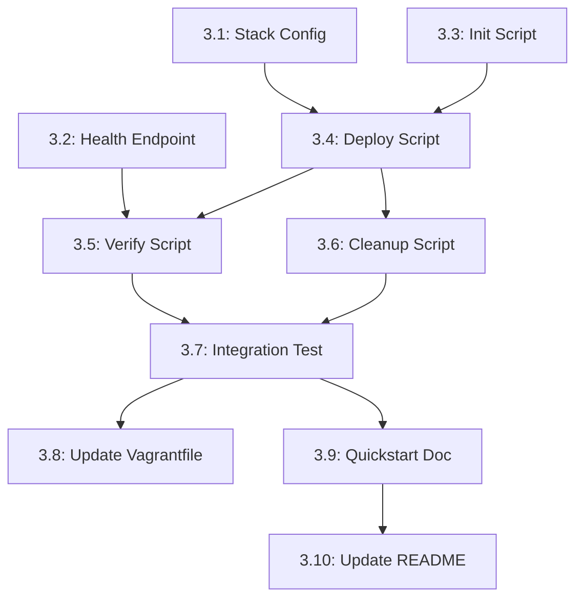

# Names Manager - Task List

## Overview
This document breaks down the simplified implementation plan into small, manageable tasks that can be completed independently and reviewed easily.

## Phase 1: Basic Testing & Code Quality (Week 1-2)

### Task 1.1: Set Up Basic Testing Infrastructure
**Estimated Time**: 2-3 hours
**Priority**: High

**Description**: Add basic testing capability to the backend

**Steps**:
1. Create `backend/requirements-dev.txt` with pytest and coverage
2. Create `backend/tests/` directory structure
3. Add basic pytest configuration
4. Verify tests can run (even with 0 tests initially)

**Files to Create/Modify**:
- `backend/requirements-dev.txt`
- `backend/tests/__init__.py`
- `backend/tests/conftest.py` (optional, for shared fixtures)

**Acceptance Criteria**:
- [ ] `cd backend && python -m pytest` runs successfully
- [ ] No import errors or configuration issues
- [ ] Coverage reporting works with `pytest --cov`

**Review Checklist**:
- Requirements file includes necessary testing dependencies
- Test directory structure is logical
- Command to run tests is documented

---

### Task 1.2: Create Basic Validation Tests
**Estimated Time**: 2-3 hours
**Priority**: High
**Depends On**: Task 1.1

**Description**: Test the core validation function with various inputs

**Steps**:
1. Create `backend/tests/test_validation.py`
2. Test valid names (normal cases)
3. Test invalid names (empty, too long, whitespace-only)
4. Test edge cases (exactly 50 chars, special characters)

**Files to Create/Modify**:
- `backend/tests/test_validation.py`

**Acceptance Criteria**:
- [ ] All validation edge cases covered
- [ ] Tests pass for current validation logic
- [ ] Test coverage for validation function is 100%

**Review Checklist**:
- Tests cover both valid and invalid inputs
- Test names are descriptive
- Expected behavior matches actual validation logic

---

### Task 1.3: Create Basic API Endpoint Tests
**Estimated Time**: 3-4 hours
**Priority**: High
**Depends On**: Task 1.1

**Description**: Test the three main API endpoints with basic scenarios

**Steps**:
1. Create `backend/tests/test_main.py`
2. Set up test client for Flask app
3. Test POST /api/names with valid/invalid data
4. Test GET /api/names 
5. Test DELETE /api/names/<id> with valid/invalid IDs

**Files to Create/Modify**:
- `backend/tests/test_main.py`

**Acceptance Criteria**:
- [ ] Each endpoint has at least 2 test cases (success/failure)
- [ ] Tests use proper HTTP status codes
- [ ] Database interactions are isolated (use test database or mocks)

**Review Checklist**:
- Tests don't interfere with each other
- Database state is properly managed
- Response formats match expected API contracts

---

### Task 1.4: Add Basic Logging to Backend
**Estimated Time**: 1-2 hours
**Priority**: Medium

**Description**: Add simple logging to track requests and errors

**Steps**:
1. Import Python logging module in `main.py`
2. Configure basic logging format
3. Add log statements to each API endpoint
4. Log validation errors and database operations

**Files to Create/Modify**:
- `backend/main.py`

**Acceptance Criteria**:
- [ ] Application logs startup message
- [ ] Each API call logs request type and outcome
- [ ] Errors are logged with appropriate level
- [ ] Log format is readable and informative

**Review Checklist**:
- Log messages are helpful for debugging
- Sensitive information is not logged
- Log level is appropriate for each message

---

### Task 1.5: Extract Configuration to Environment Variables
**Estimated Time**: 1-2 hours
**Priority**: Medium

**Description**: Move hardcoded configuration to environment variables

**Steps**:
1. Update `main.py` to use environment variables for constants
2. Update `docker-compose.yml` to set environment variables
3. Create `.env.example` file for documentation
4. Update validation to use configurable max length

**Files to Create/Modify**:
- `backend/main.py`
- `docker-compose.yml`
- `.env.example`

**Acceptance Criteria**:
- [ ] No hardcoded database credentials in source code
- [ ] MAX_NAME_LENGTH configurable via environment
- [ ] Application still works with default values
- [ ] Configuration is documented

**Review Checklist**:
- All sensitive values are externalized
- Default values are sensible
- Documentation explains how to configure

---

### Task 1.6: Improve Frontend Error Handling
**Estimated Time**: 2-3 hours
**Priority**: Medium

**Description**: Better user experience for error scenarios

**Steps**:
1. Create error display function in `app.js`
2. Add loading states for form submission
3. Improve error messages for different scenarios
4. Add client-side validation feedback

**Files to Create/Modify**:
- `frontend/app.js`
- `frontend/index.html` (if CSS changes needed)

**Acceptance Criteria**:
- [ ] Users see clear error messages for invalid inputs
- [ ] Loading states prevent double-submission
- [ ] Errors are visually distinct and temporary
- [ ] Form resets appropriately after errors

**Review Checklist**:
- Error messages are user-friendly
- UI feedback is immediate and clear
- Error states don't break the interface

---

## Phase 2: Basic Monitoring & Documentation (Week 2-3)

### Task 2.1: Add Health Check Endpoints
**Estimated Time**: 1-2 hours
**Priority**: Medium

**Description**: Simple endpoints to verify application status

**Steps**:
1. Add `/health` endpoint that returns basic status
2. Add `/health/db` endpoint that checks database connection
3. Test endpoints manually
4. Document endpoint usage

**Files to Create/Modify**:
- `backend/main.py`

**Acceptance Criteria**:
- [ ] `/health` returns 200 with status message
- [ ] `/health/db` returns 200 when DB connected, 503 when not
- [ ] Endpoints return JSON responses
- [ ] Database check handles connection failures gracefully

**Review Checklist**:
- Health checks don't expose sensitive information
- Database check doesn't cause performance issues
- Responses are consistent and documented

---

### Task 2.2: Add Basic Input Sanitization
**Estimated Time**: 1-2 hours
**Priority**: High

**Description**: Prevent basic XSS vulnerabilities

**Steps**:
1. Import HTML escaping functionality
2. Update validation function to sanitize inputs
3. Test with potentially dangerous inputs
4. Verify frontend displays escaped content correctly

**Files to Create/Modify**:
- `backend/main.py`

**Acceptance Criteria**:
- [ ] HTML tags in names are escaped/removed
- [ ] Script tags cannot be injected
- [ ] Normal names still work correctly
- [ ] Frontend displays content safely

**Review Checklist**:
- Sanitization is applied consistently
- Normal use cases are not broken
- Security improvement is measurable

---

### Task 2.3: Create Manual Testing Checklist
**Estimated Time**: 2-3 hours
**Priority**: Medium

**Description**: Document testing procedures for the application

**Steps**:
1. Create `TESTING.md` file
2. Document step-by-step manual test cases
3. Include expected outcomes for each test
4. Test the checklist by following it completely

**Files to Create/Modify**:
- `TESTING.md`

**Acceptance Criteria**:
- [ ] All major user workflows covered
- [ ] Error scenarios included
- [ ] Steps are clear enough for new developer to follow
- [ ] Expected outcomes are specific

**Review Checklist**:
- Test cases are realistic user scenarios
- Instructions are clear and complete
- Document can be used by someone else

---

### Task 2.4: Update Documentation
**Estimated Time**: 2-3 hours
**Priority**: Medium

**Description**: Improve README and setup instructions

**Steps**:
1. Update `README.md` with clearer setup instructions
2. Document how to run tests
3. Document new environment variables
4. Add troubleshooting section

**Files to Create/Modify**:
- `README.md`
- `src/README.md`

**Acceptance Criteria**:
- [ ] New developer can set up application from README
- [ ] Testing instructions are clear
- [ ] Environment variable configuration explained
- [ ] Common issues and solutions documented

**Review Checklist**:
- Instructions are tested by following them
- Prerequisites are clearly stated
- Examples are provided where helpful

---

## Task Dependencies

## Estimated Timeline

**Total Effort**: 35-55 hours over 4-5 weeks

### Week 1 (10-15 hours) - Phase 1
- Task 1.1: Testing Setup (2-3h)
- Task 1.2: Validation Tests (2-3h)  
- Task 1.3: API Tests (3-4h)
- Task 1.4: Add Logging (1-2h)
- Task 1.5: Config Variables (1-2h)

### Week 2 (8-12 hours) - Phase 2
- Task 1.6: Frontend Errors (2-3h)
- Task 2.1: Health Checks (1-2h)
- Task 2.2: Input Sanitization (1-2h)
- Task 2.3: Test Checklist (2-3h)
- Task 2.4: Documentation (2-3h)

### Week 3-4 (8-12 hours) - Phase 3: Core Infrastructure
- Task 3.1: Create Stack Configuration (2-3h)
- Task 3.2: Add Health Endpoint (1-2h)
- Task 3.3: Init Swarm Script (2-3h)
- Task 3.4: Deploy Script (1-2h)

### Week 4-5 (9-16 hours) - Phase 3: Ops & Testing
- Task 3.5: Verify Script (1-2h)
- Task 3.6: Cleanup Script (1-2h)
- Task 3.7: End-to-End Testing (3-5h)
- Task 3.8: Update Vagrantfile (1-2h)
- Task 3.9: Quickstart Documentation (2-3h)
- Task 3.10: Update Main README (1-2h)

## Review Guidelines

### For Each Task:
1. **Functionality**: Does the change work as described?
2. **Quality**: Is the code clean and maintainable?
3. **Testing**: Are changes tested appropriately?
4. **Documentation**: Are changes documented if needed?
5. **Compatibility**: Does existing functionality still work?

### Before Merging:
- All acceptance criteria met
- Code follows existing style
- No regressions in manual testing
- Documentation updated if needed

---

## Phase 3: Docker Swarm Multi-Node Orchestration (Week 3-5)

### Task 3.1: Create Docker Stack Configuration
**Estimated Time**: 2-3 hours
**Priority**: High
**Branch**: `001-swarm-orchestration`

**Description**: Create Docker Swarm stack file for multi-node deployment based on existing docker-compose.yml

**Steps**:
1. Create `src/swarm/` directory
2. Create `stack.yaml` based on `docker-compose.yml`
3. Add overlay network configuration
4. Add placement constraints (db on worker, web+api on manager)
5. Configure ingress port publishing (80:80 on manager)
6. Configure persistent volume for database on worker
7. Preserve all existing environment variables and settings

**Files to Create/Modify**:
- `src/swarm/stack.yaml` (new)

**Acceptance Criteria**:
- [ ] Stack file has `version: "3.8"` or higher
- [ ] Overlay network `appnet` configured with attachable: true
- [ ] Database service has placement constraint: `node.role == worker`
- [ ] Frontend service has placement constraint: `node.role == manager`
- [ ] Backend service has placement constraint: `node.role == manager`
- [ ] Frontend published on port 80 (ingress mode)
- [ ] Database volume configured for `/var/lib/postgres-data` on worker
- [ ] All health checks preserved from docker-compose.yml
- [ ] Restart policies configured for all services

**Review Checklist**:
- Stack file syntax is valid (test with `docker stack config`)
- Placement constraints match specification requirements
- Service dependencies properly configured
- Volume persistence configured correctly

---

### Task 3.2: Add Backend Health Endpoint
**Estimated Time**: 1-2 hours
**Priority**: High
**Depends On**: None (can be done in parallel)

**Description**: Add `/healthz` endpoint to backend API that returns service health status

**Steps**:
1. Add new route `/healthz` to `backend/main.py`
2. Implement health check that tests database connectivity
3. Return `{"status": "ok"}` with 200 status code when healthy
4. Return `{"status": "unhealthy", "reason": "..."}` with 503 when not healthy
5. Add basic logging for health check calls
6. Test endpoint locally

**Files to Create/Modify**:
- `backend/main.py` (modify)

**Acceptance Criteria**:
- [ ] GET `/healthz` returns 200 with `{"status": "ok"}` when database is reachable
- [ ] GET `/healthz` returns 503 with error details when database is unreachable
- [ ] Endpoint doesn't require authentication
- [ ] Health check doesn't perform heavy operations (simple db ping)
- [ ] Endpoint is logged at DEBUG level (not INFO to avoid spam)

**Review Checklist**:
- Health check is fast (<100ms)
- Error messages are informative
- No sensitive information leaked in error responses
- Endpoint documented in API documentation

---

### Task 3.3: Create Swarm Initialization Script
**Estimated Time**: 2-3 hours
**Priority**: High
**Depends On**: Task 3.1

**Description**: Create ops script to initialize Docker Swarm cluster with Vagrant worker node

**Steps**:
1. Create `ops/` directory
2. Create `ops/init-swarm.sh` script
3. Add prerequisite checks (Vagrant, VirtualBox, Docker installed)
4. Add check if Swarm already initialized
5. Implement Vagrant VM startup
6. Implement Swarm initialization on manager (laptop)
7. Implement worker join process
8. Add verification steps
9. Make script idempotent (safe to run multiple times)
10. Add helpful output messages

**Files to Create/Modify**:
- `ops/init-swarm.sh` (new)

**Acceptance Criteria**:
- [ ] Script checks for required tools (vagrant, docker)
- [ ] Script starts Vagrant VM if not running
- [ ] Script initializes Swarm with correct advertise address (192.168.56.1)
- [ ] Script joins worker VM to Swarm cluster
- [ ] Script verifies both nodes are Ready
- [ ] Script is idempotent (doesn't fail if Swarm already initialized)
- [ ] Script provides clear success/failure messages
- [ ] Script includes usage instructions (--help flag)
- [ ] Exit codes: 0=success, 1=error, 2=already initialized

**Review Checklist**:
- Error handling for each step
- Clear error messages guide user to resolution
- Script can be safely re-run
- Cleanup on failure (doesn't leave partial state)

---

### Task 3.4: Create Stack Deployment Script
**Estimated Time**: 1-2 hours
**Priority**: High
**Depends On**: Task 3.1, Task 3.3

**Description**: Create ops script to deploy the application stack to Swarm cluster

**Steps**:
1. Create `ops/deploy.sh` script
2. Add Swarm initialization check
3. Add .env file validation
4. Implement stack deployment command
5. Add service readiness waiting logic
6. Display deployment status
7. Show service endpoints and access instructions

**Files to Create/Modify**:
- `ops/deploy.sh` (new)

**Acceptance Criteria**:
- [ ] Script verifies Swarm is initialized before deploying
- [ ] Script checks .env file exists and has required variables
- [ ] Script deploys stack with `docker stack deploy -c swarm/stack.yaml names-app`
- [ ] Script waits for all services to be running (timeout: 2 minutes)
- [ ] Script shows service status after deployment
- [ ] Script displays frontend URL (http://localhost or manager IP)
- [ ] Script has --update flag to redeploy existing stack
- [ ] Exit codes: 0=success, 1=error, 2=timeout

**Review Checklist**:
- Deployment doesn't fail if stack already exists
- Timeout values are reasonable
- Service status output is clear and helpful
- Script provides next steps after successful deployment

---

### Task 3.5: Create Verification Script
**Estimated Time**: 1-2 hours
**Priority**: High
**Depends On**: Task 3.2, Task 3.4

**Description**: Create ops script to verify Swarm deployment health and service placement

**Steps**:
1. Create `ops/verify.sh` script
2. Check all services are running (replicas 1/1)
3. Verify service placement (db on worker, web+api on manager)
4. Test service discovery (can services reach each other)
5. Check health endpoints (db pg_isready, api /healthz)
6. Test frontend accessibility on port 80
7. Generate comprehensive status report

**Files to Create/Modify**:
- `ops/verify.sh` (new)

**Acceptance Criteria**:
- [ ] Script checks `docker service ls` shows all services running
- [ ] Script verifies service placement using `docker service ps`
- [ ] Script tests database health with pg_isready
- [ ] Script tests backend health endpoint `/healthz`
- [ ] Script tests frontend accessibility (HTTP 200 on port 80)
- [ ] Script tests cross-node service discovery
- [ ] Script outputs clear PASS/FAIL for each check
- [ ] Script provides summary and troubleshooting hints on failures
- [ ] Exit codes: 0=all checks pass, 1=some checks fail

**Review Checklist**:
- Each check has clear pass/fail criteria
- Failures include helpful troubleshooting info
- Script can run repeatedly without side effects
- Output is easy to understand

---

### Task 3.6: Create Cleanup Script
**Estimated Time**: 1-2 hours
**Priority**: Medium
**Depends On**: Task 3.4

**Description**: Create ops script to tear down Swarm deployment and optionally clean up cluster

**Steps**:
1. Create `ops/cleanup.sh` script
2. Implement stack removal
3. Add optional volume cleanup (with confirmation)
4. Add optional Swarm leave (with confirmation)
5. Add optional Vagrant VM stop (with confirmation)
6. Implement cleanup verification
7. Add helpful prompts and confirmations

**Files to Create/Modify**:
- `ops/cleanup.sh` (new)

**Acceptance Criteria**:
- [ ] Script removes stack with `docker stack rm names-app`
- [ ] Script waits for services to fully stop
- [ ] Script prompts before removing volumes (data loss warning)
- [ ] Script has --full flag to remove stack + volumes + leave Swarm
- [ ] Script has --keep-swarm flag to only remove stack
- [ ] Script verifies cleanup succeeded
- [ ] Script shows what was removed and what remains
- [ ] Exit codes: 0=success, 1=error, 2=user cancelled

**Review Checklist**:
- Dangerous operations require confirmation
- Default behavior is safe (doesn't delete data)
- Clear messages about what will be deleted
- Provides command to restore if needed

---

### Task 3.7: End-to-End Integration Testing
**Estimated Time**: 3-5 hours
**Priority**: High
**Depends On**: Tasks 3.3, 3.4, 3.5, 3.6

**Description**: Perform complete integration testing of Swarm deployment workflow

**Steps**:
1. Start from clean state (no Swarm, Vagrant VM stopped)
2. Run `ops/init-swarm.sh` and verify success
3. Run `ops/deploy.sh` and verify deployment
4. Run `ops/verify.sh` and verify all checks pass
5. Test application functionality (add/view/delete names)
6. Verify data persists on worker node
7. Test service recovery (stop container, verify auto-restart)
8. Test stack update (modify stack, redeploy)
9. Run `ops/cleanup.sh` and verify cleanup
10. Document any issues found and solutions

**Files to Create/Modify**:
- `specs/001-swarm-orchestration/TESTING.md` (new - document test results)

**Acceptance Criteria**:
- [ ] Fresh init-swarm completes successfully
- [ ] Stack deploys without errors
- [ ] All verification checks pass
- [ ] Can add names through web UI
- [ ] Names persist after service restart
- [ ] Names persist after stack redeploy
- [ ] Database volume is on worker node
- [ ] Swarm restarts failed containers automatically
- [ ] Frontend accessible on port 80
- [ ] Cleanup script successfully removes deployment

**Review Checklist**:
- Test results documented with screenshots/logs
- Any issues discovered are documented with solutions
- Test can be repeated by another person
- All acceptance scenarios from spec are tested

---

### Task 3.8: Update Vagrantfile for Persistent Storage
**Estimated Time**: 1-2 hours
**Priority**: Medium
**Depends On**: Task 3.7 (test results inform changes)

**Description**: Ensure Vagrantfile properly configures persistent storage for database

**Steps**:
1. Review current Vagrantfile configuration
2. Verify database volume path `/var/lib/postgres-data` is correct
3. Ensure synced folder for backups works correctly
4. Test volume persistence across VM restarts
5. Document any changes made
6. Update VAGRANT_SETUP.md if needed

**Files to Create/Modify**:
- `vagrant/Vagrantfile` (modify if needed)
- `vagrant/VAGRANT_SETUP.md` (update if needed)

**Acceptance Criteria**:
- [ ] Database volume persists across `vagrant reload`
- [ ] Database volume persists across `vagrant halt/up`
- [ ] Backup synced folder works correctly
- [ ] Volume path `/var/lib/postgres-data` exists on worker
- [ ] No permission issues with volume
- [ ] Documentation reflects actual configuration

**Review Checklist**:
- Tested with actual Vagrant VM
- Data persistence verified
- Documentation matches implementation
- No conflicts with Swarm volume driver

---

### Task 3.9: Create Swarm Quickstart Documentation
**Estimated Time**: 2-3 hours
**Priority**: High
**Depends On**: Task 3.7 (testing complete)

**Description**: Create comprehensive quickstart guide for Swarm deployment

**Steps**:
1. Create `specs/001-swarm-orchestration/QUICKSTART.md`
2. Document prerequisites clearly
3. Create step-by-step quick start (5 minutes to deploy)
4. Add architecture diagram
5. Document common troubleshooting scenarios
6. Add section on switching between Compose and Swarm
7. Include verification steps
8. Add links to detailed documentation

**Files to Create/Modify**:
- `specs/001-swarm-orchestration/QUICKSTART.md` (new)

**Acceptance Criteria**:
- [ ] Prerequisites section lists all requirements
- [ ] Quick start can be completed in 5 minutes
- [ ] All ops script commands documented
- [ ] Architecture diagram shows manager/worker topology
- [ ] Troubleshooting covers top 5 common issues
- [ ] Switching between Compose/Swarm documented
- [ ] Links to vagrant/, specs/, and src/ docs
- [ ] Tested by following guide from scratch

**Review Checklist**:
- Guide is accurate and up-to-date
- Steps are in correct order
- Commands are copy-pasteable
- Screenshots/diagrams aid understanding

---

### Task 3.10: Update Main README with Swarm Instructions
**Estimated Time**: 1-2 hours
**Priority**: High
**Depends On**: Task 3.9

**Description**: Update main repository README to include Swarm deployment option

**Steps**:
1. Update `src/README.md` with Swarm deployment section
2. Add comparison: when to use Compose vs Swarm
3. Link to vagrant/VAGRANT_SETUP.md for worker setup
4. Add quick commands for ops scripts
5. Add architecture overview diagram
6. Update table of contents
7. Ensure existing Compose instructions still correct

**Files to Create/Modify**:
- `src/README.md` (modify)
- `README.md` (root - add link to Swarm docs)

**Acceptance Criteria**:
- [ ] Swarm deployment section added
- [ ] Clear guidance on Compose vs Swarm usage
- [ ] Links to all relevant documentation
- [ ] Quick reference for ops scripts
- [ ] Architecture diagram included or linked
- [ ] Table of contents updated
- [ ] Existing Compose instructions unchanged and correct

**Review Checklist**:
- README is well-organized
- New content flows naturally with existing content
- All links work correctly
- No duplicate or conflicting information

---

## Phase 3 Task Dependencies

## Summary

This comprehensive task breakdown covers all three phases of the Names Manager improvements:
- **Phase 1-2**: Testing, code quality, monitoring (Completed)
- **Phase 3**: Docker Swarm multi-node orchestration (Current)

Each task is sized for completion in 1-5 hours and includes clear acceptance criteria and review guidelines. Phase 3 adds approximately 15-25 hours of work spread across infrastructure setup, operational tooling, testing, and documentation.