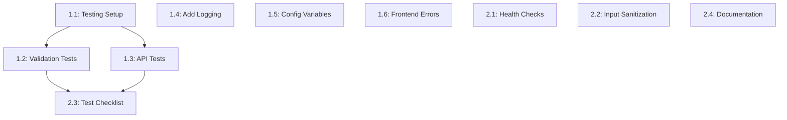

# Names Manager - Task List: Docker Swarm Migration

## Overview
This document breaks down the Docker Swarm migration plan into small, actionable tasks. Each task corresponds to specific milestones from the implementation plan (30-plan.md).

**Project Goal**: Migrate from Docker Compose (single-host) to Docker Swarm (multi-host) with distributed deployment.

**Timeline**: 15-21 days (3 weeks part-time)
**Total Effort**: 58-72 hours

---

## Phase 0: Prerequisites & Bug Fixes (Days 1-3)

### Task 0.1: Fix Backend GET /api/names Response Format
**Estimated Time**: 1 hour
**Priority**: CRITICAL
**Depends On**: None

**Description**: Fix the response format to match frontend expectations

**Steps**:
1. Open `src/backend/main.py`
2. Locate the `list_names()` function (line ~136)
3. Change `return jsonify(results)` to `return jsonify({"names": results}), 200`
4. Test with Docker Compose: `cd src && docker-compose up`
5. Verify names list displays in browser

**Files to Modify**:
- `src/backend/main.py`

**Acceptance Criteria**:
- [ ] GET /api/names returns `{"names": [...]}`
- [ ] Frontend displays names correctly
- [ ] No errors in browser console

**Testing**:
```bash
cd src/
docker-compose up --build
# Open browser: http://localhost:8080
# Add a name, verify it appears in list
```

---

### Task 0.2: Fix Frontend Display Logic
**Estimated Time**: 1-2 hours
**Priority**: CRITICAL
**Depends On**: Task 0.1

**Description**: Update frontend to properly handle response objects with timestamps

**Steps**:
1. Open `src/frontend/app.js`
2. Locate `loadNames()` function (line ~117)
3. Update to destructure response objects: `item.name`, `item.id`, `item.created_at`
4. Add timestamp display in list items
5. Test display with multiple names

**Files to Modify**:
- `src/frontend/app.js`

**Code Changes**:
```javascript
// Change from:
data.names.forEach((name) => {
  li.innerHTML = `<span>${escapeHtml(name)}</span>...`
})

// Change to:
data.names.forEach((item) => {
  li.innerHTML = `
    <div>
      <span class="name">${escapeHtml(item.name)}</span>
      <span class="meta">${new Date(item.created_at).toLocaleString()}</span>
    </div>
    <button onclick="deleteName(${item.id})" class="delete-btn">Delete</button>
  `
})
```

**Acceptance Criteria**:
- [ ] Names display with proper formatting
- [ ] Timestamps show in human-readable format
- [ ] No `[object Object]` displayed

---

### Task 0.3: Fix Frontend DELETE to Use ID
**Estimated Time**: 1 hour
**Priority**: CRITICAL
**Depends On**: Task 0.2

**Description**: Update delete function to use ID parameter instead of name string

**Steps**:
1. Open `src/frontend/app.js`
2. Locate `deleteName()` function (line ~203)
3. Change parameter from `nameToDelete` to `nameId`
4. Update DELETE request to use `/names/${nameId}`
5. Update confirmation dialog to get name from DOM

**Files to Modify**:
- `src/frontend/app.js`

**Code Changes**:
```javascript
async function deleteName(nameId) {
  try {
    const nameElement = event.target.closest('li').querySelector('.name');
    const nameText = nameElement.textContent;
    
    if (!confirm(`Are you sure you want to delete "${nameText}"?`)) {
      return;
    }
    
    const res = await apiRequest(`/names/${nameId}`, { 
      method: "DELETE" 
    });
    
    showSuccess(`Successfully deleted "${nameText}"`);
    await loadNames();
  } catch (error) {
    // error handling...
  }
}
```

**Acceptance Criteria**:
- [ ] Delete button passes ID parameter
- [ ] DELETE request uses integer ID in path
- [ ] Deletion works successfully
- [ ] Confirmation shows correct name

---

### Task 0.4: Fix Health Endpoint to Return {"status":"ok"}
**Estimated Time**: 30 minutes
**Priority**: HIGH
**Depends On**: None

**Description**: Fix health endpoint to return exact required format {"status":"ok"}

**Current Issue**:
- `/api/health` currently returns `{"status": "healthy", ...}` with extra fields
- **REQUIRED**: Must return exactly `{"status":"ok"}` (or support `/healthz` alias)

**Steps**:
1. Open `src/backend/main.py`
2. Locate `/api/health` endpoint (line ~183)
3. Change response from `{"status": "healthy"}` to `{"status": "ok"}`
4. Remove extra fields (version, timestamp, etc.)
5. Optionally add `/healthz` alias endpoint
6. Test both endpoints

**Files to Modify**:
- `src/backend/main.py`

**Required Changes**:
```python
@app.route("/api/health", methods=["GET"])
@app.route("/healthz", methods=["GET"])  # Optional alias
def health_check():
    """Basic health check endpoint."""
    logger.info("Health check requested")
    return jsonify({"status": "ok"}), 200
```

**Acceptance Criteria**:
- [ ] GET /api/health returns exactly `{"status":"ok"}`
- [ ] HTTP status code is 200
- [ ] No extra fields in response
- [ ] Optional: /healthz also works (alias)

**Testing**:
```bash
curl http://localhost:8080/api/health
# Expected: {"status":"ok"}

# Optional:
curl http://localhost:8080/healthz
# Expected: {"status":"ok"}
```

---

### Task 0.5: Update Backend to Use DATABASE_URL
**Estimated Time**: 30 minutes
**Priority**: HIGH
**Depends On**: None

**Description**: Ensure backend reads database connection from DATABASE_URL environment variable

**Steps**:
1. Open `src/backend/main.py`
2. Check if `DB_URL` environment variable is read
3. Add support for `DATABASE_URL` (Swarm stack will use this name)
4. Update to prefer DATABASE_URL over DB_URL

**Files to Modify**:
- `src/backend/main.py`

**Code Changes**:
```python
# Support both DB_URL (Compose) and DATABASE_URL (Swarm)
DATABASE_URL = os.environ.get(
    "DATABASE_URL",
    os.environ.get("DB_URL", "postgresql+psycopg2://names_user:names_pass@db:5432/namesdb")
)

engine = create_engine(DATABASE_URL, echo=DB_ECHO, future=True)
```

**Acceptance Criteria**:
- [ ] Reads DATABASE_URL environment variable
- [ ] Falls back to DB_URL if DATABASE_URL not set
- [ ] Works with Docker Compose (backward compatible)

---

### Task 0.6: End-to-End Testing with Docker Compose
**Estimated Time**: 1 hour
**Priority**: CRITICAL
**Depends On**: Tasks 0.1, 0.2, 0.3, 0.4, 0.5

**Description**: Verify all bug fixes work together with Docker Compose

**Steps**:
1. Rebuild images: `cd src && docker-compose build`
2. Start services: `docker-compose up`
3. Test add name functionality
4. Test view names with timestamps
5. Test delete name functionality
6. Test health endpoint
7. Document any remaining issues

**Acceptance Criteria**:
- [ ] Can add names successfully
- [ ] Names display with timestamps
- [ ] Can delete names by ID
- [ ] Health endpoint returns `{"status":"ok"}`
- [ ] No console errors
- [ ] All CRUD operations work

**Testing Checklist**:
- [ ] Add 3-5 names
- [ ] Verify all appear with timestamps
- [ ] Delete middle name
- [ ] Refresh page, verify data persists
- [ ] Check `/api/health` endpoint
- [ ] Stop and restart services, verify data still there

---

## Phase 1: Infrastructure Setup (Days 4-7)

### Task 1.1: Install Vagrant and VirtualBox
**Estimated Time**: 1 hour
**Priority**: HIGH
**Depends On**: Phase 0 complete

**Description**: Set up prerequisites for VM management

**Steps**:
1. Check if Vagrant installed: `vagrant --version`
2. Check if VirtualBox installed: `VBoxManage --version`
3. Install Vagrant if needed: https://www.vagrantup.com/downloads
4. Install VirtualBox if needed: https://www.virtualbox.org/wiki/Downloads
5. Verify both tools work together

**Acceptance Criteria**:
- [x] Vagrant version 2.2+ installed (✅ v2.4.9)
- [x] VirtualBox version 6.1+ installed (✅ v7.1.12)
- [x] Can run `vagrant init` successfully
- [x] VirtualBox GUI opens

**Testing**:
```bash
vagrant --version
VBoxManage --version
vagrant init bento/ubuntu-22.04
vagrant status
```

**Note**: Using `bento/ubuntu-22.04` for ARM compatibility (Apple Silicon Macs).

---

### Task 1.2: Create Vagrantfile
**Estimated Time**: 2 hours
**Priority**: HIGH
**Depends On**: Task 1.1

**Description**: Define two VMs (manager and worker) with proper configuration

**Steps**:
1. Create `Vagrantfile` in project root
2. Define manager VM: Ubuntu 22.04, 2GB RAM, 2 CPU, IP 192.168.56.10
3. Define worker VM: Ubuntu 22.04, 2GB RAM, 2 CPU, IP 192.168.56.11
4. Configure port forwarding: 80:8080 on manager
5. Set up provisioning script path

**Files to Create**:
- `Vagrantfile`

**Vagrantfile Template**:
```ruby
Vagrant.configure("2") do |config|
  config.vm.define "manager" do |manager|
    manager.vm.box = "bento/ubuntu-22.04"
    manager.vm.hostname = "swarm-manager"
    manager.vm.network "private_network", ip: "192.168.56.10"
    manager.vm.network "forwarded_port", guest: 80, host: 8080
    manager.vm.provider "virtualbox" do |vb|
      vb.memory = "2048"
      vb.cpus = 2
      vb.name = "names-manager"
    end
    manager.vm.provision "shell", path: "vagrant/install-docker.sh"
  end
  
  config.vm.define "worker" do |worker|
    worker.vm.box = "bento/ubuntu-22.04"
    worker.vm.hostname = "swarm-worker"
    worker.vm.network "private_network", ip: "192.168.56.11"
    worker.vm.provider "virtualbox" do |vb|
      vb.memory = "2048"
      vb.cpus = 2
      vb.name = "names-worker"
    end
    worker.vm.provision "shell", path: "vagrant/install-docker.sh"
  end
end
```

**Acceptance Criteria**:
- [x] Vagrantfile validates without errors (✅ vagrant validate passed)
- [x] Manager VM configured with correct specs (✅ 2GB RAM, 2 CPU, 192.168.56.10)
- [x] Worker VM configured with correct specs (✅ 2GB RAM, 2 CPU, 192.168.56.11)
- [x] Private network configured (✅ 192.168.56.0/24)
- [x] Port forwarding set up (✅ 80:8080 on manager)

---

### Task 1.3: Create Docker Installation Script
**Estimated Time**: 1 hour
**Priority**: HIGH
**Depends On**: Task 1.2

**Description**: Script to install Docker Engine on both VMs

**Steps**:
1. Create directory: `mkdir -p vagrant`
2. Create `vagrant/install-docker.sh`
3. Add Docker installation commands for Ubuntu
4. Make script executable
5. Test script syntax

**Files to Create**:
- `vagrant/install-docker.sh`

**Script Content**:
```bash
#!/bin/bash
set -e

echo "Installing Docker on $(hostname)..."

# Update package index
apt-get update

# Install prerequisites
apt-get install -y \
    ca-certificates \
    curl \
    gnupg \
    lsb-release

# Add Docker GPG key
mkdir -p /etc/apt/keyrings
curl -fsSL https://download.docker.com/linux/ubuntu/gpg | \
    gpg --dearmor -o /etc/apt/keyrings/docker.gpg

# Add Docker repository
echo \
  "deb [arch=$(dpkg --print-architecture) signed-by=/etc/apt/keyrings/docker.gpg] \
  https://download.docker.com/linux/ubuntu \
  $(lsb_release -cs) stable" | tee /etc/apt/sources.list.d/docker.list > /dev/null

# Install Docker
apt-get update
apt-get install -y docker-ce docker-ce-cli containerd.io docker-compose-plugin

# Add vagrant user to docker group
usermod -aG docker vagrant

# Enable Docker service
systemctl enable docker
systemctl start docker

echo "Docker installation complete!"
docker --version
```

**Acceptance Criteria**:
- [x] Script has execute permissions (✅ -rwxr-xr-x)
- [x] Script installs Docker CE (✅ docker-ce, docker-ce-cli, containerd.io)
- [x] Script adds vagrant user to docker group (✅ usermod -aG docker vagrant)
- [x] Script enables Docker service (✅ systemctl enable/start docker)

---

### Task 1.4: Start and Verify VMs
**Estimated Time**: 1 hour
**Priority**: HIGH
**Depends On**: Tasks 1.2, 1.3

**Description**: Bring up both VMs and verify basic connectivity

**Steps**:
1. Start VMs: `vagrant up`
2. Wait for provisioning to complete
3. Check VM status: `vagrant status`
4. SSH to manager: `vagrant ssh manager`
5. SSH to worker: `vagrant ssh worker`
6. Verify Docker on both VMs

**Acceptance Criteria**:
- [x] Both VMs start successfully (✅ both running)
- [x] Docker installed on manager VM (✅ Docker 28.5.1)
- [x] Docker installed on worker VM (✅ Docker 28.5.1)
- [x] Can SSH to both VMs (✅ vagrant ssh works)
- [x] `docker --version` works on both (✅ verified)

**Testing**:
```bash
vagrant up
vagrant status  # Both should show "running"
vagrant ssh manager -c "docker --version"
vagrant ssh worker -c "docker --version"
vagrant ssh manager -c "ping -c 3 192.168.56.11"
vagrant ssh worker -c "ping -c 3 192.168.56.10"
```

---

### Task 1.5: Initialize Docker Swarm on Manager
**Estimated Time**: 30 minutes
**Priority**: HIGH
**Depends On**: Task 1.4

**Description**: Initialize Swarm cluster on manager node

**Steps**:
1. SSH to manager: `vagrant ssh manager`
2. Initialize Swarm: `docker swarm init --advertise-addr 192.168.56.10`
3. Save the worker join token (IMPORTANT!)
4. Verify Swarm status: `docker node ls`

**Acceptance Criteria**:
- [x] Swarm initialized successfully (✅ Swarm active)
- [x] Manager node shows as Leader (✅ MANAGER STATUS: Leader)
- [x] Join token saved securely (✅ saved in vagrant/swarm-join-tokens.md)
- [x] `docker node ls` shows 1 node (✅ swarm-manager Ready/Active)

**Commands**:
```bash
vagrant ssh manager
docker swarm init --advertise-addr 192.168.56.10

# Save this output!
# Example: docker swarm join --token SWMTKN-1-xxx... 192.168.56.10:2377

docker node ls
# Should show 1 node with MANAGER STATUS = Leader
```

---

### Task 1.6: Join Worker to Swarm
**Estimated Time**: 30 minutes
**Priority**: HIGH
**Depends On**: Task 1.5

**Description**: Add worker node to Swarm cluster

**Steps**:
1. SSH to worker: `vagrant ssh worker`
2. Run join command from Task 1.5 output
3. Return to manager and verify: `docker node ls`
4. Should see 2 nodes (1 manager, 1 worker)

**Acceptance Criteria**:
- [x] Worker joins Swarm successfully (✅ "This node joined a swarm as a worker")
- [x] `docker node ls` shows 2 nodes (✅ swarm-manager + swarm-worker)
- [x] Manager shows as Leader (✅ MANAGER STATUS: Leader)
- [x] Worker shows as Active (✅ STATUS: Ready, AVAILABILITY: Active)

**Commands**:
```bash
# On worker VM
vagrant ssh worker
docker swarm join --token <TOKEN_FROM_TASK_1.5> 192.168.56.10:2377

# Back on manager VM
vagrant ssh manager
docker node ls
# Should show:
# ID     HOSTNAME        STATUS  AVAILABILITY  MANAGER STATUS
# xxx    swarm-manager   Ready   Active        Leader
# yyy    swarm-worker    Ready   Active
```

---

### Task 1.7: Label Worker Node for Database
**Estimated Time**: 15 minutes
**Priority**: CRITICAL
**Depends On**: Task 1.6

**Description**: Add custom label `role=db` to worker node (REQUIRED for placement)

**Steps**:
1. SSH to manager: `vagrant ssh manager`
2. Get worker node ID: `docker node ls`
3. Add label: `docker node update --label-add role=db <worker-node-id>`
4. Verify label: `docker node inspect <worker-node-id> --format '{{.Spec.Labels}}'`

**Acceptance Criteria**:
- [x] Worker node labeled with `role=db` (✅ label added)
- [x] Label visible in node inspection (✅ map[role:db])
- [x] Label will be used for db service placement (✅ ready for stack deployment)

**Commands**:
```bash
vagrant ssh manager

# Get node ID or hostname
docker node ls
# Note the worker node ID (first column) or HOSTNAME

# Add label (use either ID or hostname)
docker node update --label-add role=db swarm-worker

# Verify
docker node inspect swarm-worker --format '{{.Spec.Labels}}'
# Expected output: map[role:db]
```

---

### Task 1.8: Create Overlay Network
**Estimated Time**: 15 minutes
**Priority**: HIGH
**Depends On**: Task 1.7

**Description**: Create `appnet` overlay network for service communication

**Steps**:
1. SSH to manager: `vagrant ssh manager`
2. Create network: `docker network create --driver overlay --attachable appnet`
3. Verify: `docker network ls`
4. Inspect network: `docker network inspect appnet`

**Acceptance Criteria**:
- [x] Network `appnet` created (✅ ID: vw5v7ddfaytt3s6oq8kbye6p0)
- [x] Driver is `overlay` (✅ verified)
- [x] Network is attachable (✅ Attachable: true)
- [x] Network spans both nodes (✅ Scope: swarm, Subnet: 10.0.1.0/24)

**Commands**:
```bash
vagrant ssh manager
docker network create --driver overlay --attachable appnet
docker network ls | grep appnet
# Should show: DRIVER=overlay, SCOPE=swarm
```

---

## Phase 2: Docker Stack Configuration (Days 8-11)

### Task 2.1: Create swarm Directory
**Estimated Time**: 5 minutes
**Priority**: HIGH
**Depends On**: Phase 1 complete

**Description**: Create directory for Swarm stack file

**Steps**:
1. Create directory: `mkdir -p swarm`
2. Verify directory exists
3. Document purpose in README

**Files to Create**:
- `swarm/` directory

**Acceptance Criteria**:
- [ ] `swarm/` directory exists at project root
- [ ] Directory structure documented

---

### Task 2.2: Create stack.yaml File
**Estimated Time**: 3-4 hours
**Priority**: CRITICAL
**Depends On**: Task 2.1

**Description**: Create Docker Swarm stack configuration file (REQUIRED name and location)

**Steps**:
1. Create `swarm/stack.yaml`
2. Define `db` service with PostgreSQL configuration
3. Define `api` service with backend configuration
4. Define `web` service with frontend configuration
5. Configure `appnet` overlay network
6. Configure `dbdata` volume
7. Add all required placement constraints and health checks

**Files to Create**:
- `swarm/stack.yaml` (EXACT path required)

**Complete File Content**:
```yaml
version: "3.8"

services:
  db:
    image: postgres:15
    environment:
      POSTGRES_USER: names_user
      POSTGRES_PASSWORD: names_pass
      POSTGRES_DB: namesdb
    volumes:
      - dbdata:/var/lib/postgresql/data
    networks:
      - appnet
    deploy:
      replicas: 1
      placement:
        constraints:
          - node.labels.role == db
      restart_policy:
        condition: on-failure
        delay: 5s
        max_attempts: 3
    healthcheck:
      test: ["CMD-SHELL", "pg_isready -U names_user -d namesdb"]
      interval: 10s
      timeout: 5s
      retries: 5
      start_period: 20s

  api:
    image: localhost/names-backend:latest
    environment:
      DATABASE_URL: postgresql+psycopg2://names_user:names_pass@db:5432/namesdb
      MAX_NAME_LENGTH: 50
      SERVER_HOST: 0.0.0.0
      SERVER_PORT: 8000
      LOG_LEVEL: INFO
      DB_ECHO: false
    networks:
      - appnet
    deploy:
      replicas: 2
      placement:
        constraints:
          - node.role == manager
      restart_policy:
        condition: on-failure
        delay: 5s
        max_attempts: 3
      update_config:
        parallelism: 1
        delay: 10s
        failure_action: rollback
      rollback_config:
        parallelism: 1
        delay: 10s
    depends_on:
      - db

  web:
    image: localhost/names-frontend:latest
    ports:
      - "80:80"
    networks:
      - appnet
    deploy:
      replicas: 1
      placement:
        constraints:
          - node.role == manager
      restart_policy:
        condition: on-failure
        delay: 5s
        max_attempts: 3
      update_config:
        parallelism: 1
        delay: 10s
    depends_on:
      - api

networks:
  appnet:
    driver: overlay

volumes:
  dbdata:
    driver: local
    driver_opts:
      type: none
      o: bind
      device: /var/lib/postgres-data
```

**Acceptance Criteria**:
- [ ] File at exact path: `swarm/stack.yaml`
- [ ] Network `appnet` with `driver: overlay`
- [ ] Volume `dbdata` bound to `/var/lib/postgres-data`
- [ ] DB service: `node.labels.role == db` constraint
- [ ] API service: DATABASE_URL points to service name `db`
- [ ] Web service: ports `["80:80"]`
- [ ] Health checks configured
- [ ] Replica counts set (api:2, web:1, db:1)

---

### Task 2.3: Validate Stack File
**Estimated Time**: 30 minutes
**Priority**: HIGH
**Depends On**: Task 2.2

**Description**: Verify stack file syntax and configuration

**Steps**:
1. Copy stack.yaml to manager VM
2. Run: `docker stack config -c swarm/stack.yaml`
3. Fix any syntax errors
4. Verify all required fields present
5. Check service names, network, volume configuration

**Acceptance Criteria**:
- [ ] `docker stack config` validates successfully
- [ ] No YAML syntax errors
- [ ] All services defined correctly
- [ ] Network and volume properly configured

**Commands**:
```bash
# On laptop
scp -P $(vagrant port manager --guest 22) swarm/stack.yaml vagrant@localhost:/home/vagrant/

# Or use Vagrant shared folder
vagrant ssh manager
docker stack config -c /vagrant/swarm/stack.yaml
# Should output the processed configuration
```

---

## Phase 3: Image Building & Distribution (Days 12-14)

### Task 3.1: Create Build Script
**Estimated Time**: 1 hour
**Priority**: HIGH
**Depends On**: Phase 2 complete

**Description**: Automated script to build Docker images with bug fixes

**Steps**:
1. Create `src/build-images.sh`
2. Add commands to build backend image
3. Add commands to build frontend image
4. Add image tagging
5. Make script executable

**Files to Create**:
- `src/build-images.sh`

**Script Content**:
```bash
#!/bin/bash
set -e

echo "=== Building Names Manager Docker Images ==="

# Build backend
echo "Building backend image..."
cd backend
docker build -t localhost/names-backend:latest .
cd ..

# Build frontend
echo "Building frontend image..."
cd frontend
docker build -t localhost/names-frontend:latest .
cd ..

echo "=== Build Complete ==="
docker images | grep names

echo ""
echo "Images ready for deployment!"
```

**Acceptance Criteria**:
- [ ] Script is executable (`chmod +x`)
- [ ] Builds backend image successfully
- [ ] Builds frontend image successfully
- [ ] Images tagged correctly
- [ ] Script shows success message

---

### Task 3.2: Build Images Locally
**Estimated Time**: 30 minutes
**Priority**: HIGH
**Depends On**: Task 3.1

**Description**: Run build script to create images with all bug fixes

**Steps**:
1. Ensure bug fixes from Phase 0 are in code
2. Navigate to src directory
3. Run: `./build-images.sh`
4. Verify images created: `docker images | grep names`
5. Test images with Docker Compose

**Acceptance Criteria**:
- [ ] Backend image contains fixed code
- [ ] Frontend image contains fixed code
- [ ] Both images build without errors
- [ ] Images visible in `docker images`

**Testing**:
```bash
cd src/
./build-images.sh
docker images | grep names
# Should show:
# localhost/names-backend    latest
# localhost/names-frontend   latest
```

---

### Task 3.3: Transfer Images to Manager VM
**Estimated Time**: 1 hour
**Priority**: HIGH
**Depends On**: Task 3.2

**Description**: Copy built images to manager VM for Swarm deployment

**Steps**:
1. Save backend image: `docker save localhost/names-backend:latest | gzip > names-backend.tar.gz`
2. Save frontend image: `docker save localhost/names-frontend:latest | gzip > names-frontend.tar.gz`
3. Transfer to manager VM
4. Load images on manager VM
5. Verify images available

**Acceptance Criteria**:
- [ ] Images saved to tar.gz files
- [ ] Files transferred to manager VM
- [ ] Images loaded successfully
- [ ] `docker images` shows both images on manager

**Commands**:
```bash
# On laptop - save images
cd src/
docker save localhost/names-backend:latest | gzip > names-backend.tar.gz
docker save localhost/names-frontend:latest | gzip > names-frontend.tar.gz

# Transfer to manager
scp -P $(vagrant port manager --guest 22) \
  names-backend.tar.gz names-frontend.tar.gz \
  vagrant@localhost:/home/vagrant/

# On manager VM - load images
vagrant ssh manager
gunzip < names-backend.tar.gz | docker load
gunzip < names-frontend.tar.gz | docker load
docker images | grep names

# Clean up
rm names-backend.tar.gz names-frontend.tar.gz
```

---

## Phase 4: Deployment & Testing (Days 15-18)

### Task 4.1: Create Database Storage Directory
**Estimated Time**: 30 minutes
**Priority**: CRITICAL
**Depends On**: Phase 3 complete

**Description**: Set up persistent storage on worker node (REQUIRED for data persistence)

**Steps**:
1. SSH to worker VM
2. Create directory: `sudo mkdir -p /var/lib/postgres-data`
3. Set permissions: `sudo chmod 700 /var/lib/postgres-data`
4. Set ownership: `sudo chown 999:999 /var/lib/postgres-data`
5. Verify configuration
6. Test writability

**Acceptance Criteria**:
- [ ] Directory exists at `/var/lib/postgres-data` on worker only
- [ ] Permissions are 700 (drwx------)
- [ ] Owner is 999:999 (PostgreSQL UID/GID)
- [ ] Directory is writable by UID 999

**Commands**:
```bash
vagrant ssh worker

sudo mkdir -p /var/lib/postgres-data
sudo chmod 700 /var/lib/postgres-data
sudo chown 999:999 /var/lib/postgres-data

# Verify
ls -ld /var/lib/postgres-data
# Expected: drwx------ 2 999 999 ... /var/lib/postgres-data

# Test write permissions
sudo -u '#999' touch /var/lib/postgres-data/test.txt
sudo -u '#999' rm /var/lib/postgres-data/test.txt

echo "Storage directory ready!"
```

---

### Task 4.2: Deploy Stack to Swarm
**Estimated Time**: 1 hour
**Priority**: CRITICAL
**Depends On**: Task 4.1

**Description**: Initial deployment of application to Swarm cluster

**Steps**:
1. SSH to manager VM
2. Navigate to stack file location
3. Deploy: `docker stack deploy -c /vagrant/swarm/stack.yaml names-app`
4. Monitor deployment: `docker stack ps names-app`
5. Verify all services start
6. Check service logs for errors

**Acceptance Criteria**:
- [ ] Stack deploys without errors
- [ ] All 3 services created (db, api, web)
- [ ] All services reach Running state
- [ ] No errors in service logs

**Commands**:
```bash
vagrant ssh manager

# Deploy stack
docker stack deploy -c /vagrant/swarm/stack.yaml names-app

# Monitor deployment
watch -n 2 'docker stack ps names-app'
# Wait for all to show "Running"

# Check services
docker stack services names-app
docker stack ls
```

---

### Task 4.3: Verify Service Placement
**Estimated Time**: 30 minutes
**Priority**: CRITICAL
**Depends On**: Task 4.2

**Description**: Confirm services deployed to correct nodes

**Steps**:
1. Check DB service placement: should be on worker
2. Check API service placement: should be on manager
3. Check Web service placement: should be on manager
4. Verify placement constraints working
5. Document actual placement

**Acceptance Criteria**:
- [ ] DB service on worker node (labeled role=db)
- [ ] API service on manager node (2 replicas)
- [ ] Web service on manager node (1 replica)
- [ ] Placement matches requirements

**Commands**:
```bash
vagrant ssh manager

# Check placement
docker service ps names-app_db | grep Running
# Should show NODE = swarm-worker

docker service ps names-app_api | grep Running
# Should show NODE = swarm-manager (2 tasks)

docker service ps names-app_web | grep Running
# Should show NODE = swarm-manager

# Verify constraints
docker service inspect names-app_db --format '{{.Spec.TaskTemplate.Placement}}'
# Should show: {[node.labels.role == db]}
```

---

### Task 4.4: Test DNS Service Discovery
**Estimated Time**: 30 minutes
**Priority**: HIGH
**Depends On**: Task 4.3

**Description**: Verify services can reach each other by service name

**Steps**:
1. Test API can reach DB by name `db`
2. Test Web can reach API by name `api`
3. Verify DATABASE_URL uses service name
4. Check overlay network connectivity
5. Document DNS resolution

**Acceptance Criteria**:
- [ ] API container can ping/resolve `db`
- [ ] Web container can ping/resolve `api`
- [ ] DATABASE_URL environment uses service name `db`
- [ ] DNS resolution works across VMs

**Commands**:
```bash
vagrant ssh manager

# Test DNS from API to DB
docker exec $(docker ps -q -f name=names-app_api | head -1) ping -c 3 db

# Check DATABASE_URL
docker service inspect names-app_api \
  --format '{{range .Spec.TaskTemplate.ContainerSpec.Env}}{{println .}}{{end}}' \
  | grep DATABASE_URL
# Should show: DATABASE_URL=...@db:5432/...

# Test API health check (includes DB connection)
docker exec $(docker ps -q -f name=names-app_api | head -1) \
  curl http://localhost:8000/api/health/db
```

---

### Task 4.5: Test Health Check Endpoints
**Estimated Time**: 30 minutes
**Priority**: HIGH
**Depends On**: Task 4.4

**Description**: Verify health check endpoints return correct responses

**Steps**:
1. Test API health endpoint from browser
2. Test API DB health endpoint  
3. Verify exact response format
4. Check PostgreSQL health check
5. Document health check status

**Acceptance Criteria**:
- [ ] GET /api/health returns `{"status":"ok"}` exactly
- [ ] GET /api/health/db returns healthy status
- [ ] PostgreSQL health check passes (pg_isready)
- [ ] HTTP status codes correct (200 for healthy)

**Commands**:
```bash
# From laptop
curl http://localhost:8080/api/health
# Expected: {"status":"ok"}

curl http://localhost:8080/api/health/db
# Expected: {"status":"healthy", ...}

# Check Swarm health checks
vagrant ssh manager
docker service ps names-app_db --format "table {{.Name}}\t{{.CurrentState}}"
# Should show "Running" not "Starting"
```

---

### Task 4.6: Verify Database Storage Persistence
**Estimated Time**: 1-2 hours  
**Priority**: CRITICAL
**Depends On**: Task 4.5

**Description**: Ensure database data persists across container lifecycle (CRITICAL REQUIREMENT)

**Steps**:
1. Add test data through API
2. Check files created in `/var/lib/postgres-data`
3. Force container restart: `docker service update --force names-app_db`
4. Verify data still present
5. Scale service down and up
6. Verify data still present
7. Document persistence behavior

**Acceptance Criteria**:
- [ ] Data added through API visible after restart
- [ ] Files exist in `/var/lib/postgres-data` on worker
- [ ] Data survives `docker service update --force`
- [ ] Data survives service scale down/up
- [ ] Data survives stack removal/redeployment

**Commands**:
```bash
# Add test data
curl -X POST http://localhost:8080/api/names \
  -H "Content-Type: application/json" \
  -d '{"name":"Persistence Test 1"}'

curl -X POST http://localhost:8080/api/names \
  -H "Content-Type: application/json" \
  -d '{"name":"Persistence Test 2"}'

# Verify added
curl http://localhost:8080/api/names

# Check storage on worker
vagrant ssh worker
sudo ls -lh /var/lib/postgres-data/
sudo du -sh /var/lib/postgres-data

# Test 1: Force restart
vagrant ssh manager
docker service update --force names-app_db
sleep 30
curl http://localhost:8080/api/names | grep "Persistence Test"
# ✅ Data should still be there

# Test 2: Scale down/up
docker service scale names-app_db=0
sleep 10
docker service scale names-app_db=1
sleep 30
curl http://localhost:8080/api/names | grep "Persistence Test"
# ✅ Data should still be there

# Test 3: Full stack remove/redeploy
docker stack rm names-app
sleep 20
docker stack deploy -c /vagrant/swarm/stack.yaml names-app
sleep 60
curl http://localhost:8080/api/names | grep "Persistence Test"
# ✅ Data should STILL be there!
```

---

### Task 4.7: End-to-End Application Testing
**Estimated Time**: 1-2 hours
**Priority**: CRITICAL
**Depends On**: Task 4.6

**Description**: Verify all application features work across distributed deployment

**Steps**:
1. Access application: http://localhost:8080
2. Test adding multiple names
3. Test viewing names with timestamps
4. Test deleting names by ID
5. Test error handling
6. Verify cross-VM communication
7. Document test results

**Acceptance Criteria**:
- [ ] Application accessible at http://localhost:8080
- [ ] Can add names (web → api → db across VMs)
- [ ] Names display with timestamps
- [ ] Can delete names by ID
- [ ] Error messages display correctly
- [ ] All CRUD operations work

**Test Checklist**:
```
[ ] Open http://localhost:8080 in browser
[ ] Add name "Alice Johnson" - should appear immediately
[ ] Add name "Bob Smith" - should appear immediately
[ ] Add name "Charlie Brown" - should appear immediately
[ ] Verify all 3 names visible with timestamps
[ ] Delete "Bob Smith" - should be removed
[ ] Verify only Alice and Charlie remain
[ ] Try to add empty name - should show error
[ ] Try to add 51+ character name - should show error
[ ] Refresh page - data should persist
[ ] Check network tab - no console errors
```

---

## Phase 5: Production Hardening & Operations (Days 19-21)

### Task 5.0: Ensure compose.yaml for Local Development
**Estimated Time**: 1 hour
**Priority**: HIGH
**Depends On**: Phase 0 complete

**Description**: Ensure docker-compose.yml (or compose.yaml) works for local development

**Steps**:
1. Verify current `src/docker-compose.yml` exists
2. Optionally rename to `src/compose.yaml` (newer standard)
3. Ensure it includes all bug fixes from Phase 0
4. Test local development workflow
5. Document usage in README

**Files to Verify/Modify**:
- `src/docker-compose.yml` or `src/compose.yaml`

**Acceptance Criteria**:
- [ ] Compose file exists for single-host local development
- [ ] Contains all bug fixes (DATABASE_URL support, etc.)
- [ ] Works with `docker-compose up` or `docker compose up`
- [ ] Documented as development workflow
- [ ] Separate from production stack.yaml

**Testing**:
```bash
cd src/
docker-compose up --build
# or
docker compose up --build

# Test all functionality
# Open http://localhost:8080
# Verify CRUD operations work
docker-compose down
```

**Note**: This file remains unchanged or improved for local development. Production uses `swarm/stack.yaml`.

---

### Task 5.1: Create ops Directory Structure
**Estimated Time**: 15 minutes
**Priority**: HIGH
**Depends On**: Phase 4 complete

**Description**: Create ops directory for operational scripts (REQUIRED)

**Steps**:
1. Create directory: `mkdir -p ops`
2. Verify directory in project root
3. Document purpose in README

**Files to Create**:
- `ops/` directory

**Acceptance Criteria**:
- [ ] `ops/` directory exists at project root
- [ ] Ready for operational scripts
- [ ] Purpose documented

---

### Task 5.2: Create ops/init-swarm.sh Script
**Estimated Time**: 1-2 hours
**Priority**: HIGH
**Depends On**: Task 5.1

**Description**: Script to initialize Swarm cluster from scratch (REQUIRED)

**Steps**:
1. Create `ops/init-swarm.sh`
2. Add Swarm initialization logic
3. Add worker join logic
4. Add node labeling
5. Add network creation
6. Make script executable
7. Test complete workflow

**Files to Create**:
- `ops/init-swarm.sh`

**Script Content**:
```bash
#!/bin/bash
# ops/init-swarm.sh - Initialize Docker Swarm cluster

set -e

echo "=== Initializing Docker Swarm Cluster ==="

# Check if VMs are running
echo "Checking VM status..."
vagrant status | grep -E "manager.*running" || { echo "ERROR: Manager VM not running. Run 'vagrant up' first."; exit 1; }
vagrant status | grep -E "worker.*running" || { echo "ERROR: Worker VM not running. Run 'vagrant up' first."; exit 1; }

# Initialize Swarm on manager
echo "Step 1: Initializing Swarm on manager node..."
SWARM_INIT_OUTPUT=$(vagrant ssh manager -c "docker swarm init --advertise-addr 192.168.56.10 2>&1" || echo "already initialized")

if echo "$SWARM_INIT_OUTPUT" | grep -q "already initialized"; then
    echo "Swarm already initialized on manager."
    JOIN_TOKEN=$(vagrant ssh manager -c "docker swarm join-token worker -q")
else
    echo "Swarm initialized successfully."
    JOIN_TOKEN=$(echo "$SWARM_INIT_OUTPUT" | grep -oP 'SWMTKN-[^ ]+')
fi

echo "Worker join token: $JOIN_TOKEN"

# Join worker to Swarm
echo "Step 2: Joining worker node to Swarm..."
vagrant ssh worker -c "docker swarm join --token $JOIN_TOKEN 192.168.56.10:2377 2>&1" || echo "Worker already joined."

# Wait for nodes to be ready
echo "Step 3: Waiting for nodes to be ready..."
sleep 5

# Verify cluster
echo "Step 4: Verifying Swarm cluster..."
vagrant ssh manager -c "docker node ls"

# Label worker node for database placement
echo "Step 5: Labeling worker node with role=db..."
vagrant ssh manager -c "docker node update --label-add role=db swarm-worker"

# Verify label
echo "Verifying label..."
vagrant ssh manager -c "docker node inspect swarm-worker --format '{{.Spec.Labels}}'"

# Create overlay network
echo "Step 6: Creating overlay network 'appnet'..."
vagrant ssh manager -c "docker network create --driver overlay --attachable appnet 2>&1" || echo "Network already exists."

# Verify network
vagrant ssh manager -c "docker network ls | grep appnet"

# Create storage directory on worker
echo "Step 7: Creating storage directory on worker node..."
vagrant ssh worker << 'EOF'
sudo mkdir -p /var/lib/postgres-data
sudo chmod 700 /var/lib/postgres-data
sudo chown 999:999 /var/lib/postgres-data
ls -ld /var/lib/postgres-data
EOF

echo ""
echo "=== Swarm Cluster Initialized Successfully ==="
echo "Manager: 192.168.56.10"
echo "Worker: 192.168.56.11 (labeled with role=db)"
echo "Network: appnet (overlay)"
echo "Storage: /var/lib/postgres-data on worker"
echo ""
echo "Next step: Run 'ops/deploy.sh' to deploy the application"
```

**Acceptance Criteria**:
- [ ] Script initializes Swarm on manager
- [ ] Script joins worker to Swarm
- [ ] Script labels worker with `role=db`
- [ ] Script creates overlay network `appnet`
- [ ] Script creates storage directory
- [ ] Script is idempotent (can run multiple times)
- [ ] Script verifies each step

---

### Task 5.3: Create ops/deploy.sh Script
**Estimated Time**: 2 hours
**Priority**: HIGH
**Depends On**: Task 5.2

**Description**: Script to deploy application to Swarm (REQUIRED)

**Steps**:
1. Create `ops/deploy.sh`
2. Add image building logic
3. Add image transfer logic
4. Add stack deployment logic
5. Add verification steps
6. Make script executable
7. Test deployment

**Files to Create**:
- `ops/deploy.sh`

**Script Content**:
```bash
#!/bin/bash
# ops/deploy.sh - Deploy application to Docker Swarm

set -e

echo "=== Deploying Names Manager to Swarm ==="

# Check if Swarm is initialized
echo "Checking Swarm status..."
vagrant ssh manager -c "docker node ls" > /dev/null || { 
    echo "ERROR: Swarm not initialized. Run 'ops/init-swarm.sh' first."; 
    exit 1; 
}

# Build images
echo "Step 1: Building Docker images..."
cd src/
./build-images.sh || {
    echo "ERROR: build-images.sh not found. Creating it..."
    cat > build-images.sh << 'BUILDEOF'
#!/bin/bash
set -e
echo "Building backend image..."
docker build -t localhost/names-backend:latest ./backend
echo "Building frontend image..."
docker build -t localhost/names-frontend:latest ./frontend
echo "Build complete!"
docker images | grep names
BUILDEOF
    chmod +x build-images.sh
    ./build-images.sh
}
cd ..

# Save images
echo "Step 2: Saving images..."
docker save localhost/names-backend:latest | gzip > /tmp/names-backend.tar.gz
docker save localhost/names-frontend:latest | gzip > /tmp/names-frontend.tar.gz

# Transfer images to manager
echo "Step 3: Transferring images to manager VM..."
scp -P $(vagrant port manager --guest 22) -o StrictHostKeyChecking=no \
    /tmp/names-backend.tar.gz /tmp/names-frontend.tar.gz \
    vagrant@localhost:/home/vagrant/

# Load images on manager
echo "Step 4: Loading images on manager VM..."
vagrant ssh manager << 'EOF'
gunzip < names-backend.tar.gz | docker load
gunzip < names-frontend.tar.gz | docker load
rm -f names-*.tar.gz
docker images | grep names
EOF

# Deploy stack
echo "Step 5: Deploying stack..."
vagrant ssh manager -c "docker stack deploy -c /vagrant/swarm/stack.yaml names-app"

# Wait for services
echo "Step 6: Waiting for services to start..."
sleep 15

# Show deployment status
echo "Step 7: Verifying deployment..."
vagrant ssh manager -c "docker stack services names-app"
echo ""
vagrant ssh manager -c "docker stack ps names-app"

# Clean up local files
rm -f /tmp/names-*.tar.gz

echo ""
echo "=== Deployment Complete ==="
echo "Application URL: http://localhost:8080"
echo "API Health: http://localhost:8080/api/health"
echo ""
echo "To verify deployment, run: ops/verify.sh"
```

**Acceptance Criteria**:
- [ ] Script builds images
- [ ] Script transfers images to manager
- [ ] Script deploys stack from `swarm/stack.yaml`
- [ ] Script verifies deployment
- [ ] Script shows service status
- [ ] Single command deploys everything

---

### Task 5.4: Create ops/verify.sh Script
**Estimated Time**: 1-2 hours
**Priority**: HIGH
**Depends On**: Task 5.3

**Description**: Script to verify deployment health (REQUIRED)

**Steps**:
1. Create `ops/verify.sh`
2. Add service status checks
3. Add placement verification
4. Add health check tests
5. Add connectivity tests
6. Make script executable
7. Test verification

**Files to Create**:
- `ops/verify.sh`

**Script Content**:
```bash
#!/bin/bash
# ops/verify.sh - Verify Swarm deployment

set -e

echo "=== Verifying Names Manager Deployment ==="

FAILED=0

# Check if stack is deployed
echo "1. Checking stack status..."
if vagrant ssh manager -c "docker stack ls | grep -q names-app"; then
    echo "   ✓ Stack 'names-app' is deployed"
else
    echo "   ✗ Stack 'names-app' not found"
    FAILED=1
fi

# Check service replicas
echo "2. Checking service replicas..."
vagrant ssh manager -c "docker stack services names-app --format 'table {{.Name}}\t{{.Replicas}}'"

# Check service placement
echo "3. Verifying service placement..."

# DB should be on worker (labeled role=db)
DB_NODE=$(vagrant ssh manager -c "docker service ps names-app_db --format '{{.Node}}' | head -1")
if [ "$DB_NODE" == "swarm-worker" ]; then
    echo "   ✓ DB service on worker node (correct)"
else
    echo "   ✗ DB service on $DB_NODE (should be worker)"
    FAILED=1
fi

# API should be on manager
API_NODE=$(vagrant ssh manager -c "docker service ps names-app_api --format '{{.Node}}' | head -1")
if [ "$API_NODE" == "swarm-manager" ]; then
    echo "   ✓ API service on manager node (correct)"
else
    echo "   ✗ API service on $API_NODE (should be manager)"
    FAILED=1
fi

# Web should be on manager
WEB_NODE=$(vagrant ssh manager -c "docker service ps names-app_web --format '{{.Node}}' | head -1")
if [ "$WEB_NODE" == "swarm-manager" ]; then
    echo "   ✓ Web service on manager node (correct)"
else
    echo "   ✗ Web service on $WEB_NODE (should be manager)"
    FAILED=1
fi

# Check health endpoints
echo "4. Testing health endpoints..."

# Wait for services to be fully ready
sleep 5

# Test API health
if curl -sf http://localhost:8080/api/health | grep -q '"status":"ok"'; then
    echo "   ✓ API health check passed"
else
    echo "   ✗ API health check failed"
    FAILED=1
fi

# Test DB health
if curl -sf http://localhost:8080/api/health/db | grep -q 'healthy'; then
    echo "   ✓ Database health check passed"
else
    echo "   ✗ Database health check failed"
    FAILED=1
fi

# Check web access
echo "5. Testing web access..."
if curl -sf http://localhost:8080/ | grep -q 'Names Manager'; then
    echo "   ✓ Web interface accessible"
else
    echo "   ✗ Web interface not accessible"
    FAILED=1
fi

# Verify overlay network
echo "6. Verifying overlay network..."
if vagrant ssh manager -c "docker network ls | grep -q appnet.*overlay"; then
    echo "   ✓ Overlay network 'appnet' exists"
else
    echo "   ✗ Overlay network 'appnet' not found"
    FAILED=1
fi

# Verify storage on worker
echo "7. Verifying persistent storage..."
if vagrant ssh worker -c "test -d /var/lib/postgres-data && echo exists" | grep -q exists; then
    echo "   ✓ Storage directory exists on worker"
    vagrant ssh worker -c "sudo du -sh /var/lib/postgres-data"
else
    echo "   ✗ Storage directory not found on worker"
    FAILED=1
fi

# Verify node labels
echo "8. Verifying node labels..."
if vagrant ssh manager -c "docker node inspect swarm-worker --format '{{.Spec.Labels}}'" | grep -q "role:db"; then
    echo "   ✓ Worker node labeled with role=db"
else
    echo "   ✗ Worker node label missing"
    FAILED=1
fi

# Summary
echo ""
echo "=== Verification Summary ==="
if [ $FAILED -eq 0 ]; then
    echo "✓ All checks passed!"
    echo ""
    echo "Application is running correctly:"
    echo "  - Web interface: http://localhost:8080"
    echo "  - API health: http://localhost:8080/api/health"
    echo "  - DB on worker node with persistent storage"
    echo "  - Web and API on manager node"
    exit 0
else
    echo "✗ Some checks failed. Review errors above."
    echo ""
    echo "Debug commands:"
    echo "  - View logs: vagrant ssh manager -- docker service logs names-app_<service>"
    echo "  - Check services: vagrant ssh manager -- docker service ps names-app_<service>"
    exit 1
fi
```

**Acceptance Criteria**:
- [ ] Script checks stack deployment
- [ ] Script verifies service placement
- [ ] Script tests health endpoints
- [ ] Script verifies network and storage
- [ ] Script reports pass/fail status
- [ ] Script provides debug hints on failure

---

### Task 5.5: Create ops/cleanup.sh Script
**Estimated Time**: 30 minutes
**Priority**: MEDIUM
**Depends On**: Task 5.4

**Description**: Script to clean up deployment (REQUIRED)

**Steps**:
1. Create `ops/cleanup.sh`
2. Add stack removal logic
3. Add optional full cleanup
4. Add confirmation prompts
5. Make script executable
6. Test cleanup

**Files to Create**:
- `ops/cleanup.sh`

**Script Content**:
```bash
#!/bin/bash
# ops/cleanup.sh - Clean up Swarm deployment

echo "=== Names Manager Cleanup ==="
echo ""
echo "This script will remove the deployed stack."
echo "Data in /var/lib/postgres-data on worker will be preserved."
echo ""
read -p "Continue? (y/N) " -n 1 -r
echo
if [[ ! $REPLY =~ ^[Yy]$ ]]; then
    echo "Cancelled."
    exit 0
fi

# Remove stack
echo "Removing stack 'names-app'..."
vagrant ssh manager -c "docker stack rm names-app" || echo "Stack not deployed."

echo "Waiting for services to stop..."
sleep 10

# Show remaining resources
echo ""
echo "Remaining Docker resources:"
vagrant ssh manager -c "docker network ls | grep appnet || echo '  (overlay network still exists)'"
vagrant ssh worker -c "sudo ls -ld /var/lib/postgres-data 2>/dev/null || echo '  (storage directory still exists)'"

echo ""
echo "=== Cleanup Complete ==="
echo ""
echo "Stack removed. To fully reset:"
echo "  - Remove data: vagrant ssh worker -- sudo rm -rf /var/lib/postgres-data"
echo "  - Leave Swarm: vagrant ssh worker -- docker swarm leave"
echo "  - Leave Swarm: vagrant ssh manager -- docker swarm leave --force"
echo "  - Destroy VMs: vagrant destroy -f"
echo ""
echo "To redeploy: ops/deploy.sh"
```

**Acceptance Criteria**:
- [ ] Script removes stack safely
- [ ] Script preserves persistent data
- [ ] Script provides cleanup instructions
- [ ] Script requires confirmation
- [ ] Script shows remaining resources

---

### Task 5.6: Create Docker Secrets
**Estimated Time**: 1 hour
**Priority**: MEDIUM
**Depends On**: Task 5.5

**Description**: Secure database credentials using Docker secrets

**Steps**:
1. Create secrets for database credentials
2. Update stack.yaml to use secrets
3. Update backend to read from secrets files
4. Redeploy stack with secrets
5. Verify functionality

**Acceptance Criteria**:
- [ ] Secrets created in Swarm
- [ ] Stack file uses secrets (no plaintext passwords)
- [ ] Application works with secrets
- [ ] Database connection successful

**Commands**:
```bash
vagrant ssh manager

# Create secrets
echo "names_user" | docker secret create postgres_user -
echo "secure_password_here" | docker secret create postgres_password -
echo "namesdb" | docker secret create postgres_db -

# List secrets
docker secret ls

# Update stack.yaml to use secrets (see target-spec.md)
# Redeploy
docker stack deploy -c /vagrant/swarm/stack.yaml names-app
```

---

### Task 5.7: Update Project README with ops Scripts
**Estimated Time**: 1 hour
**Priority**: HIGH
**Depends On**: Task 5.5

**Description**: Update README to document operational scripts workflow

**Steps**:
1. Update `README.md`
2. Add prerequisites section
3. Add Swarm deployment workflow with ops scripts
4. Document local development with compose.yaml
5. Add troubleshooting section

**Files to Modify**:
- `README.md`

**Content to Add**:
```markdown
## Architecture

- **Development**: compose.yaml (single-host, Docker Compose)
- **Production**: swarm/stack.yaml (multi-host, Docker Swarm)
  - Manager VM (192.168.56.10): web + api services
  - Worker VM (192.168.56.11): db service

## Prerequisites

- Vagrant 2.2+
- VirtualBox 6.1+
- Docker Desktop (for local development)

## Local Development (Single-Host)

```bash
cd src/
docker-compose up --build
# or
docker compose up --build
# Access: http://localhost:8080
docker-compose down
```

## Production Deployment (Multi-Host Swarm)

```bash
# 1. Start VMs
vagrant up

# 2. Initialize Swarm cluster
./ops/init-swarm.sh

# 3. Deploy application
./ops/deploy.sh

# 4. Verify deployment
./ops/verify.sh

# 5. Access application
open http://localhost:8080

# 6. Clean up (when done)
./ops/cleanup.sh
```

## Operations Scripts

- `ops/init-swarm.sh` - Initialize Swarm cluster with node labels
- `ops/deploy.sh` - Build and deploy application stack
- `ops/verify.sh` - Verify deployment health and placement
- `ops/cleanup.sh` - Remove stack (preserves data)

## Troubleshooting

See deployment errors:
```bash
vagrant ssh manager -- docker service logs names-app_<service>
vagrant ssh manager -- docker service ps names-app_<service>
```
```

**Acceptance Criteria**:
- [ ] README documents both development and production workflows
- [ ] ops scripts documented
- [ ] compose.yaml preserved for local development
- [ ] swarm/stack.yaml documented for production
- [ ] Clear separation between dev and prod
- [ ] Troubleshooting commands included

---

### Task 5.8: Create Operations Documentation (Optional)
**Estimated Time**: 2-3 hours
**Priority**: LOW
**Depends On**: Task 5.7

**Description**: Create comprehensive operational procedures documentation

**Steps**:
1. Create `docs/OPERATIONS.md`
2. Document deployment procedures
3. Document monitoring commands
4. Document troubleshooting steps
5. Document backup procedures
6. Document rollback procedures

**Files to Create**:
- `docs/OPERATIONS.md`

**Content Sections**:
- Deployment procedures
- Service management commands
- Log viewing commands
- Health check monitoring
- Scaling services
- Rolling updates
- Rollback procedures
- Common issues and solutions

**Acceptance Criteria**:
- [ ] Deployment process documented
- [ ] Monitoring commands listed
- [ ] Troubleshooting guide complete
- [ ] Tested by following instructions

---

### Task 5.9: Final End-to-End Validation
**Estimated Time**: 2 hours
**Priority**: CRITICAL
**Depends On**: All tasks complete

**Description**: Complete validation of entire system

**Steps**:
1. Destroy VMs: `vagrant destroy -f`
2. Recreate from scratch: `vagrant up`
3. Run ops/init-swarm.sh
4. Run ops/deploy.sh
5. Run ops/verify.sh
6. Verify all requirements met
7. Document final state

**Acceptance Criteria**:
- [ ] Clean deployment from scratch works
- [ ] All functional requirements met
- [ ] All services on correct nodes
- [ ] Data persists across lifecycle
- [ ] Health checks passing
- [ ] Documentation complete
- [ ] All ops scripts working

**Final Validation Checklist**:
```
Infrastructure:
[ ] 2 VMs running (manager + worker)
[ ] Swarm cluster initialized
[ ] Worker node labeled role=db
[ ] Overlay network appnet exists
[ ] Storage directory /var/lib/postgres-data configured on worker

Deployment:
[ ] Stack deployed from swarm/stack.yaml (REQUIRED PATH)
[ ] DB service on worker (constraint: node.labels.role==db)
[ ] API service on manager (2 replicas)
[ ] Web service on manager (ingress publish port 80:80)
[ ] DATABASE_URL points to service name 'db'

Functionality:
[ ] Application accessible at http://localhost:8080
[ ] Can add names
[ ] Can view names with timestamps
[ ] Can delete names
[ ] Data persists across service restarts
[ ] /api/health returns {"status":"ok"}
[ ] pg_isready health check works

Operations Scripts (REQUIRED):
[ ] ops/init-swarm.sh - initializes cluster
[ ] ops/deploy.sh - deploys application
[ ] ops/verify.sh - verifies deployment
[ ] ops/cleanup.sh - cleans up stack

Development Workflow:
[ ] compose.yaml (or docker-compose.yml) works for local development
[ ] Single-host dev environment unchanged or improved
[ ] Parallel dev/prod workflows possible

Documentation:
[ ] README documents both compose.yaml and swarm/stack.yaml
[ ] README documents all ops scripts
[ ] Operations guide created (optional)
[ ] All specs updated
```

---

## Requirements Summary

### Topology & Constraints Verification ✅

#### ✅ **Manager (Student Laptop)**
- **Task 2.2**: API service constrained with `node.role == manager` (replicas: 2)
- **Task 2.2**: Web service constrained with `node.role == manager` (replicas: 1)
- **Task 2.2**: Web publishes port `80:80` (ingress mode)
- **Verification**: Task 4.3 (Verify Service Placement), Task 5.4 (ops/verify.sh)

#### ✅ **Worker (Lab Machine)**
- **Task 1.7**: Worker node labeled with `role=db`
- **Task 2.2**: DB service constrained with `node.labels.role == db`
- **Task 4.1**: Storage directory `/var/lib/postgres-data` created on worker
- **Task 2.2**: Volume bound to `/var/lib/postgres-data` on worker
- **Verification**: Task 4.6 (Verify Database Storage Persistence)

#### ✅ **Networks: Overlay with Service Discovery**
- **Task 1.8**: Overlay network `appnet` created
- **Task 2.2**: All services connected to `appnet` overlay network
- **Task 2.2**: DATABASE_URL points to `db` service name (DNS-based discovery)
- **Task 4.4**: Test DNS service discovery (API reaches DB by name)
- **Verification**: `ping db` from API container, connection test

#### ✅ **Health Checks**
- **Task 2.2**: DB healthcheck using `pg_isready -U names_user -d namesdb`
- **Task 0.4**: API endpoint `/api/health` (or `/healthz`) returns `{"status":"ok"}`
- **Task 4.5**: Test health check endpoints
- **Verification**: Task 5.4 verifies both health checks working

### Critical Requirements (MUST HAVE)
1. **compose.yaml** - Single-host development, unchanged or improved ✅ Task 5.0
2. **swarm/stack.yaml** - Multi-host production with: ✅ Task 2.2
   - Overlay network `appnet` ✅
   - Placement constraint `node.labels.role == db` for database ✅
   - Ingress publish `80:80` on web service ✅
   - Persistent volume `/var/lib/postgres-data` on worker ✅
3. **Ops Scripts** (in `ops/` directory): ✅ Tasks 5.1-5.5
   - `init-swarm.sh` - Initialize cluster ✅
   - `deploy.sh` - Deploy application ✅
   - `verify.sh` - Verify deployment ✅
   - `cleanup.sh` - Clean up stack ✅
4. **Node Labeling** - Worker labeled with `role=db` ✅ Task 1.7
5. **DATABASE_URL** - Points to service name `db` (not IP) ✅ Task 2.2
6. **Health Checks**: ✅ Tasks 0.4, 2.2
   - `pg_isready` for database ✅
   - `/api/health` (or `/healthz`) returning `{"status":"ok"}` ✅

### File Structure (Final)
```
HW_3/
├── ops/                          # Operational scripts (NEW)
│   ├── init-swarm.sh            # Initialize Swarm
│   ├── deploy.sh                # Deploy stack
│   ├── verify.sh                # Verify deployment
│   └── cleanup.sh               # Cleanup stack
├── swarm/                        # Swarm configuration (NEW)
│   └── stack.yaml               # Production stack file
├── src/
│   ├── compose.yaml             # Development (single-host)
│   │   (or docker-compose.yml)
│   ├── backend/
│   ├── frontend/
│   └── db/
├── Vagrantfile                   # VM definitions (NEW)
└── README.md                     # Updated with workflows
```

---

## Task Dependencies

### Phase Dependencies
```
Phase 0 (Bug Fixes)
  └─> Phase 1 (Infrastructure)
       └─> Phase 2 (Stack Configuration)
            └─> Phase 3 (Image Building)
                 └─> Phase 4 (Deployment & Testing)
                      └─> Phase 5 (Operations & Hardening)
```

### Critical Path
```
0.1-0.6 (Bug Fixes) 
  → 1.1-1.8 (VMs + Swarm + Network + Node Labels)
    → 2.1-2.3 (Stack File with Constraints)
      → 3.1-3.3 (Build + Transfer Images)
        → 4.1-4.7 (Deploy + Test + Verify Persistence)
          → 5.0-5.9 (Compose.yaml + ops/ scripts + Docs + Validation)
```

### Key Milestones
- **M1** (End of Phase 0): All bugs fixed, app functional locally
- **M2** (End of Phase 1): VMs running, Swarm initialized, node labeled
- **M3** (End of Phase 2): stack.yaml created with all constraints
- **M4** (End of Phase 4): Application deployed and verified on Swarm
- **M5** (End of Phase 5): ops/ scripts complete, docs updated, full validation

---

## Estimated Timeline

| Phase | Tasks | Time | Days |
|-------|-------|------|------|
| Phase 0 | 0.1-0.6 | 8-10h | 1-3 |
| Phase 1 | 1.1-1.8 | 10-12h | 4-7 |
| Phase 2 | 2.1-2.3 | 12-15h | 8-11 |
| Phase 3 | 3.1-3.3 | 8-10h | 12-14 |
| Phase 4 | 4.1-4.7 | 12-15h | 15-18 |
| Phase 5 | 5.1-5.5 | 8-10h | 19-21 |
| **Total** | **30 tasks** | **58-72h** | **21 days** |

**Realistic Schedule**: 3 weeks part-time (15-20 hours/week)

---

## Success Criteria Summary

### Must Have (CRITICAL)
- [ ] `swarm/stack.yaml` with all required configurations
- [ ] DB service uses `node.labels.role == db` constraint
- [ ] Web service publishes port `80:80`
- [ ] API uses `DATABASE_URL` pointing to service name `db`
- [ ] Network `appnet` with `driver: overlay`
- [ ] Volume `dbdata` bound to `/var/lib/postgres-data`
- [ ] Data persists across container replacement
- [ ] Health checks: pg_isready and {"status":"ok"}

### Should Have
- [ ] All 3 critical bugs fixed
- [ ] Complete documentation
- [ ] Automated deployment
- [ ] Operations guide

### Nice to Have
- [ ] Docker secrets for credentials
- [ ] Monitoring dashboard
- [ ] Backup procedures

---

## Review Guidelines

### For Each Task:
1. **Functionality**: Does it work as described?
2. **Requirements**: Are all acceptance criteria met?
3. **Testing**: Have test commands been run?
4. **Documentation**: Are changes documented?
5. **Rollback**: Can changes be undone if needed?

### Before Moving to Next Phase:
- [ ] All tasks in current phase complete
- [ ] Acceptance criteria verified
- [ ] No blocking issues
- [ ] Phase deliverables documented

This comprehensive task breakdown provides clear, actionable steps for completing the Docker Swarm migration.

**Steps**:
1. Create `backend/tests/test_validation.py`
2. Test valid names (normal cases)
3. Test invalid names (empty, too long, whitespace-only)
4. Test edge cases (exactly 50 chars, special characters)

**Files to Create/Modify**:
- `backend/tests/test_validation.py`

**Acceptance Criteria**:
- [ ] All validation edge cases covered
- [ ] Tests pass for current validation logic
---

## Notes

- All tasks must be completed sequentially by phase
- Each task has clear acceptance criteria that must be met
- Testing is critical at each milestone
- Document any deviations from the plan
- Keep Docker Compose working for local development throughout

## Quick Reference

### Key Files
- `swarm/stack.yaml` - Swarm stack configuration (REQUIRED)
- `Vagrantfile` - VM definitions
- `src/build-images.sh` - Build automation
- `src/deploy.sh` - Deployment automation  
- `vagrant/install-docker.sh` - Docker installation

### Key Commands
```bash
# VMs
vagrant up
vagrant ssh manager
vagrant ssh worker
vagrant destroy -f

# Swarm
docker node ls
docker network ls
docker stack deploy -c swarm/stack.yaml names-app
docker stack services names-app
docker stack ps names-app
docker stack rm names-app

# Services
docker service ls
docker service ps <service-name>
docker service logs <service-name>
docker service scale <service-name>=<replicas>

# Node labeling
docker node update --label-add role=db <node-id>
```

### Access Points
- Application: http://localhost:8080
- Health Check: http://localhost:8080/api/health
- DB Health: http://localhost:8080/api/health/db

This task list provides a complete, step-by-step guide for migrating the Names Manager application to Docker Swarm orchestration.
**Estimated Time**: 3-4 hours
**Priority**: High
**Depends On**: Task 1.1

**Description**: Test the three main API endpoints with basic scenarios

**Steps**:
1. Create `backend/tests/test_main.py`
2. Set up test client for Flask app
3. Test POST /api/names with valid/invalid data
4. Test GET /api/names 
5. Test DELETE /api/names/<id> with valid/invalid IDs

**Files to Create/Modify**:
- `backend/tests/test_main.py`

**Acceptance Criteria**:
- [ ] Each endpoint has at least 2 test cases (success/failure)
- [ ] Tests use proper HTTP status codes
- [ ] Database interactions are isolated (use test database or mocks)

**Review Checklist**:
- Tests don't interfere with each other
- Database state is properly managed
- Response formats match expected API contracts

---

### Task 1.4: Add Basic Logging to Backend
**Estimated Time**: 1-2 hours
**Priority**: Medium

**Description**: Add simple logging to track requests and errors

**Steps**:
1. Import Python logging module in `main.py`
2. Configure basic logging format
3. Add log statements to each API endpoint
4. Log validation errors and database operations

**Files to Create/Modify**:
- `backend/main.py`

**Acceptance Criteria**:
- [ ] Application logs startup message
- [ ] Each API call logs request type and outcome
- [ ] Errors are logged with appropriate level
- [ ] Log format is readable and informative

**Review Checklist**:
- Log messages are helpful for debugging
- Sensitive information is not logged
- Log level is appropriate for each message

---

### Task 1.5: Extract Configuration to Environment Variables
**Estimated Time**: 1-2 hours
**Priority**: Medium

**Description**: Move hardcoded configuration to environment variables

**Steps**:
1. Update `main.py` to use environment variables for constants
2. Update `docker-compose.yml` to set environment variables
3. Create `.env.example` file for documentation
4. Update validation to use configurable max length

**Files to Create/Modify**:
- `backend/main.py`
- `docker-compose.yml`
- `.env.example`

**Acceptance Criteria**:
- [ ] No hardcoded database credentials in source code
- [ ] MAX_NAME_LENGTH configurable via environment
- [ ] Application still works with default values
- [ ] Configuration is documented

**Review Checklist**:
- All sensitive values are externalized
- Default values are sensible
- Documentation explains how to configure

---

### Task 1.6: Improve Frontend Error Handling
**Estimated Time**: 2-3 hours
**Priority**: Medium

**Description**: Better user experience for error scenarios

**Steps**:
1. Create error display function in `app.js`
2. Add loading states for form submission
3. Improve error messages for different scenarios
4. Add client-side validation feedback

**Files to Create/Modify**:
- `frontend/app.js`
- `frontend/index.html` (if CSS changes needed)

**Acceptance Criteria**:
- [ ] Users see clear error messages for invalid inputs
- [ ] Loading states prevent double-submission
- [ ] Errors are visually distinct and temporary
- [ ] Form resets appropriately after errors

**Review Checklist**:
- Error messages are user-friendly
- UI feedback is immediate and clear
- Error states don't break the interface

---

## Phase 2: Basic Monitoring & Documentation (Week 2-3)

### Task 2.1: Add Health Check Endpoints
**Estimated Time**: 1-2 hours
**Priority**: Medium

**Description**: Simple endpoints to verify application status

**Steps**:
1. Add `/health` endpoint that returns basic status
2. Add `/health/db` endpoint that checks database connection
3. Test endpoints manually
4. Document endpoint usage

**Files to Create/Modify**:
- `backend/main.py`

**Acceptance Criteria**:
- [ ] `/health` returns 200 with status message
- [ ] `/health/db` returns 200 when DB connected, 503 when not
- [ ] Endpoints return JSON responses
- [ ] Database check handles connection failures gracefully

**Review Checklist**:
- Health checks don't expose sensitive information
- Database check doesn't cause performance issues
- Responses are consistent and documented

---

### Task 2.2: Add Basic Input Sanitization
**Estimated Time**: 1-2 hours
**Priority**: High

**Description**: Prevent basic XSS vulnerabilities

**Steps**:
1. Import HTML escaping functionality
2. Update validation function to sanitize inputs
3. Test with potentially dangerous inputs
4. Verify frontend displays escaped content correctly

**Files to Create/Modify**:
- `backend/main.py`

**Acceptance Criteria**:
- [ ] HTML tags in names are escaped/removed
- [ ] Script tags cannot be injected
- [ ] Normal names still work correctly
- [ ] Frontend displays content safely

**Review Checklist**:
- Sanitization is applied consistently
- Normal use cases are not broken
- Security improvement is measurable

---

### Task 2.3: Create Manual Testing Checklist
**Estimated Time**: 2-3 hours
**Priority**: Medium

**Description**: Document testing procedures for the application

**Steps**:
1. Create `TESTING.md` file
2. Document step-by-step manual test cases
3. Include expected outcomes for each test
4. Test the checklist by following it completely

**Files to Create/Modify**:
- `TESTING.md`

**Acceptance Criteria**:
- [ ] All major user workflows covered
- [ ] Error scenarios included
- [ ] Steps are clear enough for new developer to follow
- [ ] Expected outcomes are specific

**Review Checklist**:
- Test cases are realistic user scenarios
- Instructions are clear and complete
- Document can be used by someone else

---

### Task 2.4: Update Documentation
**Estimated Time**: 2-3 hours
**Priority**: Medium

**Description**: Improve README and setup instructions

**Steps**:
1. Update `README.md` with clearer setup instructions
2. Document how to run tests
3. Document new environment variables
4. Add troubleshooting section

**Files to Create/Modify**:
- `README.md`
- `src/README.md`

**Acceptance Criteria**:
- [ ] New developer can set up application from README
- [ ] Testing instructions are clear
- [ ] Environment variable configuration explained
- [ ] Common issues and solutions documented

**Review Checklist**:
- Instructions are tested by following them
- Prerequisites are clearly stated
- Examples are provided where helpful

---

## Task Dependencies



## Estimated Timeline

**Total Effort**: 20-30 hours over 2-3 weeks

### Week 1 (10-15 hours)
- Task 1.1: Testing Setup (2-3h)
- Task 1.2: Validation Tests (2-3h)  
- Task 1.3: API Tests (3-4h)
- Task 1.4: Add Logging (1-2h)
- Task 1.5: Config Variables (1-2h)

### Week 2 (8-12 hours)
- Task 1.6: Frontend Errors (2-3h)
- Task 2.1: Health Checks (1-2h)
- Task 2.2: Input Sanitization (1-2h)
- Task 2.3: Test Checklist (2-3h)
- Task 2.4: Documentation (2-3h)

## Review Guidelines

### For Each Task:
1. **Functionality**: Does the change work as described?
2. **Quality**: Is the code clean and maintainable?
3. **Testing**: Are changes tested appropriately?
4. **Documentation**: Are changes documented if needed?
5. **Compatibility**: Does existing functionality still work?

### Before Merging:
- All acceptance criteria met
- Code follows existing style
- No regressions in manual testing
- Documentation updated if needed

This task breakdown makes the improvements manageable while ensuring each piece can be reviewed and integrated independently.