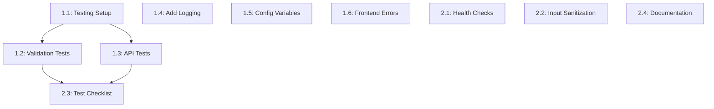

# Names Manager - Task List

## Overview
This document breaks down the simplified implementation plan into small, manageable tasks that can be completed independently and reviewed easily.

## Phase 1: Basic Testing & Code Quality (Week 1-2)

### Task 1.1: Set Up Basic Testing Infrastructure
**Estimated Time**: 2-3 hours
**Priority**: High

**Description**: Add basic testing capability to the backend

**Steps**:
1. Create `backend/requirements-dev.txt` with pytest and coverage
2. Create `backend/tests/` directory structure
3. Add basic pytest configuration
4. Verify tests can run (even with 0 tests initially)

**Files to Create/Modify**:
- `backend/requirements-dev.txt`
- `backend/tests/__init__.py`
- `backend/tests/conftest.py` (optional, for shared fixtures)

**Acceptance Criteria**:
- [ ] `cd backend && python -m pytest` runs successfully
- [ ] No import errors or configuration issues
- [ ] Coverage reporting works with `pytest --cov`

**Review Checklist**:
- Requirements file includes necessary testing dependencies
- Test directory structure is logical
- Command to run tests is documented

---

### Task 1.2: Create Basic Validation Tests
**Estimated Time**: 2-3 hours
**Priority**: High
**Depends On**: Task 1.1

**Description**: Test the core validation function with various inputs

**Steps**:
1. Create `backend/tests/test_validation.py`
2. Test valid names (normal cases)
3. Test invalid names (empty, too long, whitespace-only)
4. Test edge cases (exactly 50 chars, special characters)

**Files to Create/Modify**:
- `backend/tests/test_validation.py`

**Acceptance Criteria**:
- [ ] All validation edge cases covered
- [ ] Tests pass for current validation logic
- [ ] Test coverage for validation function is 100%

**Review Checklist**:
- Tests cover both valid and invalid inputs
- Test names are descriptive
- Expected behavior matches actual validation logic

---

### Task 1.3: Create Basic API Endpoint Tests
**Estimated Time**: 3-4 hours
**Priority**: High
**Depends On**: Task 1.1

**Description**: Test the three main API endpoints with basic scenarios

**Steps**:
1. Create `backend/tests/test_main.py`
2. Set up test client for Flask app
3. Test POST /api/names with valid/invalid data
4. Test GET /api/names 
5. Test DELETE /api/names/<id> with valid/invalid IDs

**Files to Create/Modify**:
- `backend/tests/test_main.py`

**Acceptance Criteria**:
- [ ] Each endpoint has at least 2 test cases (success/failure)
- [ ] Tests use proper HTTP status codes
- [ ] Database interactions are isolated (use test database or mocks)

**Review Checklist**:
- Tests don't interfere with each other
- Database state is properly managed
- Response formats match expected API contracts

---

### Task 1.4: Add Basic Logging to Backend
**Estimated Time**: 1-2 hours
**Priority**: Medium

**Description**: Add simple logging to track requests and errors

**Steps**:
1. Import Python logging module in `main.py`
2. Configure basic logging format
3. Add log statements to each API endpoint
4. Log validation errors and database operations

**Files to Create/Modify**:
- `backend/main.py`

**Acceptance Criteria**:
- [ ] Application logs startup message
- [ ] Each API call logs request type and outcome
- [ ] Errors are logged with appropriate level
- [ ] Log format is readable and informative

**Review Checklist**:
- Log messages are helpful for debugging
- Sensitive information is not logged
- Log level is appropriate for each message

---

### Task 1.5: Extract Configuration to Environment Variables
**Estimated Time**: 1-2 hours
**Priority**: Medium

**Description**: Move hardcoded configuration to environment variables

**Steps**:
1. Update `main.py` to use environment variables for constants
2. Update `docker-compose.yml` to set environment variables
3. Create `.env.example` file for documentation
4. Update validation to use configurable max length

**Files to Create/Modify**:
- `backend/main.py`
- `docker-compose.yml`
- `.env.example`

**Acceptance Criteria**:
- [ ] No hardcoded database credentials in source code
- [ ] MAX_NAME_LENGTH configurable via environment
- [ ] Application still works with default values
- [ ] Configuration is documented

**Review Checklist**:
- All sensitive values are externalized
- Default values are sensible
- Documentation explains how to configure

---

### Task 1.6: Improve Frontend Error Handling
**Estimated Time**: 2-3 hours
**Priority**: Medium

**Description**: Better user experience for error scenarios

**Steps**:
1. Create error display function in `app.js`
2. Add loading states for form submission
3. Improve error messages for different scenarios
4. Add client-side validation feedback

**Files to Create/Modify**:
- `frontend/app.js`
- `frontend/index.html` (if CSS changes needed)

**Acceptance Criteria**:
- [ ] Users see clear error messages for invalid inputs
- [ ] Loading states prevent double-submission
- [ ] Errors are visually distinct and temporary
- [ ] Form resets appropriately after errors

**Review Checklist**:
- Error messages are user-friendly
- UI feedback is immediate and clear
- Error states don't break the interface

---

## Phase 2: Basic Monitoring & Documentation (Week 2-3)

### Task 2.1: Add Health Check Endpoints
**Estimated Time**: 1-2 hours
**Priority**: Medium

**Description**: Simple endpoints to verify application status

**Steps**:
1. Add `/health` endpoint that returns basic status
2. Add `/health/db` endpoint that checks database connection
3. Test endpoints manually
4. Document endpoint usage

**Files to Create/Modify**:
- `backend/main.py`

**Acceptance Criteria**:
- [ ] `/health` returns 200 with status message
- [ ] `/health/db` returns 200 when DB connected, 503 when not
- [ ] Endpoints return JSON responses
- [ ] Database check handles connection failures gracefully

**Review Checklist**:
- Health checks don't expose sensitive information
- Database check doesn't cause performance issues
- Responses are consistent and documented

---

### Task 2.2: Add Basic Input Sanitization
**Estimated Time**: 1-2 hours
**Priority**: High

**Description**: Prevent basic XSS vulnerabilities

**Steps**:
1. Import HTML escaping functionality
2. Update validation function to sanitize inputs
3. Test with potentially dangerous inputs
4. Verify frontend displays escaped content correctly

**Files to Create/Modify**:
- `backend/main.py`

**Acceptance Criteria**:
- [ ] HTML tags in names are escaped/removed
- [ ] Script tags cannot be injected
- [ ] Normal names still work correctly
- [ ] Frontend displays content safely

**Review Checklist**:
- Sanitization is applied consistently
- Normal use cases are not broken
- Security improvement is measurable

---

### Task 2.3: Create Manual Testing Checklist
**Estimated Time**: 2-3 hours
**Priority**: Medium

**Description**: Document testing procedures for the application

**Steps**:
1. Create `TESTING.md` file
2. Document step-by-step manual test cases
3. Include expected outcomes for each test
4. Test the checklist by following it completely

**Files to Create/Modify**:
- `TESTING.md`

**Acceptance Criteria**:
- [ ] All major user workflows covered
- [ ] Error scenarios included
- [ ] Steps are clear enough for new developer to follow
- [ ] Expected outcomes are specific

**Review Checklist**:
- Test cases are realistic user scenarios
- Instructions are clear and complete
- Document can be used by someone else

---

### Task 2.4: Update Documentation
**Estimated Time**: 2-3 hours
**Priority**: Medium

**Description**: Improve README and setup instructions

**Steps**:
1. Update `README.md` with clearer setup instructions
2. Document how to run tests
3. Document new environment variables
4. Add troubleshooting section

**Files to Create/Modify**:
- `README.md`
- `src/README.md`

**Acceptance Criteria**:
- [ ] New developer can set up application from README
- [ ] Testing instructions are clear
- [ ] Environment variable configuration explained
- [ ] Common issues and solutions documented

**Review Checklist**:
- Instructions are tested by following them
- Prerequisites are clearly stated
- Examples are provided where helpful

---

## Task Dependencies

## Estimated Timeline

**Total Effort**: 20-30 hours over 2-3 weeks

### Week 1 (10-15 hours)
- Task 1.1: Testing Setup (2-3h)
- Task 1.2: Validation Tests (2-3h)  
- Task 1.3: API Tests (3-4h)
- Task 1.4: Add Logging (1-2h)
- Task 1.5: Config Variables (1-2h)

### Week 2 (8-12 hours)
- Task 1.6: Frontend Errors (2-3h)
- Task 2.1: Health Checks (1-2h)
- Task 2.2: Input Sanitization (1-2h)
- Task 2.3: Test Checklist (2-3h)
- Task 2.4: Documentation (2-3h)

## Review Guidelines

### For Each Task:
1. **Functionality**: Does the change work as described?
2. **Quality**: Is the code clean and maintainable?
3. **Testing**: Are changes tested appropriately?
4. **Documentation**: Are changes documented if needed?
5. **Compatibility**: Does existing functionality still work?

### Before Merging:
- All acceptance criteria met
- Code follows existing style
- No regressions in manual testing
- Documentation updated if needed

This task breakdown makes the improvements manageable while ensuring each piece can be reviewed and integrated independently.